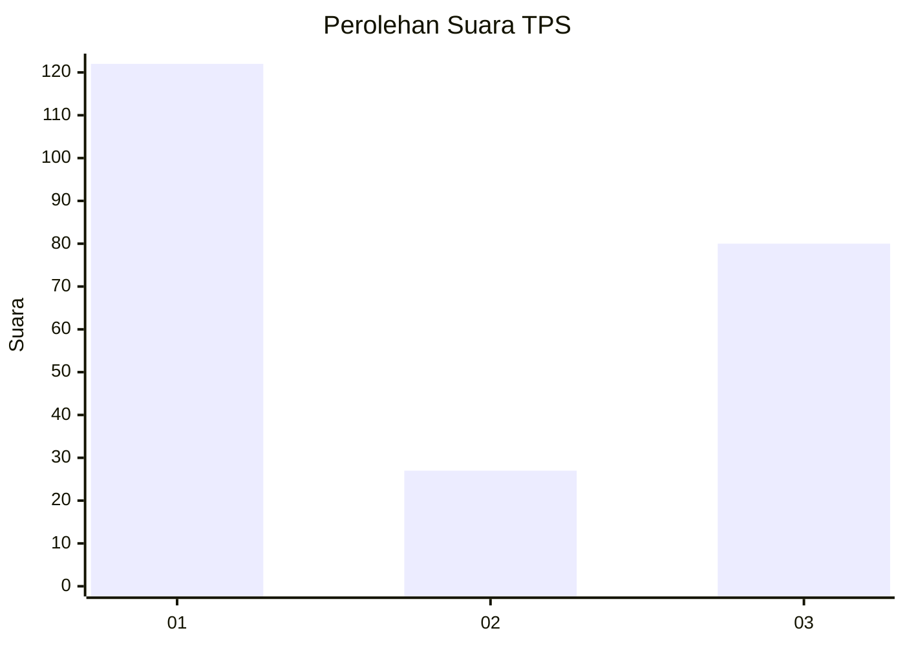
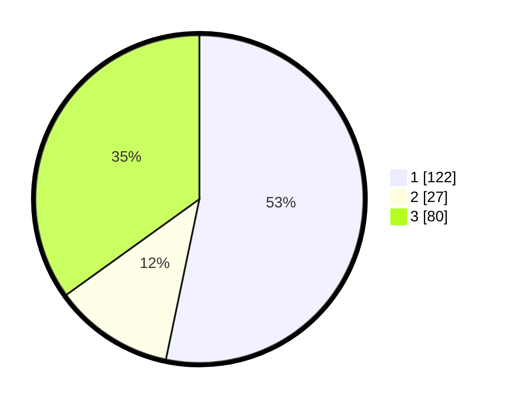

# Hasil

## Grafik

## Tabel

| No. | Nama Paslon    | Suara | Suara (raw) | Persentase |
|:--- |:-------------- | -----:| -----------:| ----------:|
| 1   | ANIES MUHAIMIN | 122   | [122][p-1]  | 53,28      |
| 2   | PRABOWO GIBRAN | 27    | [27][p-2]   | 11,79      |
| 3   | GANJAR MAHFUD  | 80    | [80][p-3]   | 34,93      |

[p-1]: https://github.com/gigit-pemilu/pemilu-2024-94-papua-tengah/blob/main/pilpres/hitung-suara/sub/94-papua-tengah/sub/01-nabire/sub/01-nabire/sub/2012-sanoba/sub/011-tps/sub/paslon-1.txt
[p-2]: https://github.com/gigit-pemilu/pemilu-2024-94-papua-tengah/blob/main/pilpres/hitung-suara/sub/94-papua-tengah/sub/01-nabire/sub/01-nabire/sub/2012-sanoba/sub/011-tps/sub/paslon-2.txt
[p-3]: https://github.com/gigit-pemilu/pemilu-2024-94-papua-tengah/blob/main/pilpres/hitung-suara/sub/94-papua-tengah/sub/01-nabire/sub/01-nabire/sub/2012-sanoba/sub/011-tps/sub/paslon-3.txt

## Foto C Plano

https://sirekap-obj-formc.kpu.go.id/89f7/pemilu/ppwp/94/01/01/20/12/9401012012011-20240215-051245--bfc3898b-0bbe-49d0-91c9-e88883136876.jpg

https://sirekap-obj-formc.kpu.go.id/89f7/pemilu/ppwp/94/01/01/20/12/9401012012011-20240214-193656--c3d87f1b-10b9-4027-8081-3b0e82fa1485.jpg

https://sirekap-obj-formc.kpu.go.id/89f7/pemilu/ppwp/94/01/01/20/12/9401012012011-20240215-075006--55b8ebe6-4046-488e-be56-2e197c27f463.jpg

## Metadata

| Key        | Value               |
| ---------- | ------------------- |
| Time Stamp | 2024-02-19 11:00:00 |

