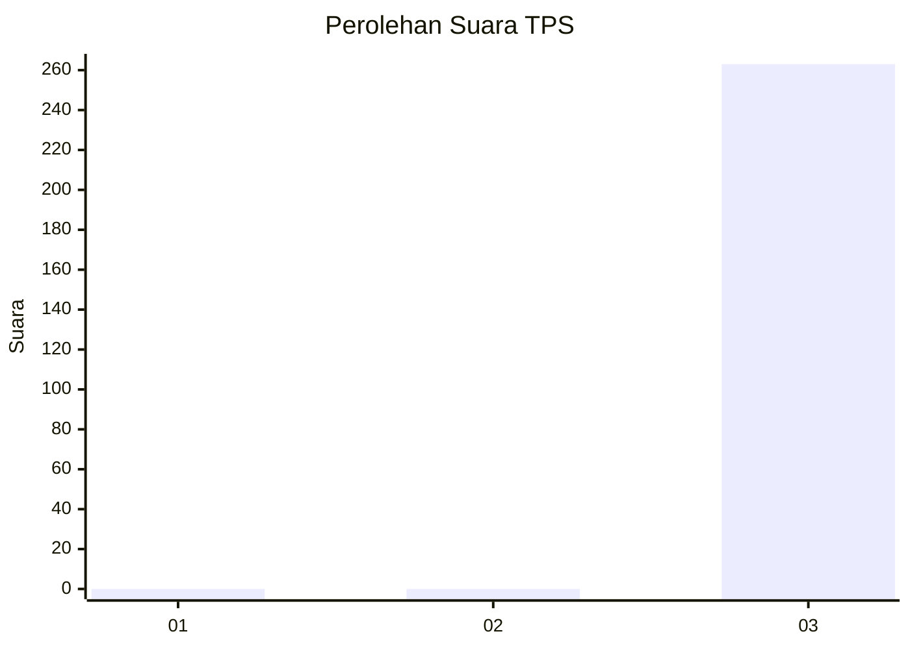
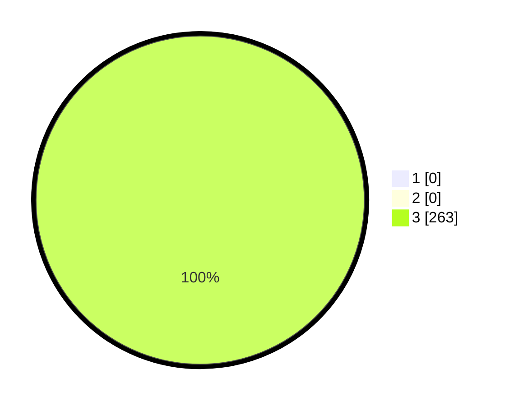

# Hasil

## Grafik

## Tabel

| No. | Nama Paslon    | Suara | Suara (raw) | Persentase |
|:--- |:-------------- | -----:| -----------:| ----------:|
| 1   | ANIES MUHAIMIN | 0     | [0][p-1]    | 0,00       |
| 2   | PRABOWO GIBRAN | 0     | [0][p-2]    | 0,00       |
| 3   | GANJAR MAHFUD  | 263   | [263][p-3]  | 100,00     |

[p-1]: https://github.com/gigit-pemilu/pemilu-2024-94-papua-tengah/blob/main/pilpres/hitung-suara/sub/94-papua-tengah/sub/01-nabire/sub/01-nabire/sub/2012-sanoba/sub/013-tps/sub/paslon-1.txt
[p-2]: https://github.com/gigit-pemilu/pemilu-2024-94-papua-tengah/blob/main/pilpres/hitung-suara/sub/94-papua-tengah/sub/01-nabire/sub/01-nabire/sub/2012-sanoba/sub/013-tps/sub/paslon-2.txt
[p-3]: https://github.com/gigit-pemilu/pemilu-2024-94-papua-tengah/blob/main/pilpres/hitung-suara/sub/94-papua-tengah/sub/01-nabire/sub/01-nabire/sub/2012-sanoba/sub/013-tps/sub/paslon-3.txt

## Foto C Plano

https://sirekap-obj-formc.kpu.go.id/6145/pemilu/ppwp/94/01/01/20/12/9401012012013-20240215-104221--79dff758-d85f-48b1-9a47-5cebea53b95e.jpg

https://sirekap-obj-formc.kpu.go.id/6145/pemilu/ppwp/94/01/01/20/12/9401012012013-20240215-103620--ea82be40-ac2d-41e0-b4e2-baa66d2f7497.jpg

https://sirekap-obj-formc.kpu.go.id/6145/pemilu/ppwp/94/01/01/20/12/9401012012013-20240215-104519--771d854d-6c0b-4dae-9e3b-9530c9da83fb.jpg

## Metadata

| Key        | Value               |
| ---------- | ------------------- |
| Time Stamp | 2024-02-15 19:30:26 |

