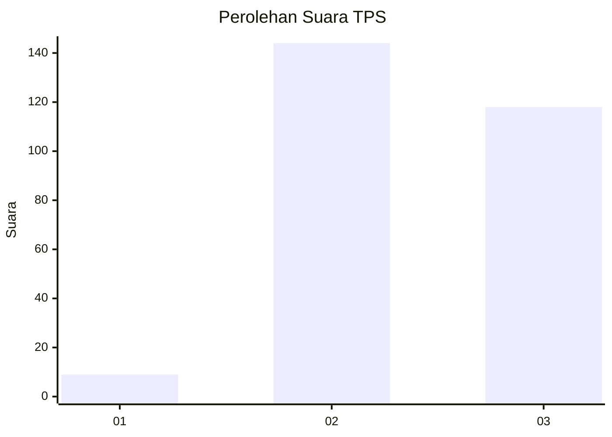
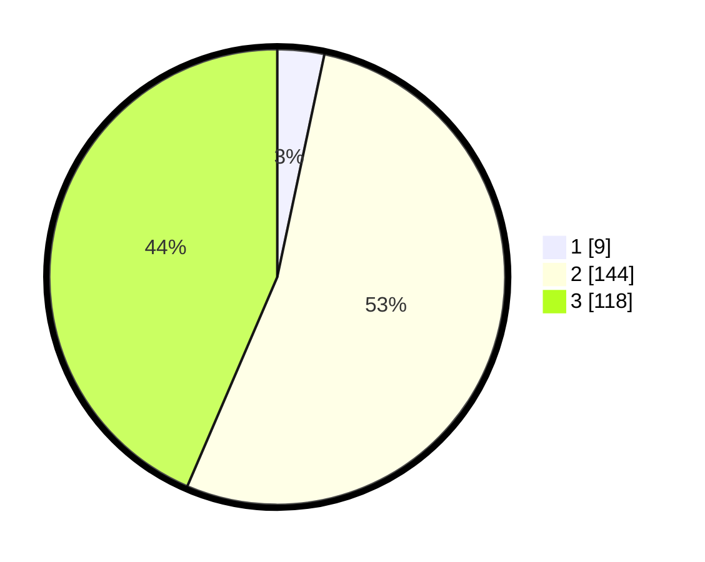

# Hasil

## Grafik

## Tabel

| No. | Nama Paslon    | Suara | Suara (raw) | Persentase |
|:--- |:-------------- | -----:| -----------:| ----------:|
| 1   | ANIES MUHAIMIN | 9     | [9][p-1]    | 3,32       |
| 2   | PRABOWO GIBRAN | 144   | [144][p-2]  | 53,14      |
| 3   | GANJAR MAHFUD  | 118   | [118][p-3]  | 43,54      |

[p-1]: https://github.com/gigit-pemilu/pemilu-2024-94-papua-tengah/blob/main/pilpres/hitung-suara/sub/94-papua-tengah/sub/01-nabire/sub/01-nabire/sub/2012-sanoba/sub/014-tps/sub/paslon-1.txt
[p-2]: https://github.com/gigit-pemilu/pemilu-2024-94-papua-tengah/blob/main/pilpres/hitung-suara/sub/94-papua-tengah/sub/01-nabire/sub/01-nabire/sub/2012-sanoba/sub/014-tps/sub/paslon-2.txt
[p-3]: https://github.com/gigit-pemilu/pemilu-2024-94-papua-tengah/blob/main/pilpres/hitung-suara/sub/94-papua-tengah/sub/01-nabire/sub/01-nabire/sub/2012-sanoba/sub/014-tps/sub/paslon-3.txt

## Foto C Plano

https://sirekap-obj-formc.kpu.go.id/e510/pemilu/ppwp/94/01/01/20/12/9401012012014-20240215-131017--28eb6628-b6f8-4eff-90df-e13b6dbac443.jpg

https://sirekap-obj-formc.kpu.go.id/e510/pemilu/ppwp/94/01/01/20/12/9401012012014-20240215-130817--758a3dcb-728d-4da4-b3aa-47c6a8907005.jpg

https://sirekap-obj-formc.kpu.go.id/e510/pemilu/ppwp/94/01/01/20/12/9401012012014-20240215-130913--1b5fbace-73b4-424f-b411-4eb931516d47.jpg

## Metadata

| Key        | Value               |
| ---------- | ------------------- |
| Time Stamp | 2024-02-24 22:31:28 |

