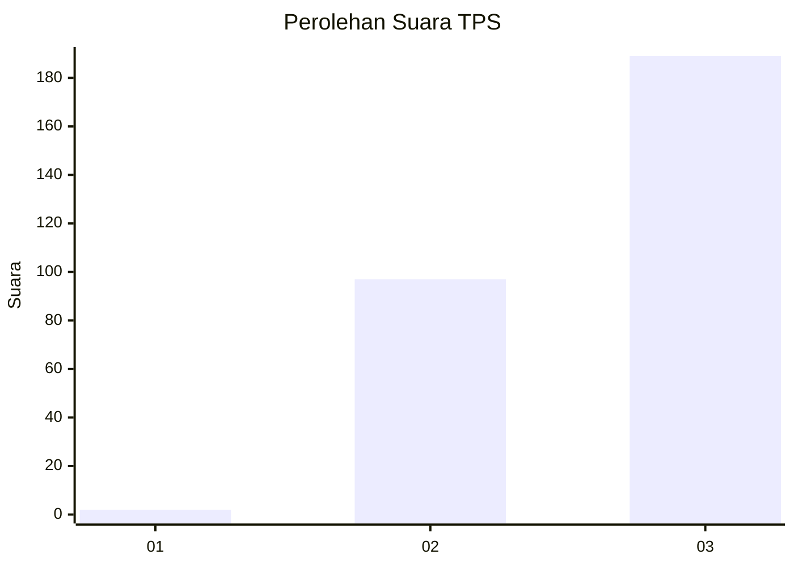
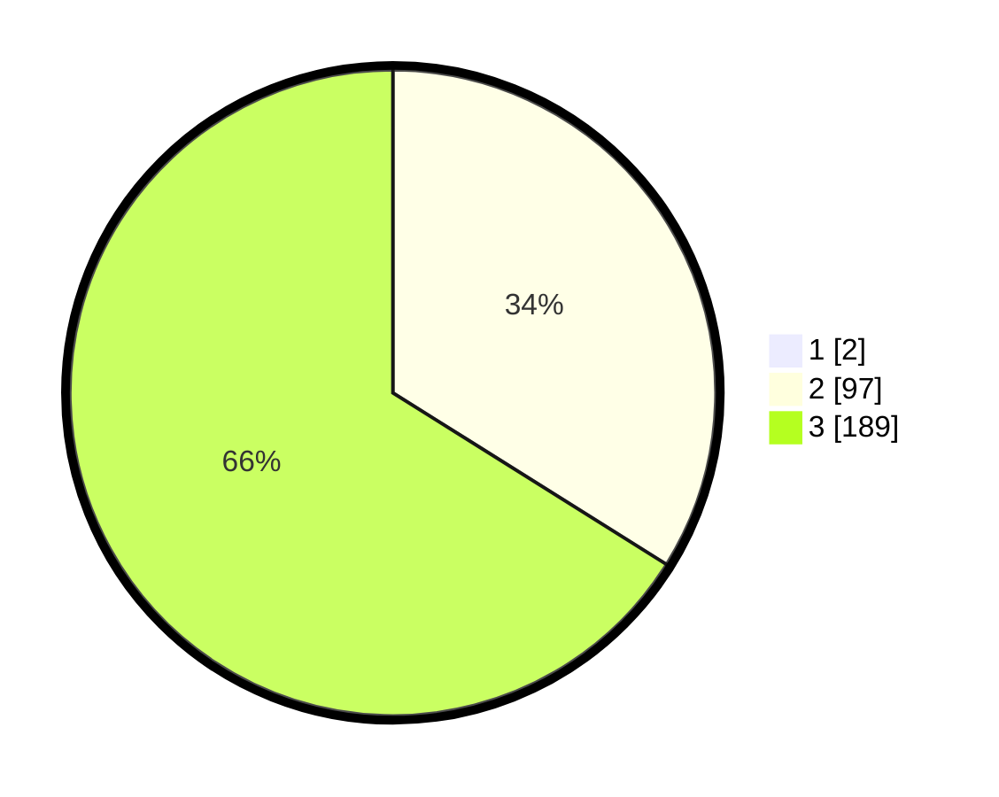

# Hasil

## Grafik

## Tabel

| No. | Nama Paslon    | Suara | Suara (raw) | Persentase |
|:--- |:-------------- | -----:| -----------:| ----------:|
| 1   | ANIES MUHAIMIN | 2     | [2][p-1]    | 0,69       |
| 2   | PRABOWO GIBRAN | 97    | [97][p-2]   | 33,68      |
| 3   | GANJAR MAHFUD  | 189   | [189][p-3]  | 65,63      |

[p-1]: https://github.com/gigit-pemilu/pemilu-2024-94-papua-tengah/blob/main/pilpres/hitung-suara/sub/94-papua-tengah/sub/01-nabire/sub/02-napan/sub/2002-masipawa/sub/001-tps/sub/paslon-1.txt
[p-2]: https://github.com/gigit-pemilu/pemilu-2024-94-papua-tengah/blob/main/pilpres/hitung-suara/sub/94-papua-tengah/sub/01-nabire/sub/02-napan/sub/2002-masipawa/sub/001-tps/sub/paslon-2.txt
[p-3]: https://github.com/gigit-pemilu/pemilu-2024-94-papua-tengah/blob/main/pilpres/hitung-suara/sub/94-papua-tengah/sub/01-nabire/sub/02-napan/sub/2002-masipawa/sub/001-tps/sub/paslon-3.txt

## Foto C Plano

https://sirekap-obj-formc.kpu.go.id/e6ab/pemilu/ppwp/94/01/02/20/02/9401022002001-20240216-135717--c5c26f1d-b4f0-42d1-a031-3d04628398dd.jpg

https://sirekap-obj-formc.kpu.go.id/e6ab/pemilu/ppwp/94/01/02/20/02/9401022002001-20240216-135718--e1252be6-c2f7-411f-9a05-6152be5faad0.jpg

https://sirekap-obj-formc.kpu.go.id/e6ab/pemilu/ppwp/94/01/02/20/02/9401022002001-20240216-135718--94ed7440-a013-4ad5-9e29-2cf6dd33abc1.jpg

## Metadata

| Key        | Value               |
| ---------- | ------------------- |
| Time Stamp | 2024-02-16 23:30:00 |

## DATA PEMILIH TETAP

Jumlah pemilih dalam DPT: **289**.
 * L: **157**.
 * P: **132**.

## DATA PENGGUNA HAK PILIH

Jumlah pengguna hak pilih dalam DPT: **289**.
 * L: **157**.
 * P: **132**.

Jumlah pengguna hak pilih dalam DPTb: **0**.
 * L: **0**.
 * P: **0**.

Jumlah pengguna hak pilih dalam DPK: **0**.
 * L: **0**.
 * P: **0**.

Jumlah pengguna hak pilih: **289**.
 * L: **157**.
 * P: **132**.

## JUMLAH SUARA SAH DAN TIDAK SAH

JUMLAH SELURUH SUARA SAH: **288**.

JUMLAH SUARA TIDAK SAH: **1**.

JUMLAH SELURUH SUARA SAH DAN SUARA TIDAK SAH: **289**.

