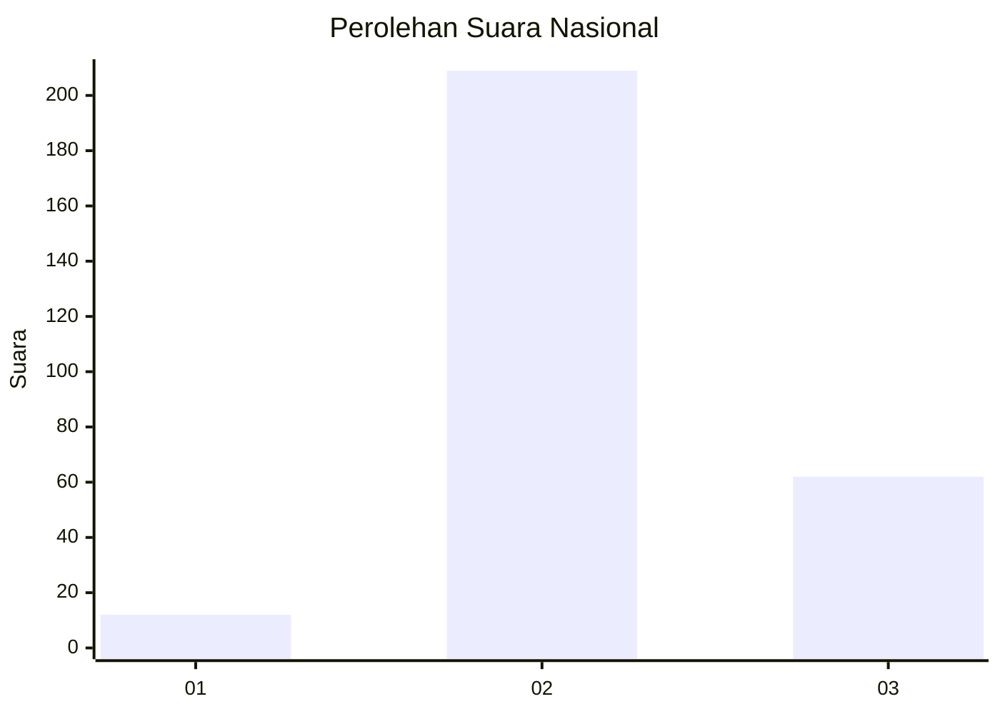
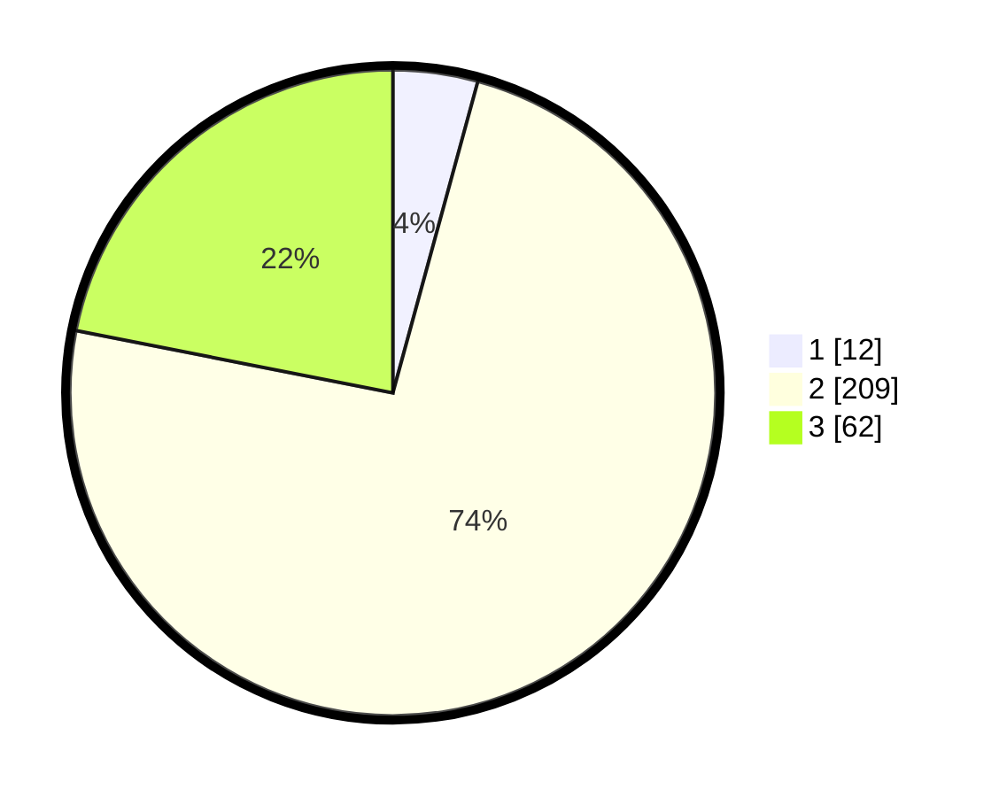

# Hasil

## Grafik

## Tabel

| No. | Nama Paslon    | Suara | Suara (raw) | Persentase |
|:--- |:-------------- | -----:| -----------:| ----------:|
| 1   | ANIES MUHAIMIN | 12    | [12][p-1]   | 4,24       |
| 2   | PRABOWO GIBRAN | 209   | [209][p-2]  | 73,85      |
| 3   | GANJAR MAHFUD  | 62    | [62][p-3]   | 21,91      |

[p-1]: https://github.com/gigit-pemilu/pemilu-2024/blob/main/pilpres/hitung-suara/sub/94-papua-tengah/sub/01-nabire/sub/03-yaur/sub/2004-wami/sub/002-tps/sub/paslon-1.txt
[p-2]: https://github.com/gigit-pemilu/pemilu-2024/blob/main/pilpres/hitung-suara/sub/94-papua-tengah/sub/01-nabire/sub/03-yaur/sub/2004-wami/sub/002-tps/sub/paslon-2.txt
[p-3]: https://github.com/gigit-pemilu/pemilu-2024/blob/main/pilpres/hitung-suara/sub/94-papua-tengah/sub/01-nabire/sub/03-yaur/sub/2004-wami/sub/002-tps/sub/paslon-3.txt

## Foto C Plano

https://sirekap-obj-formc.kpu.go.id/d696/pemilu/ppwp/94/01/03/20/04/9401032004002-20240217-045911--0397d240-8748-4ae8-be0d-104795067a7c.jpg

https://sirekap-obj-formc.kpu.go.id/d696/pemilu/ppwp/94/01/03/20/04/9401032004002-20240217-045336--94c08635-5ded-4cf3-a9c6-b3008c49dbd0.jpg

## Metadata

| Key        | Value               |
| ---------- | ------------------- |
| Time Stamp | 2024-02-25 14:00:00 |

