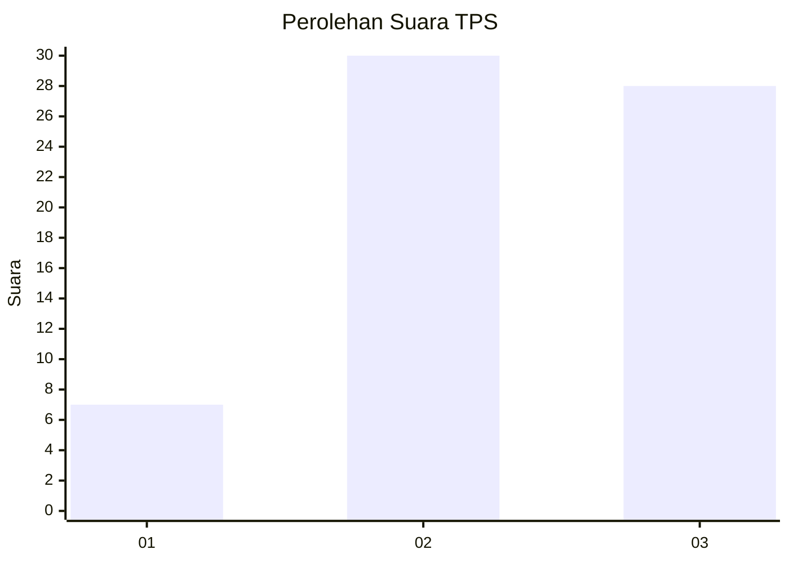
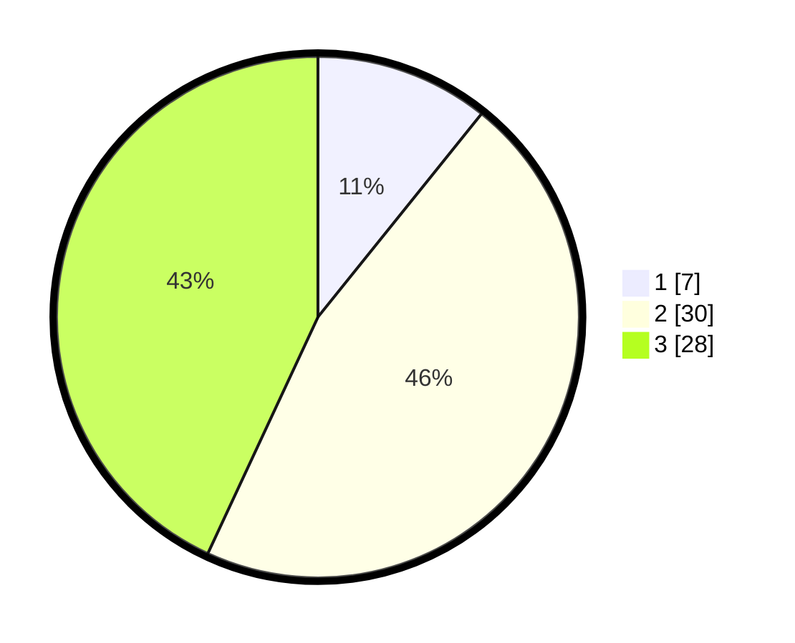

# Hasil

## Grafik

## Tabel

| No. | Nama Paslon    | Suara | Suara (raw) | Persentase |
|:--- |:-------------- | -----:| -----------:| ----------:|
| 1   | ANIES MUHAIMIN | 7     | [7][p-1]    | 10,77      |
| 2   | PRABOWO GIBRAN | 30    | [30][p-2]   | 46,15      |
| 3   | GANJAR MAHFUD  | 28    | [28][p-3]   | 43,08      |

[p-1]: https://github.com/gigit-pemilu/pemilu-2024-94-papua-tengah/blob/main/pilpres/hitung-suara/sub/94-papua-tengah/sub/01-nabire/sub/04-uwapa/sub/2002-urumusu/sub/002-tps/sub/paslon-1.txt
[p-2]: https://github.com/gigit-pemilu/pemilu-2024-94-papua-tengah/blob/main/pilpres/hitung-suara/sub/94-papua-tengah/sub/01-nabire/sub/04-uwapa/sub/2002-urumusu/sub/002-tps/sub/paslon-2.txt
[p-3]: https://github.com/gigit-pemilu/pemilu-2024-94-papua-tengah/blob/main/pilpres/hitung-suara/sub/94-papua-tengah/sub/01-nabire/sub/04-uwapa/sub/2002-urumusu/sub/002-tps/sub/paslon-3.txt

## Foto C Plano

https://sirekap-obj-formc.kpu.go.id/6393/pemilu/ppwp/94/01/04/20/02/9401042002002-20240215-063702--e1fb4a86-4044-408d-b51d-50cd94bd33e7.jpg

https://sirekap-obj-formc.kpu.go.id/6393/pemilu/ppwp/94/01/04/20/02/9401042002002-20240215-062614--b061e97a-b094-44d7-957c-29fe714172ec.jpg

## Metadata

| Key        | Value               |
| ---------- | ------------------- |
| Time Stamp | 2024-02-15 20:30:46 |

