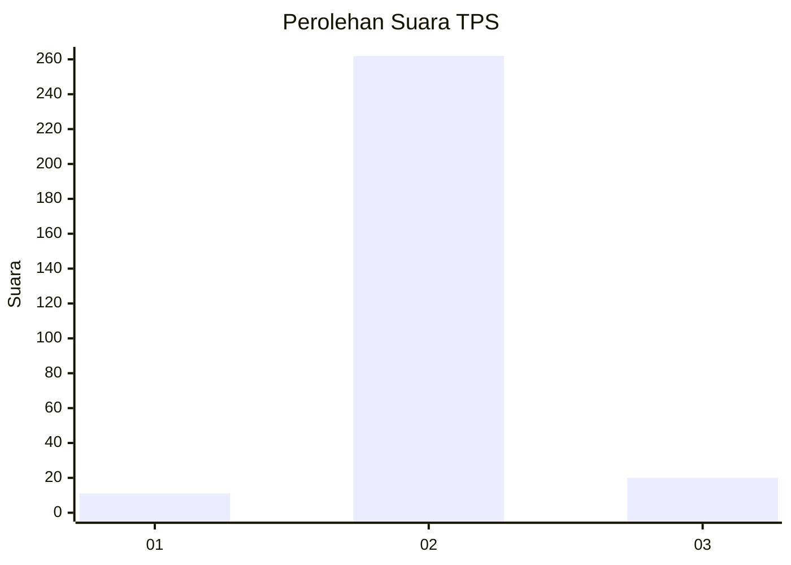
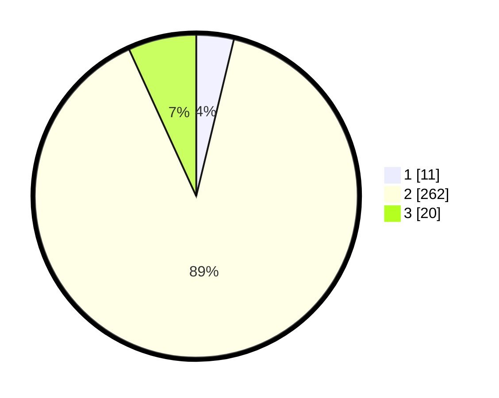

# Hasil

## Grafik

## Tabel

| No. | Nama Paslon    | Suara | Suara (raw) | Persentase |
|:--- |:-------------- | -----:| -----------:| ----------:|
| 1   | ANIES MUHAIMIN | 11    | [11][p-1]   | 3,75       |
| 2   | PRABOWO GIBRAN | 262   | [262][p-2]  | 89,42      |
| 3   | GANJAR MAHFUD  | 20    | [20][p-3]   | 6,83       |

[p-1]: https://github.com/gigit-pemilu/pemilu-2024-94-papua-tengah/blob/main/pilpres/hitung-suara/sub/94-papua-tengah/sub/01-nabire/sub/04-uwapa/sub/2005-topo-jaya/sub/001-tps/sub/paslon-1.txt
[p-2]: https://github.com/gigit-pemilu/pemilu-2024-94-papua-tengah/blob/main/pilpres/hitung-suara/sub/94-papua-tengah/sub/01-nabire/sub/04-uwapa/sub/2005-topo-jaya/sub/001-tps/sub/paslon-2.txt
[p-3]: https://github.com/gigit-pemilu/pemilu-2024-94-papua-tengah/blob/main/pilpres/hitung-suara/sub/94-papua-tengah/sub/01-nabire/sub/04-uwapa/sub/2005-topo-jaya/sub/001-tps/sub/paslon-3.txt

## Foto C Plano

https://sirekap-obj-formc.kpu.go.id/d14c/pemilu/ppwp/94/01/04/20/05/9401042005001-20240215-154720--77cf0f76-7e31-444b-803b-ceb9c186005c.jpg

https://sirekap-obj-formc.kpu.go.id/d14c/pemilu/ppwp/94/01/04/20/05/9401042005001-20240215-154800--da3ad983-5e87-4d55-882e-fcfc3924e68f.jpg

https://sirekap-obj-formc.kpu.go.id/d14c/pemilu/ppwp/94/01/04/20/05/9401042005001-20240215-181949--b5736cf0-00c6-4b52-a4cb-df26c348ca2f.jpg

## Metadata

| Key        | Value               |
| ---------- | ------------------- |
| Time Stamp | 2024-02-16 16:25:10 |

## DATA PEMILIH TETAP

Jumlah pemilih dalam DPT: **294**.
 * L: **161**.
 * P: **133**.

## DATA PENGGUNA HAK PILIH

Jumlah pengguna hak pilih dalam DPT: **280**.
 * L: **156**.
 * P: **124**.

Jumlah pengguna hak pilih dalam DPTb: **0**.
 * L: **0**.
 * P: **0**.

Jumlah pengguna hak pilih dalam DPK: **14**.
 * L: **4**.
 * P: **10**.

Jumlah pengguna hak pilih: **294**.
 * L: **160**.
 * P: **134**.

## JUMLAH SUARA SAH DAN TIDAK SAH

JUMLAH SELURUH SUARA SAH: **293**.

JUMLAH SUARA TIDAK SAH: **1**.

JUMLAH SELURUH SUARA SAH DAN SUARA TIDAK SAH: **294**.

