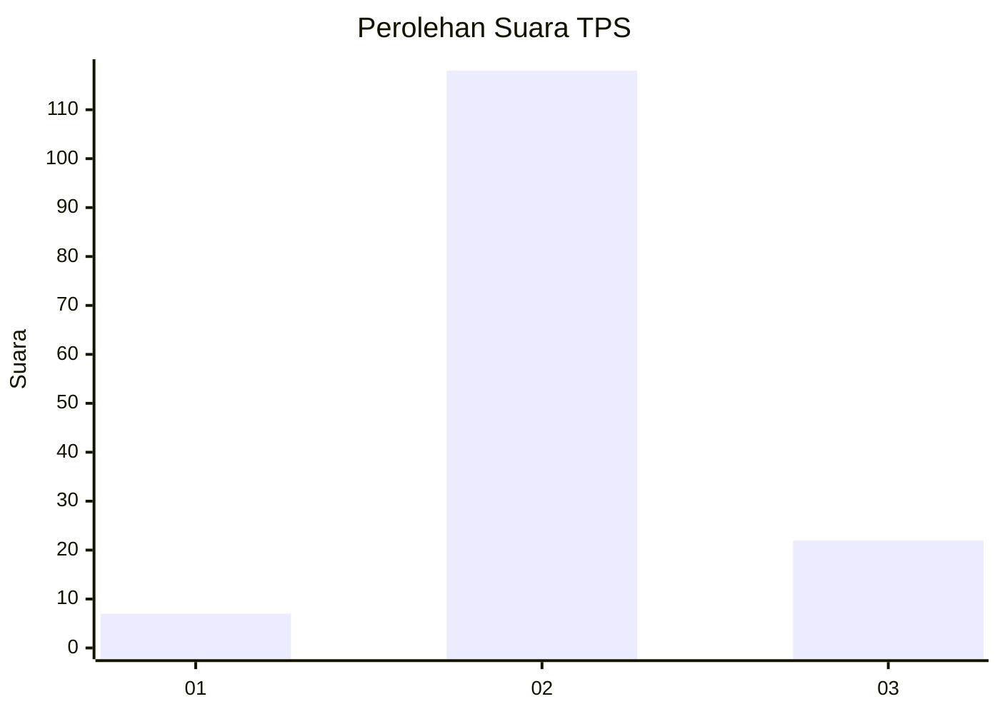

# Hasil

## Grafik

## Tabel

| No. | Nama Paslon    | Suara | Suara (raw) | Persentase |
|:--- |:-------------- | -----:| -----------:| ----------:|
| 1   | ANIES MUHAIMIN | 7     | [7][p-1]    | 4,76       |
| 2   | PRABOWO GIBRAN | 118   | [118][p-2]  | 80,27      |
| 3   | GANJAR MAHFUD  | 22    | [22][p-3]   | 14,97      |

[p-1]: https://github.com/gigit-pemilu/pemilu-2024-94-papua-tengah/blob/main/pilpres/hitung-suara/sub/94-papua-tengah/sub/01-nabire/sub/04-uwapa/sub/2005-topo-jaya/sub/002-tps/sub/paslon-1.txt
[p-2]: https://github.com/gigit-pemilu/pemilu-2024-94-papua-tengah/blob/main/pilpres/hitung-suara/sub/94-papua-tengah/sub/01-nabire/sub/04-uwapa/sub/2005-topo-jaya/sub/002-tps/sub/paslon-2.txt
[p-3]: https://github.com/gigit-pemilu/pemilu-2024-94-papua-tengah/blob/main/pilpres/hitung-suara/sub/94-papua-tengah/sub/01-nabire/sub/04-uwapa/sub/2005-topo-jaya/sub/002-tps/sub/paslon-3.txt

## Foto C Plano

https://sirekap-obj-formc.kpu.go.id/1253/pemilu/ppwp/94/01/04/20/05/9401042005002-20240215-110739--302471d4-013d-4320-8b71-2be606655332.jpg

https://sirekap-obj-formc.kpu.go.id/1253/pemilu/ppwp/94/01/04/20/05/9401042005002-20240215-204445--6c717cfc-1bae-4e0d-8513-0f5d471d9397.jpg

https://sirekap-obj-formc.kpu.go.id/1253/pemilu/ppwp/94/01/04/20/05/9401042005002-20240215-205230--6cb6c728-f304-4cdd-a265-827d99f30cf8.jpg

## Metadata

| Key        | Value               |
| ---------- | ------------------- |
| Time Stamp | 2024-02-15 21:30:27 |

## DATA PEMILIH TETAP

Jumlah pemilih dalam DPT: **147**.
 * L: **80**.
 * P: **67**.

## DATA PENGGUNA HAK PILIH

Jumlah pengguna hak pilih dalam DPT: **141**.
 * L: **77**.
 * P: **64**.

Jumlah pengguna hak pilih dalam DPTb: **0**.
 * L: **0**.
 * P: **0**.

Jumlah pengguna hak pilih dalam DPK: **6**.
 * L: **3**.
 * P: **3**.

Jumlah pengguna hak pilih: **147**.
 * L: **80**.
 * P: **67**.

## JUMLAH SUARA SAH DAN TIDAK SAH

JUMLAH SELURUH SUARA SAH: **147**.

JUMLAH SUARA TIDAK SAH: **0**.

JUMLAH SELURUH SUARA SAH DAN SUARA TIDAK SAH: **147**.

