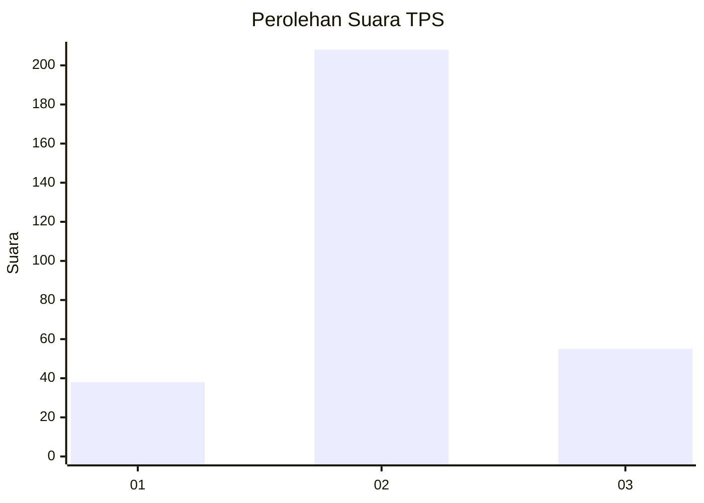
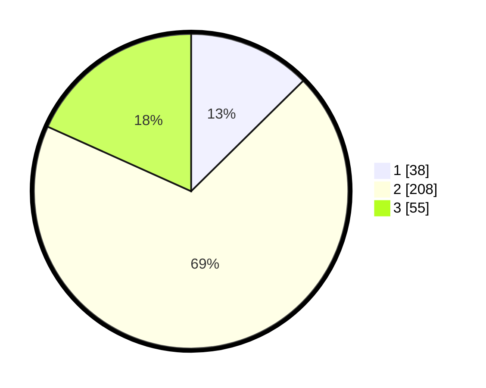

# Hasil

## Grafik

## Tabel

| No. | Nama Paslon    | Suara | Suara (raw) | Persentase |
|:--- |:-------------- | -----:| -----------:| ----------:|
| 1   | ANIES MUHAIMIN | 38    | [38][p-1]   | 12,62      |
| 2   | PRABOWO GIBRAN | 208   | [208][p-2]  | 69,10      |
| 3   | GANJAR MAHFUD  | 55    | [55][p-3]   | 18,27      |

[p-1]: https://github.com/gigit-pemilu/pemilu-2024-94-papua-tengah/blob/main/pilpres/hitung-suara/sub/94-papua-tengah/sub/01-nabire/sub/05-wanggar/sub/2001-bumi-mulia/sub/003-tps/sub/paslon-1.txt
[p-2]: https://github.com/gigit-pemilu/pemilu-2024-94-papua-tengah/blob/main/pilpres/hitung-suara/sub/94-papua-tengah/sub/01-nabire/sub/05-wanggar/sub/2001-bumi-mulia/sub/003-tps/sub/paslon-2.txt
[p-3]: https://github.com/gigit-pemilu/pemilu-2024-94-papua-tengah/blob/main/pilpres/hitung-suara/sub/94-papua-tengah/sub/01-nabire/sub/05-wanggar/sub/2001-bumi-mulia/sub/003-tps/sub/paslon-3.txt

## Foto C Plano

https://sirekap-obj-formc.kpu.go.id/bf90/pemilu/ppwp/94/01/05/20/01/9401052001003-20240216-151806--0747d5f3-5f84-4f64-b8dc-2695f9af42d0.jpg

https://sirekap-obj-formc.kpu.go.id/bf90/pemilu/ppwp/94/01/05/20/01/9401052001003-20240216-151808--1701150a-0900-4665-80b8-8a3d4bb3b179.jpg

https://sirekap-obj-formc.kpu.go.id/bf90/pemilu/ppwp/94/01/05/20/01/9401052001003-20240216-151807--ebdaa8ca-0e16-47e5-a518-7d0c9370adf3.jpg

## Metadata

| Key        | Value               |
| ---------- | ------------------- |
| Time Stamp | 2024-02-17 00:00:00 |

## DATA PEMILIH TETAP

Jumlah pemilih dalam DPT: **297**.
 * L: **156**.
 * P: **141**.

## DATA PENGGUNA HAK PILIH

Jumlah pengguna hak pilih dalam DPT: **257**.
 * L: **131**.
 * P: **126**.

Jumlah pengguna hak pilih dalam DPTb: **48**.
 * L: **20**.
 * P: **28**.

Jumlah pengguna hak pilih dalam DPK: **0**.
 * L: **0**.
 * P: **0**.

Jumlah pengguna hak pilih: **305**.
 * L: **151**.
 * P: **154**.

## JUMLAH SUARA SAH DAN TIDAK SAH

JUMLAH SELURUH SUARA SAH: **301**.

JUMLAH SUARA TIDAK SAH: **4**.

JUMLAH SELURUH SUARA SAH DAN SUARA TIDAK SAH: **305**.

