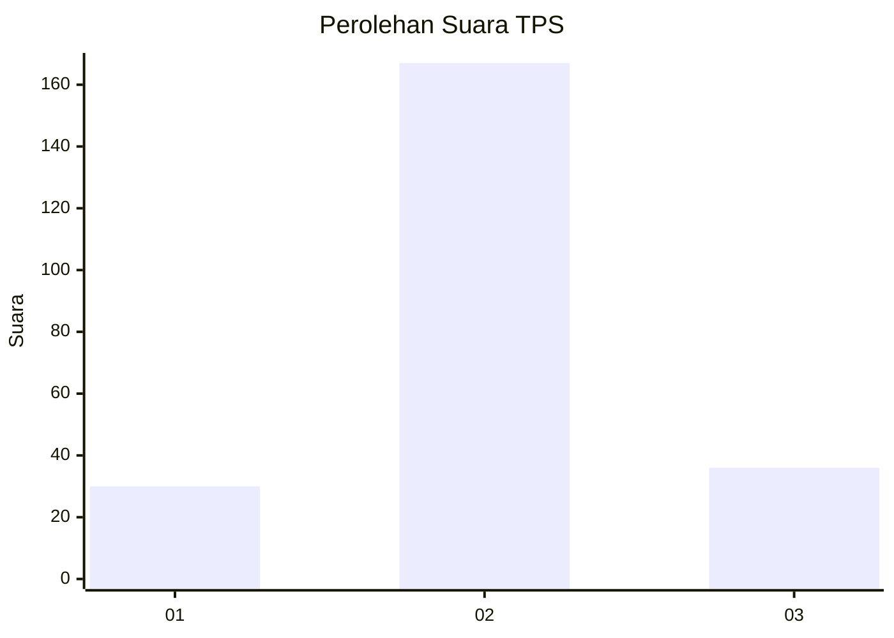

# Hasil

## Grafik

## Tabel

| No. | Nama Paslon    | Suara | Suara (raw) | Persentase |
|:--- |:-------------- | -----:| -----------:| ----------:|
| 1   | ANIES MUHAIMIN | 30    | [30][p-1]   | 12,88      |
| 2   | PRABOWO GIBRAN | 167   | [167][p-2]  | 71,67      |
| 3   | GANJAR MAHFUD  | 36    | [36][p-3]   | 15,45      |

[p-1]: https://github.com/gigit-pemilu/pemilu-2024-94-papua-tengah/blob/main/pilpres/hitung-suara/sub/94-papua-tengah/sub/01-nabire/sub/05-wanggar/sub/2001-bumi-mulia/sub/006-tps/sub/paslon-1.txt
[p-2]: https://github.com/gigit-pemilu/pemilu-2024-94-papua-tengah/blob/main/pilpres/hitung-suara/sub/94-papua-tengah/sub/01-nabire/sub/05-wanggar/sub/2001-bumi-mulia/sub/006-tps/sub/paslon-2.txt
[p-3]: https://github.com/gigit-pemilu/pemilu-2024-94-papua-tengah/blob/main/pilpres/hitung-suara/sub/94-papua-tengah/sub/01-nabire/sub/05-wanggar/sub/2001-bumi-mulia/sub/006-tps/sub/paslon-3.txt

## Foto C Plano

https://sirekap-obj-formc.kpu.go.id/ecbe/pemilu/ppwp/94/01/05/20/01/9401052001006-20240215-125400--ec70a30c-ca01-4066-8556-48b7f73f430b.jpg

https://sirekap-obj-formc.kpu.go.id/ecbe/pemilu/ppwp/94/01/05/20/01/9401052001006-20240215-125458--9fb25bab-4f76-4a5a-b39d-3a1ad4bab1a9.jpg

https://sirekap-obj-formc.kpu.go.id/ecbe/pemilu/ppwp/94/01/05/20/01/9401052001006-20240215-125908--e1477174-4ec2-40a5-92ed-8e2311d1b326.jpg

## Metadata

| Key        | Value               |
| ---------- | ------------------- |
| Time Stamp | 2024-02-25 13:00:00 |

