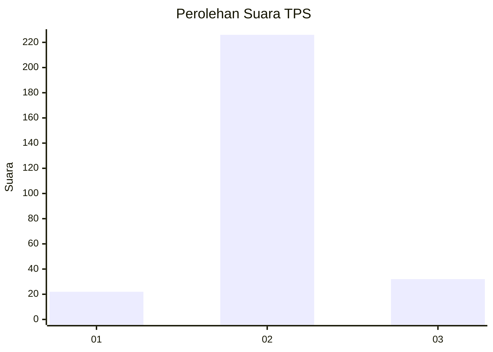
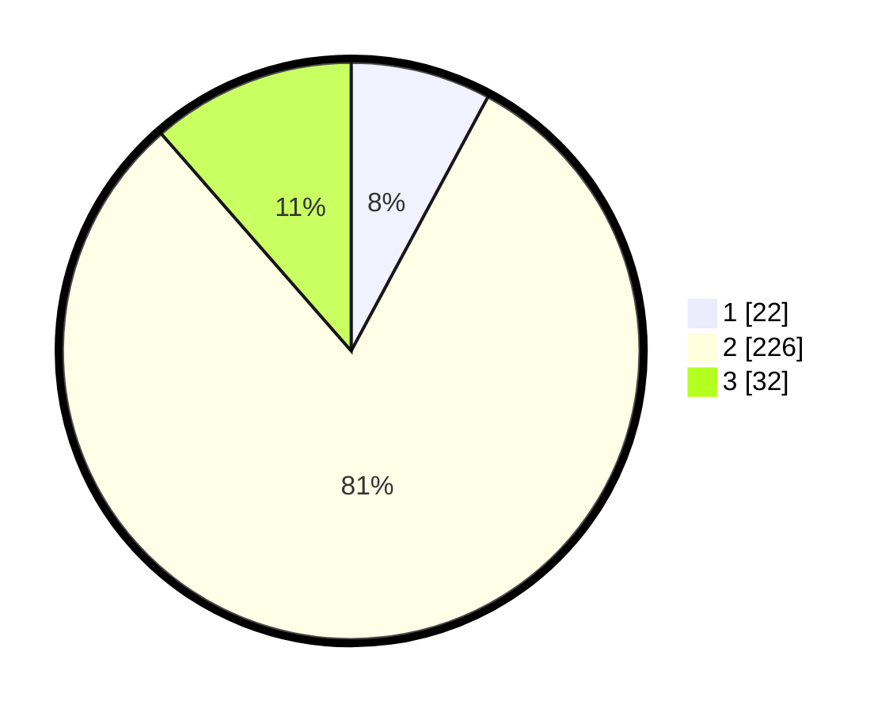

# Hasil

## Grafik

## Tabel

| No. | Nama Paslon    | Suara | Suara (raw) | Persentase |
|:--- |:-------------- | -----:| -----------:| ----------:|
| 1   | ANIES MUHAIMIN | 22    | [22][p-1]   | 7,86       |
| 2   | PRABOWO GIBRAN | 226   | [226][p-2]  | 80,71      |
| 3   | GANJAR MAHFUD  | 32    | [32][p-3]   | 11,43      |

[p-1]: https://github.com/gigit-pemilu/pemilu-2024-94-papua-tengah/blob/main/pilpres/hitung-suara/sub/94-papua-tengah/sub/01-nabire/sub/05-wanggar/sub/2002-karadiri/sub/001-tps/sub/paslon-1.txt
[p-2]: https://github.com/gigit-pemilu/pemilu-2024-94-papua-tengah/blob/main/pilpres/hitung-suara/sub/94-papua-tengah/sub/01-nabire/sub/05-wanggar/sub/2002-karadiri/sub/001-tps/sub/paslon-2.txt
[p-3]: https://github.com/gigit-pemilu/pemilu-2024-94-papua-tengah/blob/main/pilpres/hitung-suara/sub/94-papua-tengah/sub/01-nabire/sub/05-wanggar/sub/2002-karadiri/sub/001-tps/sub/paslon-3.txt

## Foto C Plano

https://sirekap-obj-formc.kpu.go.id/5a94/pemilu/ppwp/94/01/05/20/02/9401052002001-20240215-083714--85d192e5-7112-425b-881d-a11d0abe659d.jpg

https://sirekap-obj-formc.kpu.go.id/5a94/pemilu/ppwp/94/01/05/20/02/9401052002001-20240215-083434--bef77b07-4efc-48f9-aabe-35c8e97dfc5a.jpg

## Metadata

| Key        | Value               |
| ---------- | ------------------- |
| Time Stamp | 2024-02-15 19:00:26 |

