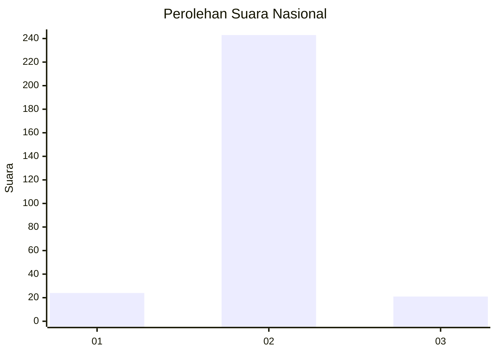
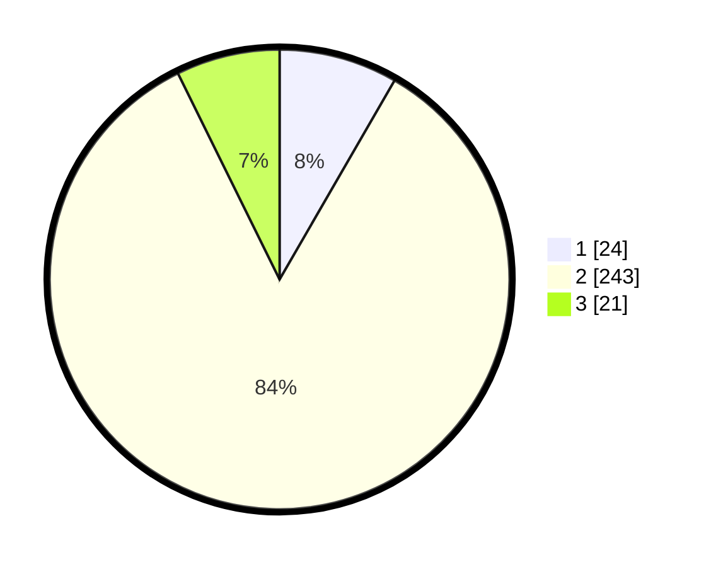

# Hasil

## Grafik

## Tabel

| No. | Nama Paslon    | Suara | Suara (raw) | Persentase |
|:--- |:-------------- | -----:| -----------:| ----------:|
| 1   | ANIES MUHAIMIN | 24    | [24][p-1]   | 8,33       |
| 2   | PRABOWO GIBRAN | 243   | [243][p-2]  | 84,38      |
| 3   | GANJAR MAHFUD  | 21    | [21][p-3]   | 7,29       |

[p-1]: https://github.com/gigit-pemilu/pemilu-2024/blob/main/pilpres/hitung-suara/sub/94-papua-tengah/sub/01-nabire/sub/05-wanggar/sub/2002-karadiri/sub/002-tps/sub/paslon-1.txt
[p-2]: https://github.com/gigit-pemilu/pemilu-2024/blob/main/pilpres/hitung-suara/sub/94-papua-tengah/sub/01-nabire/sub/05-wanggar/sub/2002-karadiri/sub/002-tps/sub/paslon-2.txt
[p-3]: https://github.com/gigit-pemilu/pemilu-2024/blob/main/pilpres/hitung-suara/sub/94-papua-tengah/sub/01-nabire/sub/05-wanggar/sub/2002-karadiri/sub/002-tps/sub/paslon-3.txt

## Foto C Plano

https://sirekap-obj-formc.kpu.go.id/1950/pemilu/ppwp/94/01/05/20/02/9401052002002-20240215-094522--f5373bcd-97a1-4599-a2b0-094165926ba2.jpg

https://sirekap-obj-formc.kpu.go.id/1950/pemilu/ppwp/94/01/05/20/02/9401052002002-20240215-082731--2a0606e6-e1e6-40c7-b648-2d2e0a87fd7f.jpg

https://sirekap-obj-formc.kpu.go.id/1950/pemilu/ppwp/94/01/05/20/02/9401052002002-20240215-083011--7d362a69-5a51-4252-af7c-b6d1cc6b5461.jpg

## Metadata

| Key        | Value               |
| ---------- | ------------------- |
| Time Stamp | 2024-02-25 14:00:00 |

