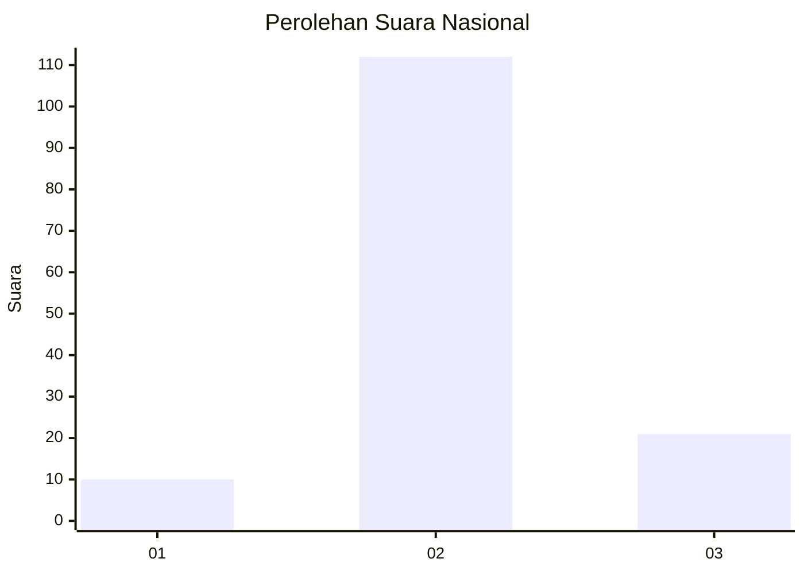

# Hasil

## Grafik

## Tabel

| No. | Nama Paslon    | Suara | Suara (raw) | Persentase |
|:--- |:-------------- | -----:| -----------:| ----------:|
| 1   | ANIES MUHAIMIN | 10    | [10][p-1]   | 6,99       |
| 2   | PRABOWO GIBRAN | 112   | [112][p-2]  | 78,32      |
| 3   | GANJAR MAHFUD  | 21    | [21][p-3]   | 14,69      |

[p-1]: https://github.com/gigit-pemilu/pemilu-2024/blob/main/pilpres/hitung-suara/sub/94-papua-tengah/sub/01-nabire/sub/05-wanggar/sub/2002-karadiri/sub/004-tps/sub/paslon-1.txt
[p-2]: https://github.com/gigit-pemilu/pemilu-2024/blob/main/pilpres/hitung-suara/sub/94-papua-tengah/sub/01-nabire/sub/05-wanggar/sub/2002-karadiri/sub/004-tps/sub/paslon-2.txt
[p-3]: https://github.com/gigit-pemilu/pemilu-2024/blob/main/pilpres/hitung-suara/sub/94-papua-tengah/sub/01-nabire/sub/05-wanggar/sub/2002-karadiri/sub/004-tps/sub/paslon-3.txt

## Foto C Plano

https://sirekap-obj-formc.kpu.go.id/aa61/pemilu/ppwp/94/01/05/20/02/9401052002004-20240215-142210--34e3a64c-07d9-4092-88dc-37eea91d6091.jpg

https://sirekap-obj-formc.kpu.go.id/aa61/pemilu/ppwp/94/01/05/20/02/9401052002004-20240215-172443--26ea5ab3-3033-4a0c-be62-b9776821e88f.jpg

## Metadata

| Key        | Value               |
| ---------- | ------------------- |
| Time Stamp | 2024-02-15 19:30:26 |

