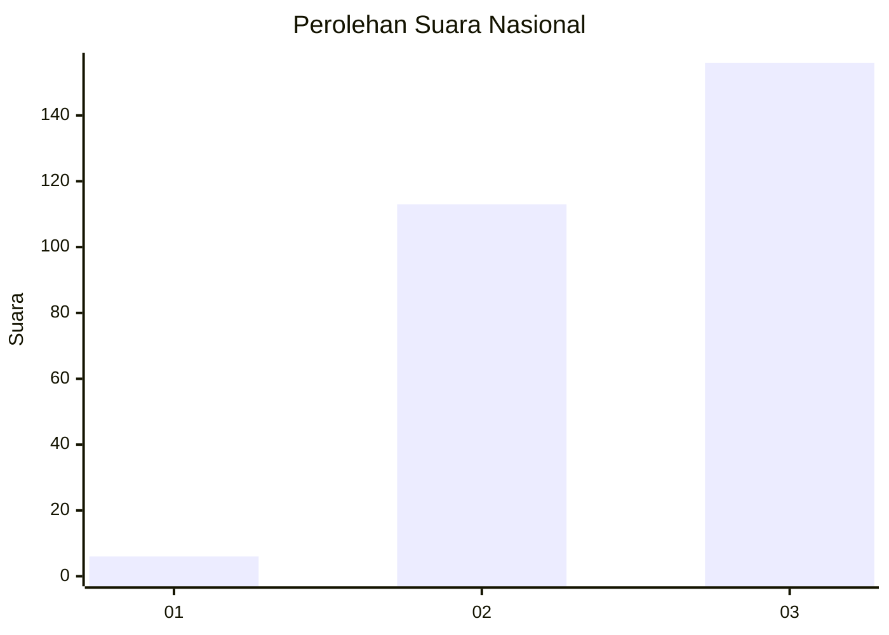
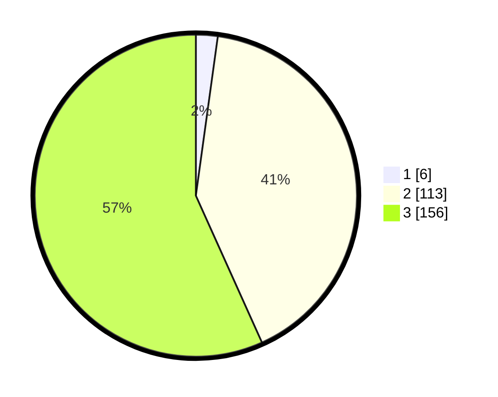

# Hasil

## Grafik

## Tabel

| No. | Nama Paslon    | Suara | Suara (raw) | Persentase |
|:--- |:-------------- | -----:| -----------:| ----------:|
| 1   | ANIES MUHAIMIN | 6     | [6][p-1]    | 2,18       |
| 2   | PRABOWO GIBRAN | 113   | [113][p-2]  | 41,09      |
| 3   | GANJAR MAHFUD  | 156   | [156][p-3]  | 56,73      |

[p-1]: https://github.com/gigit-pemilu/pemilu-2024/blob/main/pilpres/hitung-suara/sub/94-papua-tengah/sub/01-nabire/sub/07-makimi/sub/2002-nifasi/sub/001-tps/sub/paslon-1.txt
[p-2]: https://github.com/gigit-pemilu/pemilu-2024/blob/main/pilpres/hitung-suara/sub/94-papua-tengah/sub/01-nabire/sub/07-makimi/sub/2002-nifasi/sub/001-tps/sub/paslon-2.txt
[p-3]: https://github.com/gigit-pemilu/pemilu-2024/blob/main/pilpres/hitung-suara/sub/94-papua-tengah/sub/01-nabire/sub/07-makimi/sub/2002-nifasi/sub/001-tps/sub/paslon-3.txt

## Foto C Plano

https://sirekap-obj-formc.kpu.go.id/a634/pemilu/ppwp/94/01/07/20/02/9401072002001-20240219-110535--5eb2796e-9b40-43eb-a204-fc5dad483e1f.jpg

https://sirekap-obj-formc.kpu.go.id/a634/pemilu/ppwp/94/01/07/20/02/9401072002001-20240219-110537--f6d6ddfe-727d-4e9c-ada9-9682c255d6b4.jpg

https://sirekap-obj-formc.kpu.go.id/a634/pemilu/ppwp/94/01/07/20/02/9401072002001-20240219-110536--f47dfb83-3226-4a4d-8b97-976a9c1b2c83.jpg

## Metadata

| Key        | Value               |
| ---------- | ------------------- |
| Time Stamp | 2024-02-25 14:00:00 |

## DATA PEMILIH TETAP

Jumlah pemilih dalam DPT: **283**.
 * L: **148**.
 * P: **135**.

## DATA PENGGUNA HAK PILIH

Jumlah pengguna hak pilih dalam DPT: **279**.
 * L: **145**.
 * P: **134**.

Jumlah pengguna hak pilih dalam DPTb: **0**.
 * L: **0**.
 * P: **0**.

Jumlah pengguna hak pilih dalam DPK: **0**.
 * L: **0**.
 * P: **0**.

Jumlah pengguna hak pilih: **279**.
 * L: **145**.
 * P: **134**.

## JUMLAH SUARA SAH DAN TIDAK SAH

JUMLAH SELURUH SUARA SAH: **275**.

JUMLAH SUARA TIDAK SAH: **4**.

JUMLAH SELURUH SUARA SAH DAN SUARA TIDAK SAH: **279**.

