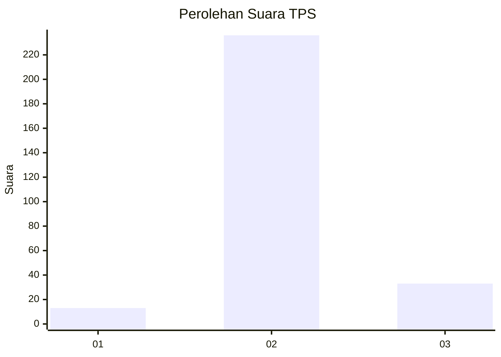
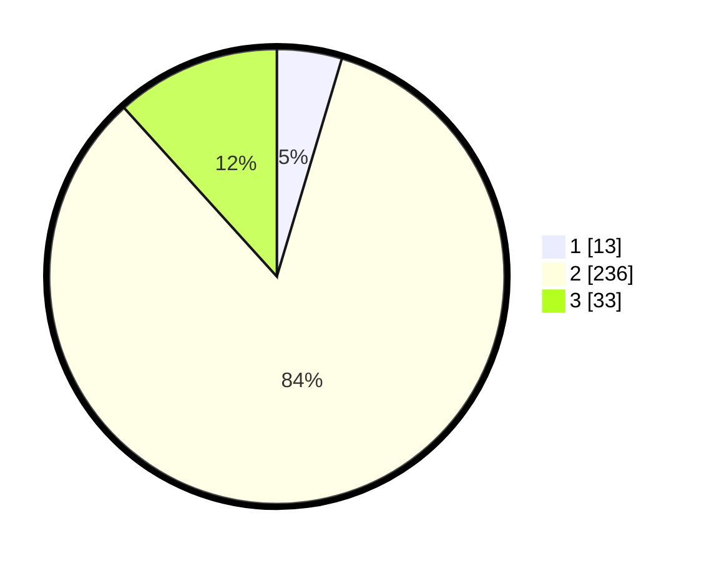

# Hasil

## Grafik

## Tabel

| No. | Nama Paslon    | Suara | Suara (raw) | Persentase |
|:--- |:-------------- | -----:| -----------:| ----------:|
| 1   | ANIES MUHAIMIN | 13    | [13][p-1]   | 4,61       |
| 2   | PRABOWO GIBRAN | 236   | [236][p-2]  | 83,69      |
| 3   | GANJAR MAHFUD  | 33    | [33][p-3]   | 11,70      |

[p-1]: https://github.com/gigit-pemilu/pemilu-2024-94-papua-tengah/blob/main/pilpres/hitung-suara/sub/94-papua-tengah/sub/01-nabire/sub/07-makimi/sub/2003-biha/sub/004-tps/sub/paslon-1.txt
[p-2]: https://github.com/gigit-pemilu/pemilu-2024-94-papua-tengah/blob/main/pilpres/hitung-suara/sub/94-papua-tengah/sub/01-nabire/sub/07-makimi/sub/2003-biha/sub/004-tps/sub/paslon-2.txt
[p-3]: https://github.com/gigit-pemilu/pemilu-2024-94-papua-tengah/blob/main/pilpres/hitung-suara/sub/94-papua-tengah/sub/01-nabire/sub/07-makimi/sub/2003-biha/sub/004-tps/sub/paslon-3.txt

## Foto C Plano

https://sirekap-obj-formc.kpu.go.id/bf64/pemilu/ppwp/94/01/07/20/03/9401072003004-20240216-152500--ff458cd4-29e9-409e-b893-c16477d6ffd6.jpg

https://sirekap-obj-formc.kpu.go.id/bf64/pemilu/ppwp/94/01/07/20/03/9401072003004-20240216-152501--ae0c7ca2-d24a-444e-a8a2-9a8ab28ba9d7.jpg

https://sirekap-obj-formc.kpu.go.id/bf64/pemilu/ppwp/94/01/07/20/03/9401072003004-20240216-152500--7957a74c-1452-4e7c-a62d-03afdca5e321.jpg

## Metadata

| Key        | Value               |
| ---------- | ------------------- |
| Time Stamp | 2024-02-16 23:30:00 |

## DATA PEMILIH TETAP

Jumlah pemilih dalam DPT: **282**.
 * L: **143**.
 * P: **139**.

## DATA PENGGUNA HAK PILIH

Jumlah pengguna hak pilih dalam DPT: **282**.
 * L: **143**.
 * P: **139**.

Jumlah pengguna hak pilih dalam DPTb: **7**.
 * L: **3**.
 * P: **4**.

Jumlah pengguna hak pilih dalam DPK: **0**.
 * L: **0**.
 * P: **0**.

Jumlah pengguna hak pilih: **289**.
 * L: **146**.
 * P: **143**.

## JUMLAH SUARA SAH DAN TIDAK SAH

JUMLAH SELURUH SUARA SAH: **282**.

JUMLAH SUARA TIDAK SAH: **7**.

JUMLAH SELURUH SUARA SAH DAN SUARA TIDAK SAH: **289**.

