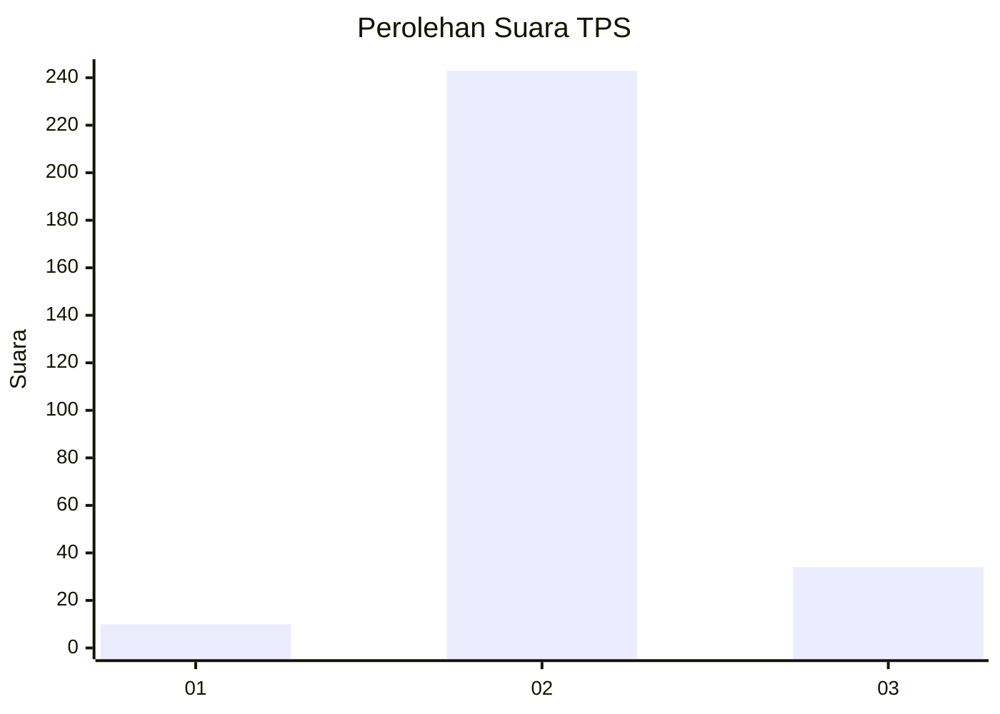
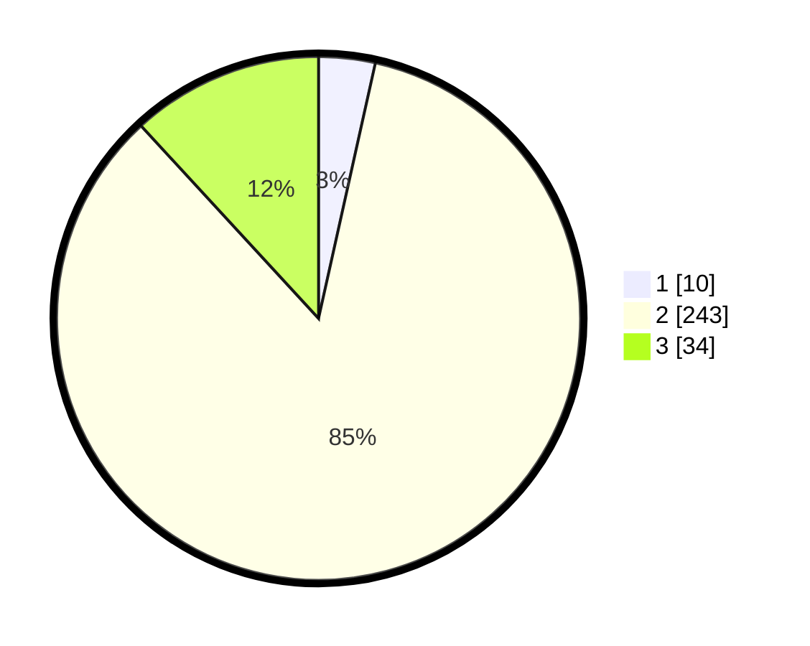

# Hasil

## Grafik

## Tabel

| No. | Nama Paslon    | Suara | Suara (raw) | Persentase |
|:--- |:-------------- | -----:| -----------:| ----------:|
| 1   | ANIES MUHAIMIN | 10    | [10][p-1]   | 3,48       |
| 2   | PRABOWO GIBRAN | 243   | [243][p-2]  | 84,67      |
| 3   | GANJAR MAHFUD  | 34    | [34][p-3]   | 11,85      |

[p-1]: https://github.com/gigit-pemilu/pemilu-2024-94-papua-tengah/blob/main/pilpres/hitung-suara/sub/94-papua-tengah/sub/01-nabire/sub/07-makimi/sub/2004-lagari-jaya/sub/001-tps/sub/paslon-1.txt
[p-2]: https://github.com/gigit-pemilu/pemilu-2024-94-papua-tengah/blob/main/pilpres/hitung-suara/sub/94-papua-tengah/sub/01-nabire/sub/07-makimi/sub/2004-lagari-jaya/sub/001-tps/sub/paslon-2.txt
[p-3]: https://github.com/gigit-pemilu/pemilu-2024-94-papua-tengah/blob/main/pilpres/hitung-suara/sub/94-papua-tengah/sub/01-nabire/sub/07-makimi/sub/2004-lagari-jaya/sub/001-tps/sub/paslon-3.txt

## Foto C Plano

https://sirekap-obj-formc.kpu.go.id/4b65/pemilu/ppwp/94/01/07/20/04/9401072004001-20240216-145359--cb5deb2b-7a7a-4993-882e-5941d29b6d47.jpg

https://sirekap-obj-formc.kpu.go.id/4b65/pemilu/ppwp/94/01/07/20/04/9401072004001-20240216-145401--869e752f-2041-40ed-9a21-3e2e78341fde.jpg

https://sirekap-obj-formc.kpu.go.id/4b65/pemilu/ppwp/94/01/07/20/04/9401072004001-20240216-145400--f92cef76-f5d4-48ba-b5b3-8c137813daec.jpg

## Metadata

| Key        | Value               |
| ---------- | ------------------- |
| Time Stamp | 2024-02-16 23:30:00 |

## DATA PEMILIH TETAP

Jumlah pemilih dalam DPT: **0**.
 * L: **0**.
 * P: **0**.

## DATA PENGGUNA HAK PILIH

Jumlah pengguna hak pilih dalam DPT: **0**.
 * L: **0**.
 * P: **0**.

Jumlah pengguna hak pilih dalam DPTb: **0**.
 * L: **0**.
 * P: **0**.

Jumlah pengguna hak pilih dalam DPK: **0**.
 * L: **0**.
 * P: **0**.

Jumlah pengguna hak pilih: **0**.
 * L: **0**.
 * P: **0**.

## JUMLAH SUARA SAH DAN TIDAK SAH

JUMLAH SELURUH SUARA SAH: **287**.

JUMLAH SUARA TIDAK SAH: **10**.

JUMLAH SELURUH SUARA SAH DAN SUARA TIDAK SAH: **297**.

