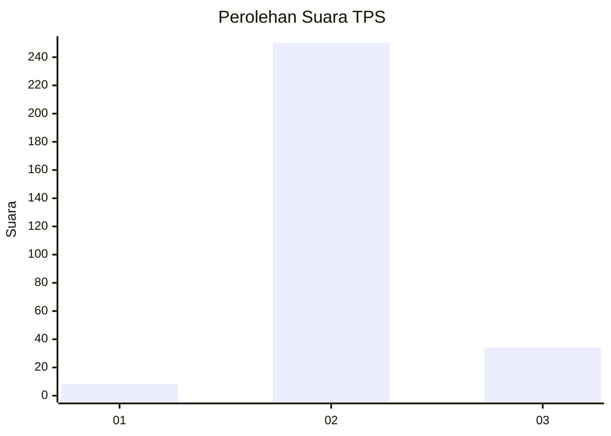
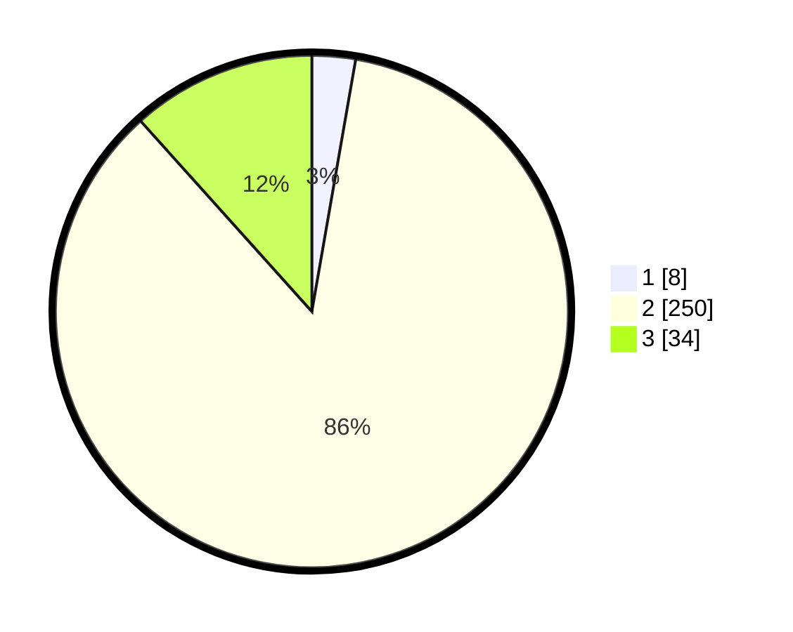

# Hasil

## Grafik

## Tabel

| No. | Nama Paslon    | Suara | Suara (raw) | Persentase |
|:--- |:-------------- | -----:| -----------:| ----------:|
| 1   | ANIES MUHAIMIN | 8     | [8][p-1]    | 2,74       |
| 2   | PRABOWO GIBRAN | 250   | [250][p-2]  | 85,62      |
| 3   | GANJAR MAHFUD  | 34    | [34][p-3]   | 11,64      |

[p-1]: https://github.com/gigit-pemilu/pemilu-2024-94-papua-tengah/blob/main/pilpres/hitung-suara/sub/94-papua-tengah/sub/01-nabire/sub/07-makimi/sub/2004-lagari-jaya/sub/002-tps/sub/paslon-1.txt
[p-2]: https://github.com/gigit-pemilu/pemilu-2024-94-papua-tengah/blob/main/pilpres/hitung-suara/sub/94-papua-tengah/sub/01-nabire/sub/07-makimi/sub/2004-lagari-jaya/sub/002-tps/sub/paslon-2.txt
[p-3]: https://github.com/gigit-pemilu/pemilu-2024-94-papua-tengah/blob/main/pilpres/hitung-suara/sub/94-papua-tengah/sub/01-nabire/sub/07-makimi/sub/2004-lagari-jaya/sub/002-tps/sub/paslon-3.txt

## Foto C Plano

https://sirekap-obj-formc.kpu.go.id/4fe6/pemilu/ppwp/94/01/07/20/04/9401072004002-20240216-153925--a61f7de5-0f64-4013-a7b7-0f27d3e10b3f.jpg

https://sirekap-obj-formc.kpu.go.id/4fe6/pemilu/ppwp/94/01/07/20/04/9401072004002-20240216-153927--2786b79a-510f-4364-8f50-e7cb4c94ae09.jpg

https://sirekap-obj-formc.kpu.go.id/4fe6/pemilu/ppwp/94/01/07/20/04/9401072004002-20240216-153926--3c69d890-f31b-4585-bfde-e96636ba21a2.jpg

## Metadata

| Key        | Value               |
| ---------- | ------------------- |
| Time Stamp | 2024-02-16 23:30:00 |

## DATA PEMILIH TETAP

Jumlah pemilih dalam DPT: **300**.
 * L: **161**.
 * P: **139**.

## DATA PENGGUNA HAK PILIH

Jumlah pengguna hak pilih dalam DPT: **300**.
 * L: **161**.
 * P: **139**.

Jumlah pengguna hak pilih dalam DPTb: **0**.
 * L: **0**.
 * P: **0**.

Jumlah pengguna hak pilih dalam DPK: **0**.
 * L: **0**.
 * P: **0**.

Jumlah pengguna hak pilih: **300**.
 * L: **161**.
 * P: **139**.

## JUMLAH SUARA SAH DAN TIDAK SAH

JUMLAH SELURUH SUARA SAH: **292**.

JUMLAH SUARA TIDAK SAH: **8**.

JUMLAH SELURUH SUARA SAH DAN SUARA TIDAK SAH: **300**.

