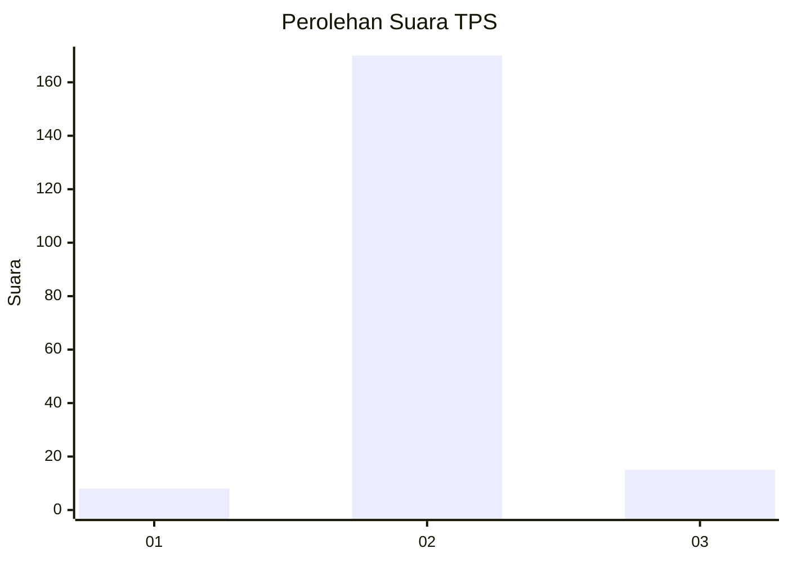
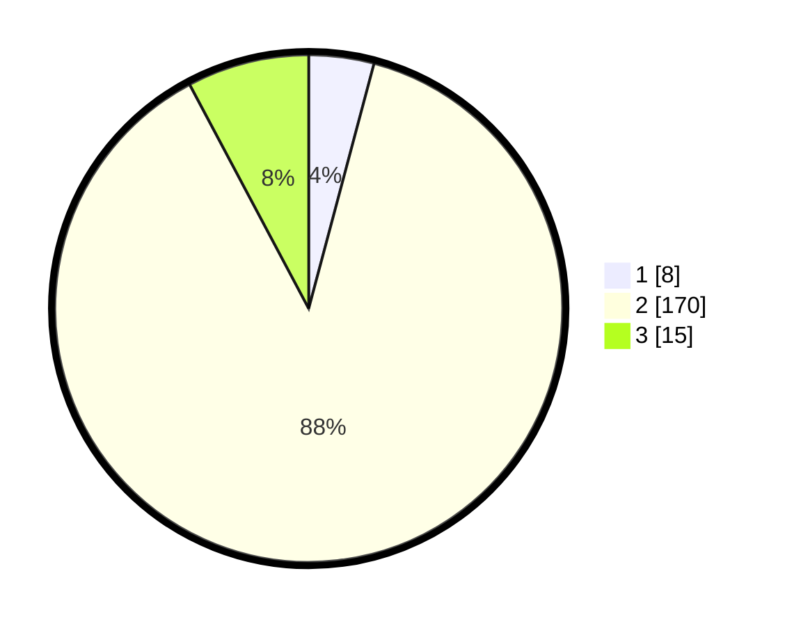

# Hasil

## Grafik

## Tabel

| No. | Nama Paslon    | Suara | Suara (raw) | Persentase |
|:--- |:-------------- | -----:| -----------:| ----------:|
| 1   | ANIES MUHAIMIN | 8     | [8][p-1]    | 4,15       |
| 2   | PRABOWO GIBRAN | 170   | [170][p-2]  | 88,08      |
| 3   | GANJAR MAHFUD  | 15    | [15][p-3]   | 7,77       |

[p-1]: https://github.com/gigit-pemilu/pemilu-2024-94-papua-tengah/blob/main/pilpres/hitung-suara/sub/94-papua-tengah/sub/01-nabire/sub/07-makimi/sub/2004-lagari-jaya/sub/004-tps/sub/paslon-1.txt
[p-2]: https://github.com/gigit-pemilu/pemilu-2024-94-papua-tengah/blob/main/pilpres/hitung-suara/sub/94-papua-tengah/sub/01-nabire/sub/07-makimi/sub/2004-lagari-jaya/sub/004-tps/sub/paslon-2.txt
[p-3]: https://github.com/gigit-pemilu/pemilu-2024-94-papua-tengah/blob/main/pilpres/hitung-suara/sub/94-papua-tengah/sub/01-nabire/sub/07-makimi/sub/2004-lagari-jaya/sub/004-tps/sub/paslon-3.txt

## Foto C Plano

https://sirekap-obj-formc.kpu.go.id/8e52/pemilu/ppwp/94/01/07/20/04/9401072004004-20240216-151918--1b601542-78f2-4cdd-9d4b-dc4d1a58c721.jpg

https://sirekap-obj-formc.kpu.go.id/8e52/pemilu/ppwp/94/01/07/20/04/9401072004004-20240216-151920--6f603cff-0302-478e-9c87-e48f1923505a.jpg

https://sirekap-obj-formc.kpu.go.id/8e52/pemilu/ppwp/94/01/07/20/04/9401072004004-20240216-151919--743ea4f5-b7b4-48ce-977e-9bc0c15161f9.jpg

## Metadata

| Key        | Value               |
| ---------- | ------------------- |
| Time Stamp | 2024-02-16 23:30:00 |

## DATA PEMILIH TETAP

Jumlah pemilih dalam DPT: **193**.
 * L: **95**.
 * P: **98**.

## DATA PENGGUNA HAK PILIH

Jumlah pengguna hak pilih dalam DPT: **193**.
 * L: **95**.
 * P: **98**.

Jumlah pengguna hak pilih dalam DPTb: **0**.
 * L: **0**.
 * P: **0**.

Jumlah pengguna hak pilih dalam DPK: **0**.
 * L: **0**.
 * P: **0**.

Jumlah pengguna hak pilih: **193**.
 * L: **95**.
 * P: **98**.

## JUMLAH SUARA SAH DAN TIDAK SAH

JUMLAH SELURUH SUARA SAH: **193**.

JUMLAH SUARA TIDAK SAH: **0**.

JUMLAH SELURUH SUARA SAH DAN SUARA TIDAK SAH: **193**.

