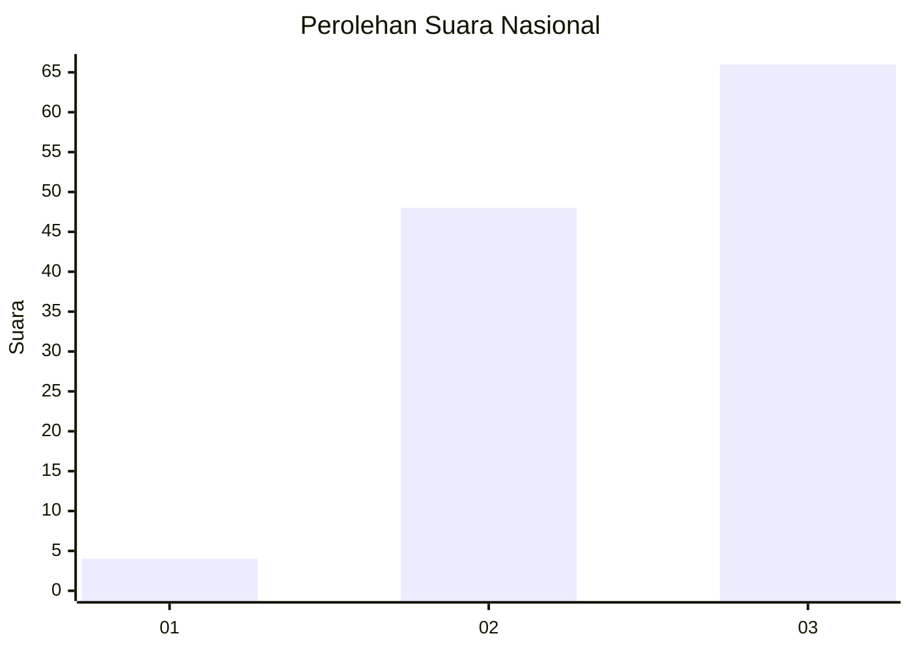
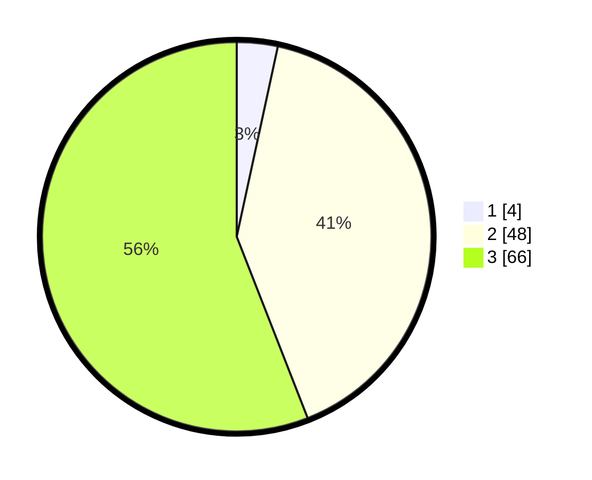

# Hasil

## Grafik

## Tabel

| No. | Nama Paslon    | Suara | Suara (raw) | Persentase |
|:--- |:-------------- | -----:| -----------:| ----------:|
| 1   | ANIES MUHAIMIN | 4     | [4][p-1]    | 3,39       |
| 2   | PRABOWO GIBRAN | 48    | [48][p-2]   | 40,68      |
| 3   | GANJAR MAHFUD  | 66    | [66][p-3]   | 55,93      |

[p-1]: https://github.com/gigit-pemilu/pemilu-2024/blob/main/pilpres/hitung-suara/sub/94-papua-tengah/sub/01-nabire/sub/08-teluk-umar/sub/2001-napan-yaur/sub/001-tps/sub/paslon-1.txt
[p-2]: https://github.com/gigit-pemilu/pemilu-2024/blob/main/pilpres/hitung-suara/sub/94-papua-tengah/sub/01-nabire/sub/08-teluk-umar/sub/2001-napan-yaur/sub/001-tps/sub/paslon-2.txt
[p-3]: https://github.com/gigit-pemilu/pemilu-2024/blob/main/pilpres/hitung-suara/sub/94-papua-tengah/sub/01-nabire/sub/08-teluk-umar/sub/2001-napan-yaur/sub/001-tps/sub/paslon-3.txt

## Foto C Plano

https://sirekap-obj-formc.kpu.go.id/243b/pemilu/ppwp/94/01/08/20/01/9401082001001-20240215-151853--bad844ec-4ba8-45d6-8dc8-df598b521199.jpg

https://sirekap-obj-formc.kpu.go.id/243b/pemilu/ppwp/94/01/08/20/01/9401082001001-20240215-151923--e0dc9360-b890-4c99-b407-da7b45b51d91.jpg

https://sirekap-obj-formc.kpu.go.id/243b/pemilu/ppwp/94/01/08/20/01/9401082001001-20240215-151945--0db18114-7c2e-415a-954b-4633b66ca06b.jpg

## Metadata

| Key        | Value               |
| ---------- | ------------------- |
| Time Stamp | 2024-02-15 22:00:27 |

