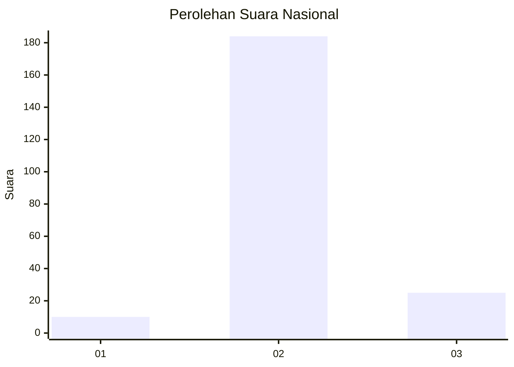
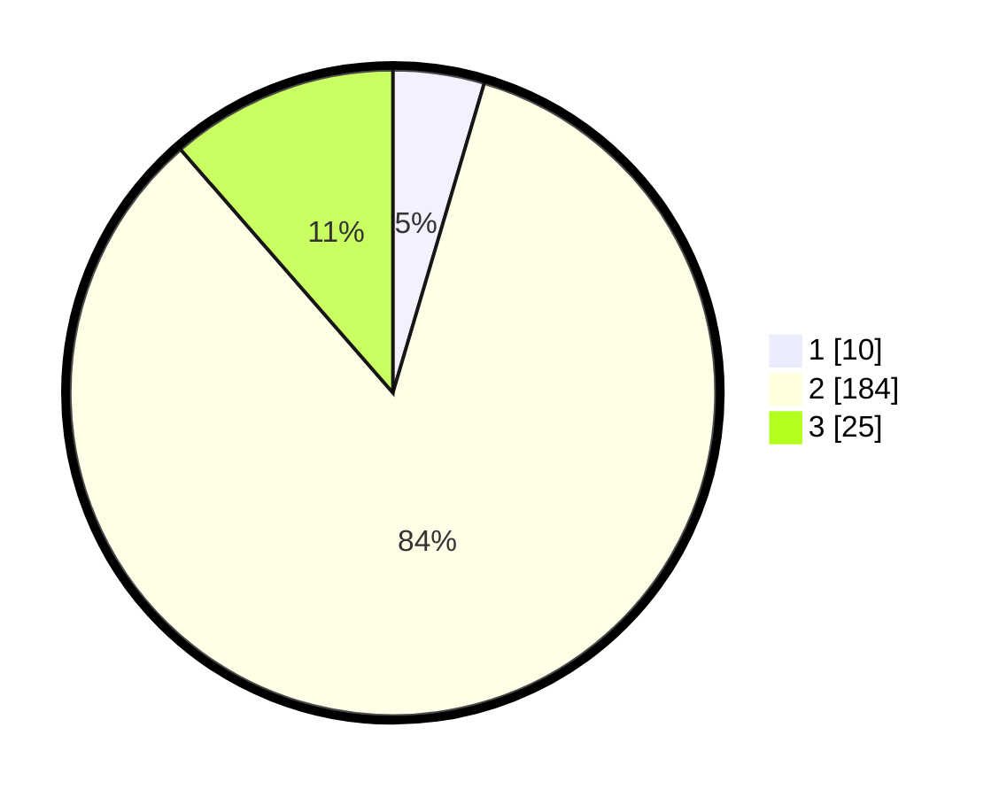

# Hasil

## Grafik

## Tabel

| No. | Nama Paslon    | Suara | Suara (raw) | Persentase |
|:--- |:-------------- | -----:| -----------:| ----------:|
| 1   | ANIES MUHAIMIN | 10    | [10][p-1]   | 4,57       |
| 2   | PRABOWO GIBRAN | 184   | [184][p-2]  | 84,02      |
| 3   | GANJAR MAHFUD  | 25    | [25][p-3]   | 11,42      |

[p-1]: https://github.com/gigit-pemilu/pemilu-2024/blob/main/pilpres/hitung-suara/sub/94-papua-tengah/sub/01-nabire/sub/09-teluk-kimi/sub/2001-samabusa/sub/004-tps/sub/paslon-1.txt
[p-2]: https://github.com/gigit-pemilu/pemilu-2024/blob/main/pilpres/hitung-suara/sub/94-papua-tengah/sub/01-nabire/sub/09-teluk-kimi/sub/2001-samabusa/sub/004-tps/sub/paslon-2.txt
[p-3]: https://github.com/gigit-pemilu/pemilu-2024/blob/main/pilpres/hitung-suara/sub/94-papua-tengah/sub/01-nabire/sub/09-teluk-kimi/sub/2001-samabusa/sub/004-tps/sub/paslon-3.txt

## Foto C Plano

https://sirekap-obj-formc.kpu.go.id/b182/pemilu/ppwp/94/01/09/20/01/9401092001004-20240214-155524--7e330289-40f1-4929-89e0-0a0212ee13bd.jpg

https://sirekap-obj-formc.kpu.go.id/b182/pemilu/ppwp/94/01/09/20/01/9401092001004-20240214-155919--f9bea1e9-c98b-4dca-b916-0f015054cbcd.jpg

https://sirekap-obj-formc.kpu.go.id/b182/pemilu/ppwp/94/01/09/20/01/9401092001004-20240214-155612--f29dbec1-0a39-4caa-96d4-00a232d767eb.jpg

## Metadata

| Key        | Value               |
| ---------- | ------------------- |
| Time Stamp | 2024-02-15 22:00:27 |

