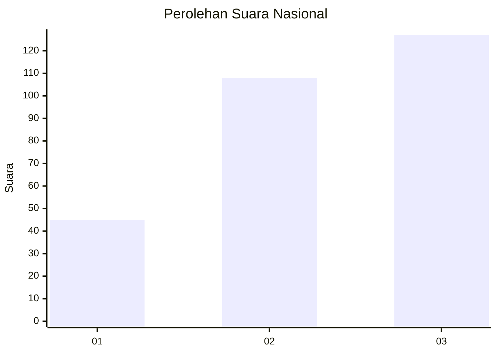
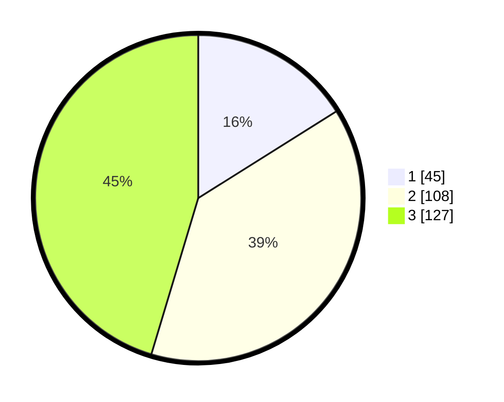

# Hasil

## Grafik

## Tabel

| No. | Nama Paslon    | Suara | Suara (raw) | Persentase |
|:--- |:-------------- | -----:| -----------:| ----------:|
| 1   | ANIES MUHAIMIN | 45    | [45][p-1]   | 16,07      |
| 2   | PRABOWO GIBRAN | 108   | [108][p-2]  | 38,57      |
| 3   | GANJAR MAHFUD  | 127   | [127][p-3]  | 45,36      |

[p-1]: https://github.com/gigit-pemilu/pemilu-2024/blob/main/pilpres/hitung-suara/sub/94-papua-tengah/sub/01-nabire/sub/09-teluk-kimi/sub/2001-samabusa/sub/012-tps/sub/paslon-1.txt
[p-2]: https://github.com/gigit-pemilu/pemilu-2024/blob/main/pilpres/hitung-suara/sub/94-papua-tengah/sub/01-nabire/sub/09-teluk-kimi/sub/2001-samabusa/sub/012-tps/sub/paslon-2.txt
[p-3]: https://github.com/gigit-pemilu/pemilu-2024/blob/main/pilpres/hitung-suara/sub/94-papua-tengah/sub/01-nabire/sub/09-teluk-kimi/sub/2001-samabusa/sub/012-tps/sub/paslon-3.txt

## Foto C Plano

https://sirekap-obj-formc.kpu.go.id/262e/pemilu/ppwp/94/01/09/20/01/9401092001012-20240215-051603--b2d06bd6-0529-4e4b-a1ea-23031244900a.jpg

https://sirekap-obj-formc.kpu.go.id/262e/pemilu/ppwp/94/01/09/20/01/9401092001012-20240215-052024--da8c3c15-fab4-450b-b644-bd311f07969c.jpg

https://sirekap-obj-formc.kpu.go.id/262e/pemilu/ppwp/94/01/09/20/01/9401092001012-20240215-052401--a7b19566-c943-4680-bc80-fb806ae01e18.jpg

## Metadata

| Key        | Value               |
| ---------- | ------------------- |
| Time Stamp | 2024-02-15 22:00:27 |

