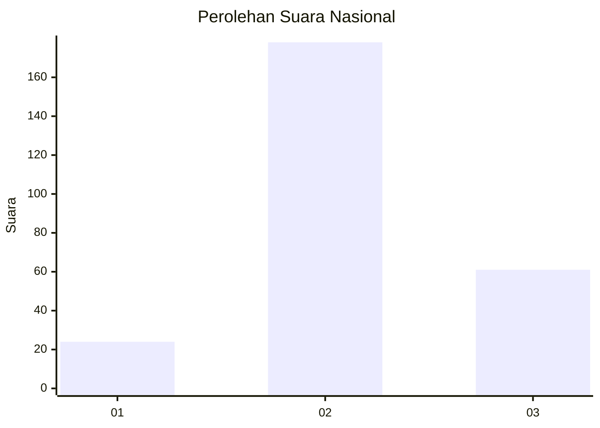
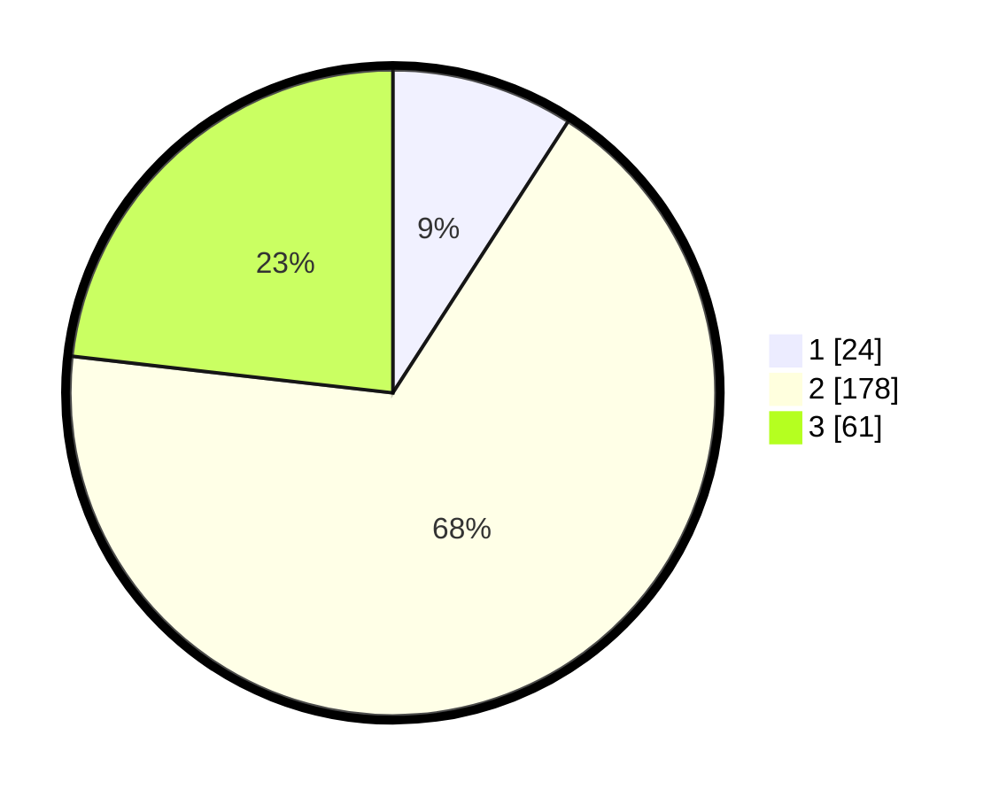

# Hasil

## Grafik

## Tabel

| No. | Nama Paslon    | Suara | Suara (raw) | Persentase |
|:--- |:-------------- | -----:| -----------:| ----------:|
| 1   | ANIES MUHAIMIN | 24    | [24][p-1]   | 9,13       |
| 2   | PRABOWO GIBRAN | 178   | [178][p-2]  | 67,68      |
| 3   | GANJAR MAHFUD  | 61    | [61][p-3]   | 23,19      |

[p-1]: https://github.com/gigit-pemilu/pemilu-2024/blob/main/pilpres/hitung-suara/sub/94-papua-tengah/sub/01-nabire/sub/09-teluk-kimi/sub/2001-samabusa/sub/014-tps/sub/paslon-1.txt
[p-2]: https://github.com/gigit-pemilu/pemilu-2024/blob/main/pilpres/hitung-suara/sub/94-papua-tengah/sub/01-nabire/sub/09-teluk-kimi/sub/2001-samabusa/sub/014-tps/sub/paslon-2.txt
[p-3]: https://github.com/gigit-pemilu/pemilu-2024/blob/main/pilpres/hitung-suara/sub/94-papua-tengah/sub/01-nabire/sub/09-teluk-kimi/sub/2001-samabusa/sub/014-tps/sub/paslon-3.txt

## Foto C Plano

https://sirekap-obj-formc.kpu.go.id/dd4d/pemilu/ppwp/94/01/09/20/01/9401092001014-20240214-210417--45cdaac3-6637-4754-9a94-b935a3ebfd39.jpg

https://sirekap-obj-formc.kpu.go.id/dd4d/pemilu/ppwp/94/01/09/20/01/9401092001014-20240214-210525--66a893a8-d59d-4da7-8cf5-ddcc3348c7d1.jpg

https://sirekap-obj-formc.kpu.go.id/dd4d/pemilu/ppwp/94/01/09/20/01/9401092001014-20240214-210701--612dc993-0177-4535-84af-d95114843000.jpg

## Metadata

| Key        | Value               |
| ---------- | ------------------- |
| Time Stamp | 2024-02-15 22:00:27 |

## DATA PEMILIH TETAP

Jumlah pemilih dalam DPT: **360**.
 * L: **153**.
 * P: **147**.

## DATA PENGGUNA HAK PILIH

Jumlah pengguna hak pilih dalam DPT: **300**.
 * L: **153**.
 * P: **147**.

Jumlah pengguna hak pilih dalam DPTb: **0**.
 * L: **0**.
 * P: **0**.

Jumlah pengguna hak pilih dalam DPK: **0**.
 * L: **0**.
 * P: **0**.

Jumlah pengguna hak pilih: **300**.
 * L: **153**.
 * P: **197**.

## JUMLAH SUARA SAH DAN TIDAK SAH

JUMLAH SELURUH SUARA SAH: **263**.

JUMLAH SUARA TIDAK SAH: **37**.

JUMLAH SELURUH SUARA SAH DAN SUARA TIDAK SAH: **300**.

