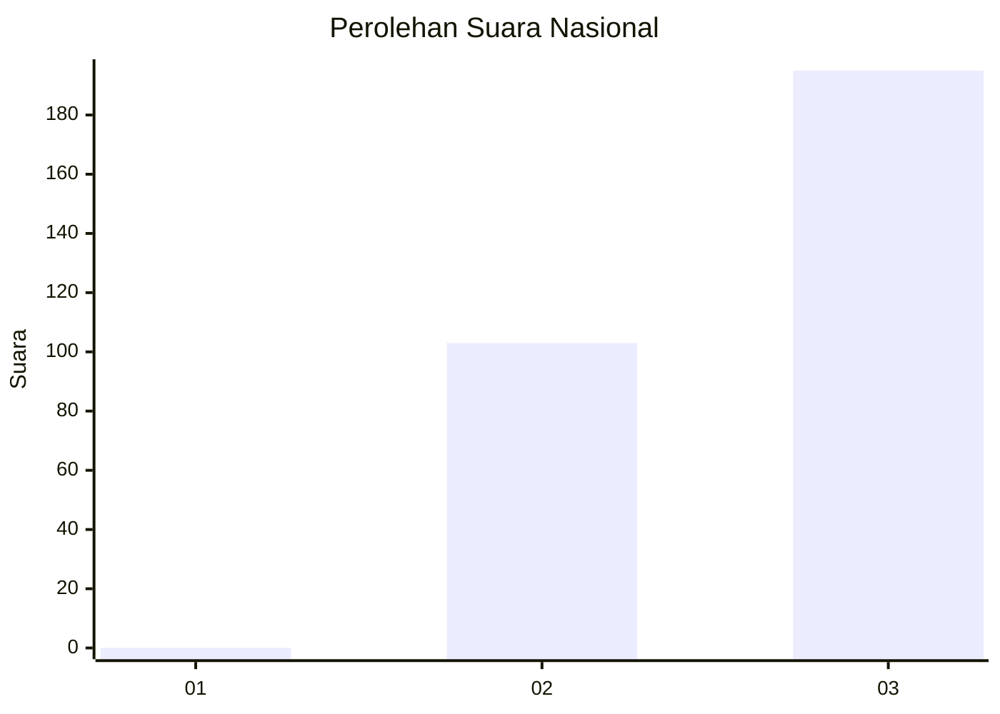
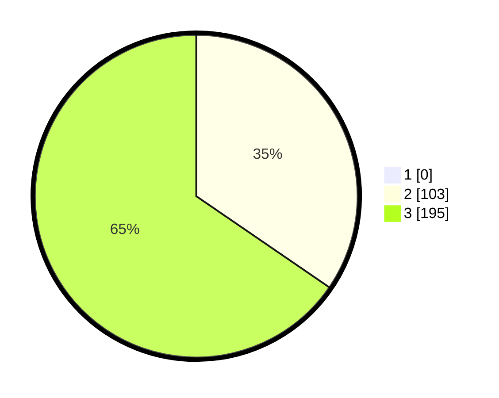

# Hasil

## Grafik

## Tabel

| No. | Nama Paslon    | Suara | Suara (raw) | Persentase |
|:--- |:-------------- | -----:| -----------:| ----------:|
| 1   | ANIES MUHAIMIN | 0     | [0][p-1]    | 0,00       |
| 2   | PRABOWO GIBRAN | 103   | [103][p-2]  | 34,56      |
| 3   | GANJAR MAHFUD  | 195   | [195][p-3]  | 65,44      |

[p-1]: https://github.com/gigit-pemilu/pemilu-2024/blob/main/pilpres/hitung-suara/sub/94-papua-tengah/sub/01-nabire/sub/09-teluk-kimi/sub/2001-samabusa/sub/016-tps/sub/paslon-1.txt
[p-2]: https://github.com/gigit-pemilu/pemilu-2024/blob/main/pilpres/hitung-suara/sub/94-papua-tengah/sub/01-nabire/sub/09-teluk-kimi/sub/2001-samabusa/sub/016-tps/sub/paslon-2.txt
[p-3]: https://github.com/gigit-pemilu/pemilu-2024/blob/main/pilpres/hitung-suara/sub/94-papua-tengah/sub/01-nabire/sub/09-teluk-kimi/sub/2001-samabusa/sub/016-tps/sub/paslon-3.txt

## Foto C Plano

https://sirekap-obj-formc.kpu.go.id/265f/pemilu/ppwp/94/01/09/20/01/9401092001016-20240215-071021--d7549966-b20c-4402-89b4-619b39f5d858.jpg

https://sirekap-obj-formc.kpu.go.id/265f/pemilu/ppwp/94/01/09/20/01/9401092001016-20240215-071046--16f3d848-5869-46ef-a1f4-8feb5397d44d.jpg

https://sirekap-obj-formc.kpu.go.id/265f/pemilu/ppwp/94/01/09/20/01/9401092001016-20240215-071108--b713913e-3820-4f1e-8ea4-6be6990a4550.jpg

## Metadata

| Key        | Value               |
| ---------- | ------------------- |
| Time Stamp | 2024-02-15 22:00:27 |

