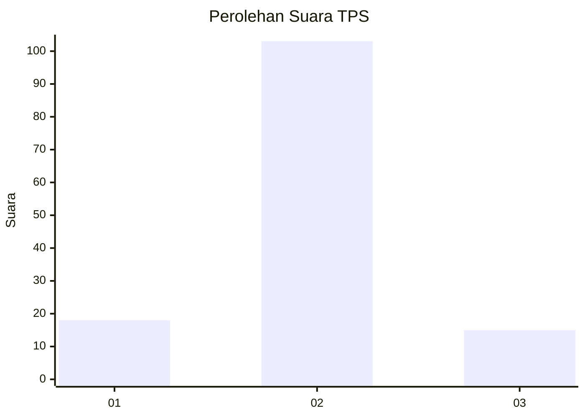
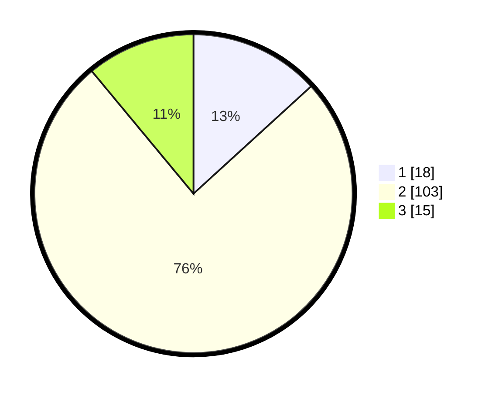

# Hasil

## Grafik

## Tabel

| No. | Nama Paslon    | Suara | Suara (raw) | Persentase |
|:--- |:-------------- | -----:| -----------:| ----------:|
| 1   | ANIES MUHAIMIN | 18    | [18][p-1]   | 13,24      |
| 2   | PRABOWO GIBRAN | 103   | [103][p-2]  | 75,74      |
| 3   | GANJAR MAHFUD  | 15    | [15][p-3]   | 11,03      |

[p-1]: https://github.com/gigit-pemilu/pemilu-2024-94-papua-tengah/blob/main/pilpres/hitung-suara/sub/94-papua-tengah/sub/01-nabire/sub/09-teluk-kimi/sub/2002-waharia/sub/004-tps/sub/paslon-1.txt
[p-2]: https://github.com/gigit-pemilu/pemilu-2024-94-papua-tengah/blob/main/pilpres/hitung-suara/sub/94-papua-tengah/sub/01-nabire/sub/09-teluk-kimi/sub/2002-waharia/sub/004-tps/sub/paslon-2.txt
[p-3]: https://github.com/gigit-pemilu/pemilu-2024-94-papua-tengah/blob/main/pilpres/hitung-suara/sub/94-papua-tengah/sub/01-nabire/sub/09-teluk-kimi/sub/2002-waharia/sub/004-tps/sub/paslon-3.txt

## Foto C Plano

https://sirekap-obj-formc.kpu.go.id/080d/pemilu/ppwp/94/01/09/20/02/9401092002004-20240216-175436--63eb1637-4c7b-4feb-8b67-a0007986f0ba.jpg

https://sirekap-obj-formc.kpu.go.id/080d/pemilu/ppwp/94/01/09/20/02/9401092002004-20240216-212059--a6117553-4a68-4dc5-94c9-07c646e57dcc.jpg

## Metadata

| Key        | Value               |
| ---------- | ------------------- |
| Time Stamp | 2024-02-24 22:31:28 |

