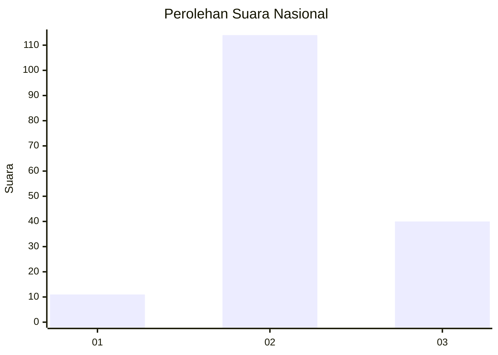
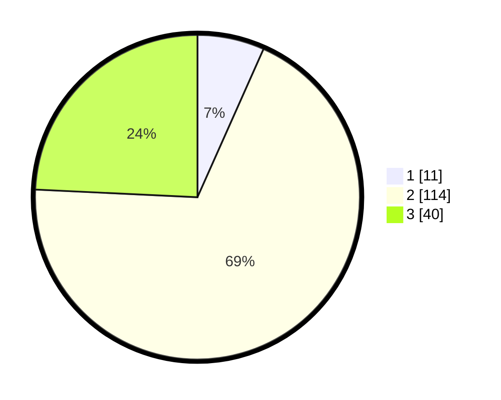

# Hasil

## Grafik

## Tabel

| No. | Nama Paslon    | Suara | Suara (raw) | Persentase |
|:--- |:-------------- | -----:| -----------:| ----------:|
| 1   | ANIES MUHAIMIN | 11    | [11][p-1]   | 6,67       |
| 2   | PRABOWO GIBRAN | 114   | [114][p-2]  | 69,09      |
| 3   | GANJAR MAHFUD  | 40    | [40][p-3]   | 24,24      |

[p-1]: https://github.com/gigit-pemilu/pemilu-2024/blob/main/pilpres/hitung-suara/sub/94-papua-tengah/sub/01-nabire/sub/09-teluk-kimi/sub/2002-waharia/sub/005-tps/sub/paslon-1.txt
[p-2]: https://github.com/gigit-pemilu/pemilu-2024/blob/main/pilpres/hitung-suara/sub/94-papua-tengah/sub/01-nabire/sub/09-teluk-kimi/sub/2002-waharia/sub/005-tps/sub/paslon-2.txt
[p-3]: https://github.com/gigit-pemilu/pemilu-2024/blob/main/pilpres/hitung-suara/sub/94-papua-tengah/sub/01-nabire/sub/09-teluk-kimi/sub/2002-waharia/sub/005-tps/sub/paslon-3.txt

## Foto C Plano

https://sirekap-obj-formc.kpu.go.id/3226/pemilu/ppwp/94/01/09/20/02/9401092002005-20240215-141618--ec5557fa-776c-425a-a816-8d7d6c811431.jpg

https://sirekap-obj-formc.kpu.go.id/3226/pemilu/ppwp/94/01/09/20/02/9401092002005-20240215-141749--f0774507-0470-4e11-a827-7bf4b07b260c.jpg

https://sirekap-obj-formc.kpu.go.id/3226/pemilu/ppwp/94/01/09/20/02/9401092002005-20240215-141846--bf89feac-a5dc-45f9-acae-c5d3dac0f87d.jpg

## Metadata

| Key        | Value               |
| ---------- | ------------------- |
| Time Stamp | 2024-02-15 22:00:27 |

