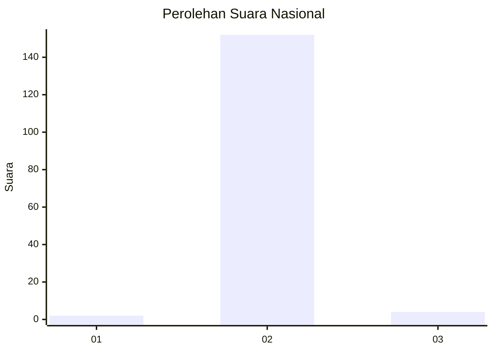
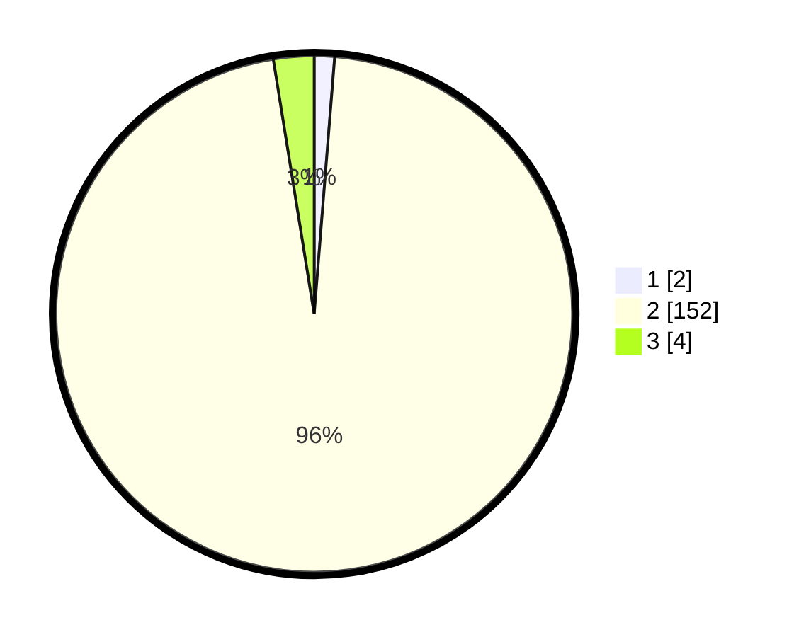

# Hasil

## Grafik

## Tabel

| No. | Nama Paslon    | Suara | Suara (raw) | Persentase |
|:--- |:-------------- | -----:| -----------:| ----------:|
| 1   | ANIES MUHAIMIN | 2     | [2][p-1]    | 1,27       |
| 2   | PRABOWO GIBRAN | 152   | [152][p-2]  | 96,20      |
| 3   | GANJAR MAHFUD  | 4     | [4][p-3]    | 2,53       |

[p-1]: https://github.com/gigit-pemilu/pemilu-2024/blob/main/pilpres/hitung-suara/sub/94-papua-tengah/sub/01-nabire/sub/09-teluk-kimi/sub/2003-kimi/sub/007-tps/sub/paslon-1.txt
[p-2]: https://github.com/gigit-pemilu/pemilu-2024/blob/main/pilpres/hitung-suara/sub/94-papua-tengah/sub/01-nabire/sub/09-teluk-kimi/sub/2003-kimi/sub/007-tps/sub/paslon-2.txt
[p-3]: https://github.com/gigit-pemilu/pemilu-2024/blob/main/pilpres/hitung-suara/sub/94-papua-tengah/sub/01-nabire/sub/09-teluk-kimi/sub/2003-kimi/sub/007-tps/sub/paslon-3.txt

## Foto C Plano

https://sirekap-obj-formc.kpu.go.id/331a/pemilu/ppwp/94/01/09/20/03/9401092003007-20240214-233956--5c6f6142-8d67-4887-a8a3-604bd9d669b3.jpg

https://sirekap-obj-formc.kpu.go.id/331a/pemilu/ppwp/94/01/09/20/03/9401092003007-20240214-234310--5e55fbed-0da7-4cb5-a873-84c4a36579c2.jpg

https://sirekap-obj-formc.kpu.go.id/331a/pemilu/ppwp/94/01/09/20/03/9401092003007-20240214-234536--5f04aefd-4f1a-4a4a-bdeb-9d921634524a.jpg

## Metadata

| Key        | Value               |
| ---------- | ------------------- |
| Time Stamp | 2024-02-15 21:30:27 |

