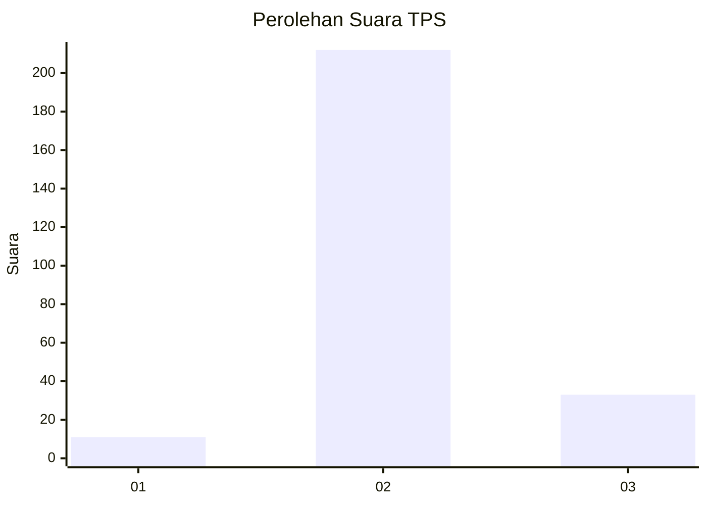
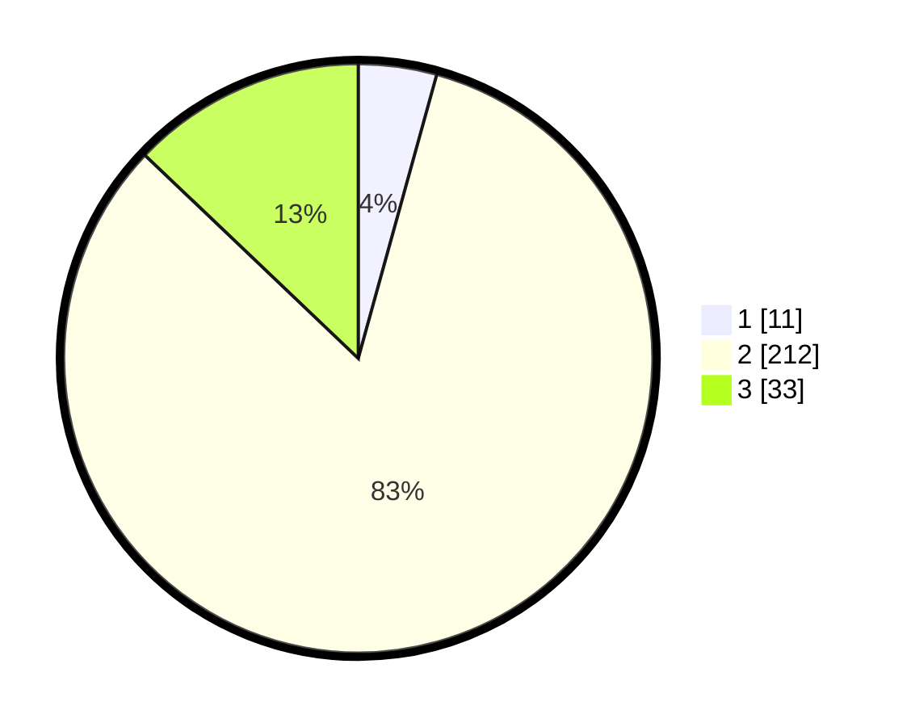

# Hasil

## Grafik

## Tabel

| No. | Nama Paslon    | Suara | Suara (raw) | Persentase |
|:--- |:-------------- | -----:| -----------:| ----------:|
| 1   | ANIES MUHAIMIN | 11    | [11][p-1]   | 4,30       |
| 2   | PRABOWO GIBRAN | 212   | [212][p-2]  | 82,81      |
| 3   | GANJAR MAHFUD  | 33    | [33][p-3]   | 12,89      |

[p-1]: https://github.com/gigit-pemilu/pemilu-2024-94-papua-tengah/blob/main/pilpres/hitung-suara/sub/94-papua-tengah/sub/01-nabire/sub/09-teluk-kimi/sub/2004-lani/sub/005-tps/sub/paslon-1.txt
[p-2]: https://github.com/gigit-pemilu/pemilu-2024-94-papua-tengah/blob/main/pilpres/hitung-suara/sub/94-papua-tengah/sub/01-nabire/sub/09-teluk-kimi/sub/2004-lani/sub/005-tps/sub/paslon-2.txt
[p-3]: https://github.com/gigit-pemilu/pemilu-2024-94-papua-tengah/blob/main/pilpres/hitung-suara/sub/94-papua-tengah/sub/01-nabire/sub/09-teluk-kimi/sub/2004-lani/sub/005-tps/sub/paslon-3.txt

## Foto C Plano

https://sirekap-obj-formc.kpu.go.id/c9fa/pemilu/ppwp/94/01/09/20/04/9401092004005-20240217-193904--16d30187-a4ca-4fe3-aa59-8683ab7b01b0.jpg

https://sirekap-obj-formc.kpu.go.id/c9fa/pemilu/ppwp/94/01/09/20/04/9401092004005-20240217-195252--e3082052-eac7-4054-85ef-ad5a51f61f91.jpg

## Metadata

| Key        | Value               |
| ---------- | ------------------- |
| Time Stamp | 2024-02-25 12:00:00 |

