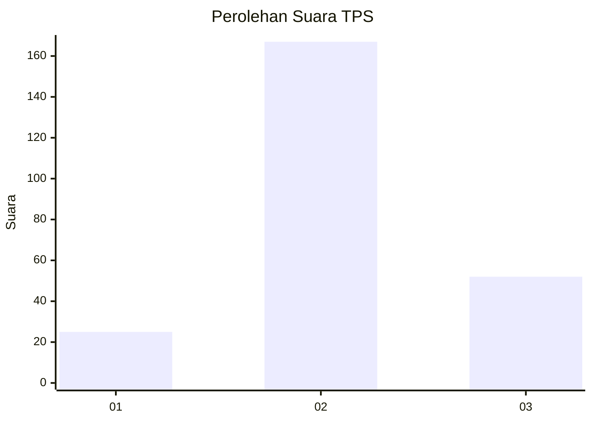
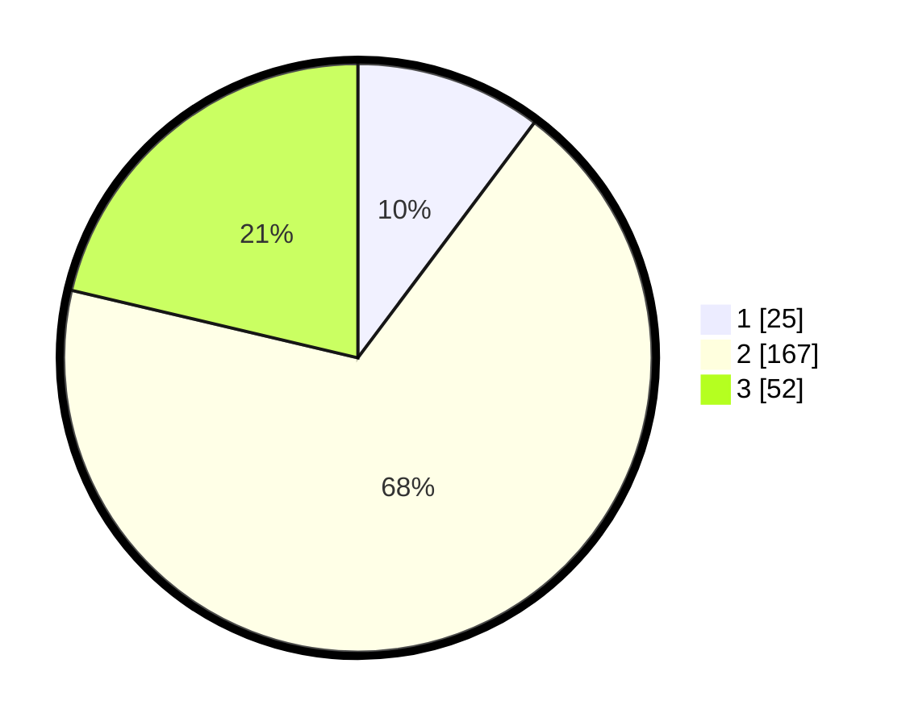

# Hasil

## Grafik

## Tabel

| No. | Nama Paslon    | Suara | Suara (raw) | Persentase |
|:--- |:-------------- | -----:| -----------:| ----------:|
| 1   | ANIES MUHAIMIN | 25    | [25][p-1]   | 10,25      |
| 2   | PRABOWO GIBRAN | 167   | [167][p-2]  | 68,44      |
| 3   | GANJAR MAHFUD  | 52    | [52][p-3]   | 21,31      |

[p-1]: https://github.com/gigit-pemilu/pemilu-2024-94-papua-tengah/blob/main/pilpres/hitung-suara/sub/94-papua-tengah/sub/01-nabire/sub/09-teluk-kimi/sub/2005-air-mandidi/sub/001-tps/sub/paslon-1.txt
[p-2]: https://github.com/gigit-pemilu/pemilu-2024-94-papua-tengah/blob/main/pilpres/hitung-suara/sub/94-papua-tengah/sub/01-nabire/sub/09-teluk-kimi/sub/2005-air-mandidi/sub/001-tps/sub/paslon-2.txt
[p-3]: https://github.com/gigit-pemilu/pemilu-2024-94-papua-tengah/blob/main/pilpres/hitung-suara/sub/94-papua-tengah/sub/01-nabire/sub/09-teluk-kimi/sub/2005-air-mandidi/sub/001-tps/sub/paslon-3.txt

## Foto C Plano

https://sirekap-obj-formc.kpu.go.id/a822/pemilu/ppwp/94/01/09/20/05/9401092005001-20240216-192918--cc9e85d9-5cd1-4f0f-8241-2d3af41d3350.jpg

https://sirekap-obj-formc.kpu.go.id/a822/pemilu/ppwp/94/01/09/20/05/9401092005001-20240216-193148--6cb0f7e1-e3fa-4ad8-bec9-df2415891f2b.jpg

https://sirekap-obj-formc.kpu.go.id/a822/pemilu/ppwp/94/01/09/20/05/9401092005001-20240216-192312--88987cc7-1253-4ff1-bdce-93b6eecd0348.jpg

## Metadata

| Key        | Value               |
| ---------- | ------------------- |
| Time Stamp | 2024-02-25 12:00:00 |

