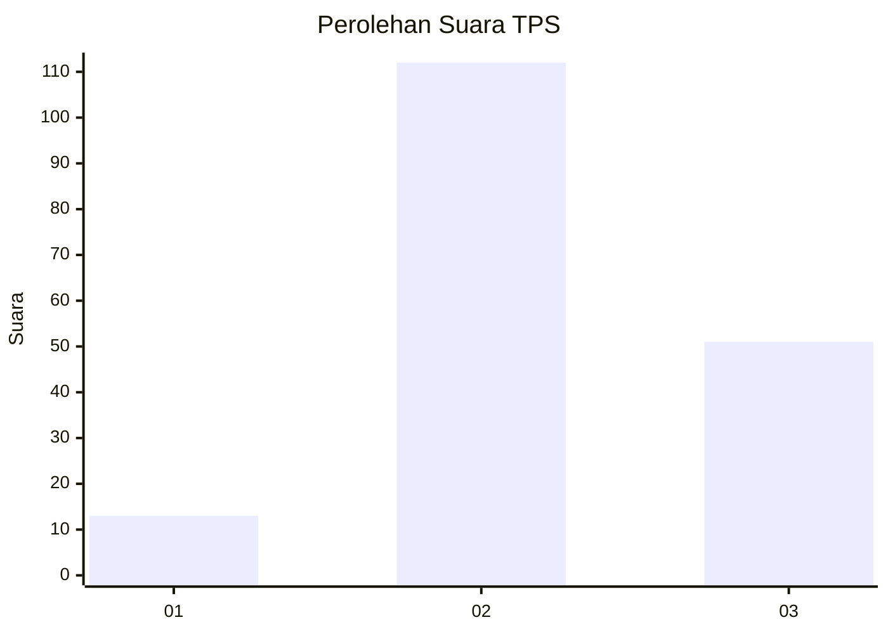
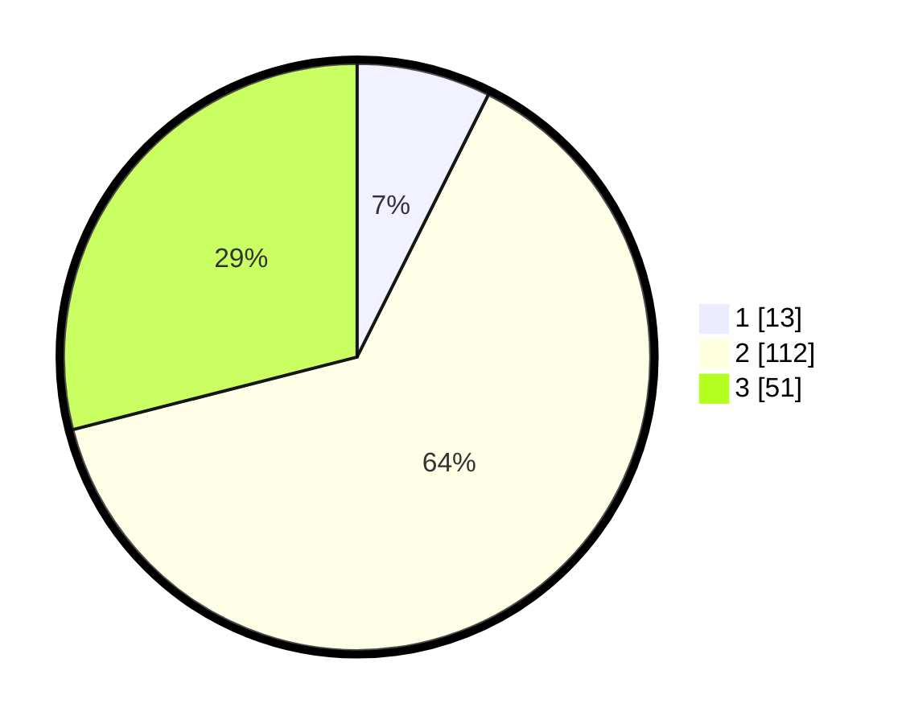

# Hasil

## Grafik

## Tabel

| No. | Nama Paslon    | Suara | Suara (raw) | Persentase |
|:--- |:-------------- | -----:| -----------:| ----------:|
| 1   | ANIES MUHAIMIN | 13    | [13][p-1]   | 7,39       |
| 2   | PRABOWO GIBRAN | 112   | [112][p-2]  | 63,64      |
| 3   | GANJAR MAHFUD  | 51    | [51][p-3]   | 28,98      |

[p-1]: https://github.com/gigit-pemilu/pemilu-2024-94-papua-tengah/blob/main/pilpres/hitung-suara/sub/94-papua-tengah/sub/01-nabire/sub/09-teluk-kimi/sub/2005-air-mandidi/sub/002-tps/sub/paslon-1.txt
[p-2]: https://github.com/gigit-pemilu/pemilu-2024-94-papua-tengah/blob/main/pilpres/hitung-suara/sub/94-papua-tengah/sub/01-nabire/sub/09-teluk-kimi/sub/2005-air-mandidi/sub/002-tps/sub/paslon-2.txt
[p-3]: https://github.com/gigit-pemilu/pemilu-2024-94-papua-tengah/blob/main/pilpres/hitung-suara/sub/94-papua-tengah/sub/01-nabire/sub/09-teluk-kimi/sub/2005-air-mandidi/sub/002-tps/sub/paslon-3.txt

## Foto C Plano

https://sirekap-obj-formc.kpu.go.id/6e97/pemilu/ppwp/94/01/09/20/05/9401092005002-20240215-003917--f274d169-2627-4d32-a725-21f8ce75934b.jpg

https://sirekap-obj-formc.kpu.go.id/6e97/pemilu/ppwp/94/01/09/20/05/9401092005002-20240215-004144--10c3b50a-8fe2-44f8-86ec-15ef8f01a7b0.jpg

## Metadata

| Key        | Value               |
| ---------- | ------------------- |
| Time Stamp | 2024-02-15 21:01:18 |

