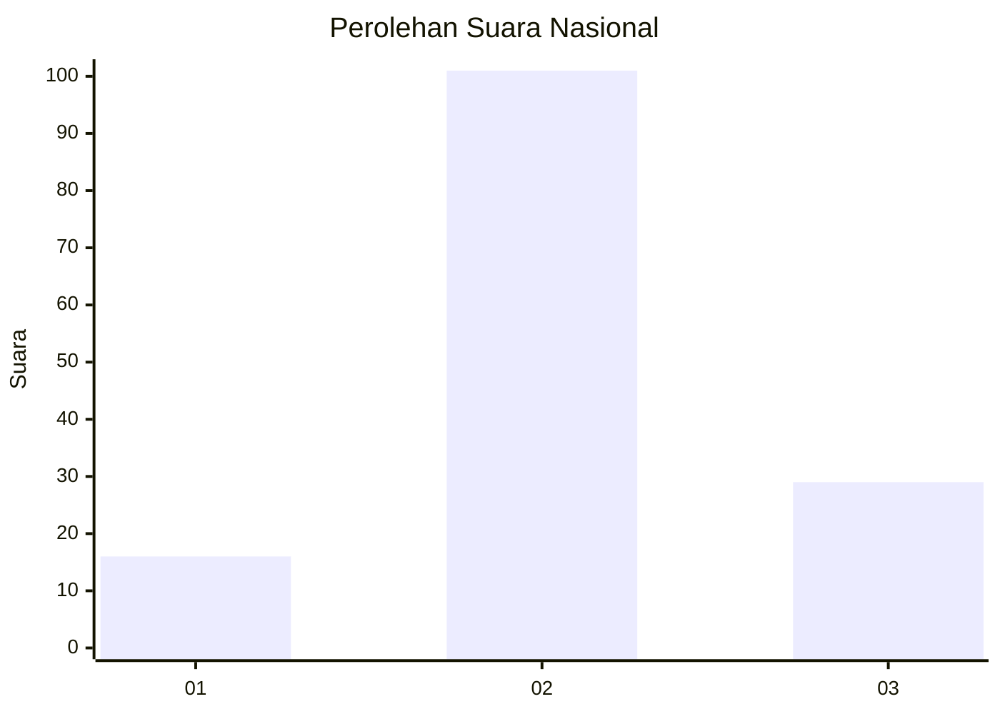
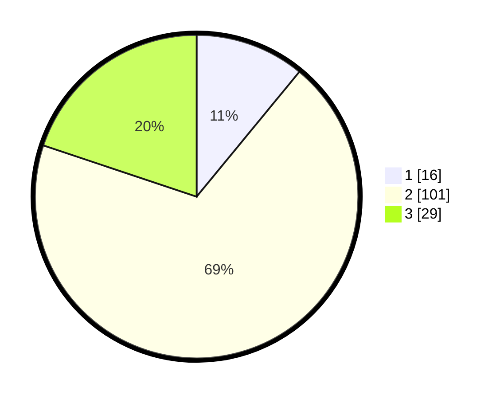

# Hasil

## Grafik

## Tabel

| No. | Nama Paslon    | Suara | Suara (raw) | Persentase |
|:--- |:-------------- | -----:| -----------:| ----------:|
| 1   | ANIES MUHAIMIN | 16    | [16][p-1]   | 10,96      |
| 2   | PRABOWO GIBRAN | 101   | [101][p-2]  | 69,18      |
| 3   | GANJAR MAHFUD  | 29    | [29][p-3]   | 19,86      |

[p-1]: https://github.com/gigit-pemilu/pemilu-2024/blob/main/pilpres/hitung-suara/sub/94-papua-tengah/sub/01-nabire/sub/12-nabire-barat/sub/2001-bumi-raya/sub/013-tps/sub/paslon-1.txt
[p-2]: https://github.com/gigit-pemilu/pemilu-2024/blob/main/pilpres/hitung-suara/sub/94-papua-tengah/sub/01-nabire/sub/12-nabire-barat/sub/2001-bumi-raya/sub/013-tps/sub/paslon-2.txt
[p-3]: https://github.com/gigit-pemilu/pemilu-2024/blob/main/pilpres/hitung-suara/sub/94-papua-tengah/sub/01-nabire/sub/12-nabire-barat/sub/2001-bumi-raya/sub/013-tps/sub/paslon-3.txt

## Foto C Plano

https://sirekap-obj-formc.kpu.go.id/235d/pemilu/ppwp/94/01/12/20/01/9401122001013-20240215-085505--d9bd42dc-0044-4ba0-a572-1ac607c0d8bd.jpg

https://sirekap-obj-formc.kpu.go.id/235d/pemilu/ppwp/94/01/12/20/01/9401122001013-20240215-085722--bc4fd3d5-6cb9-49f0-bfe4-143c56b92bc7.jpg

## Metadata

| Key        | Value               |
| ---------- | ------------------- |
| Time Stamp | 2024-02-15 20:30:46 |

