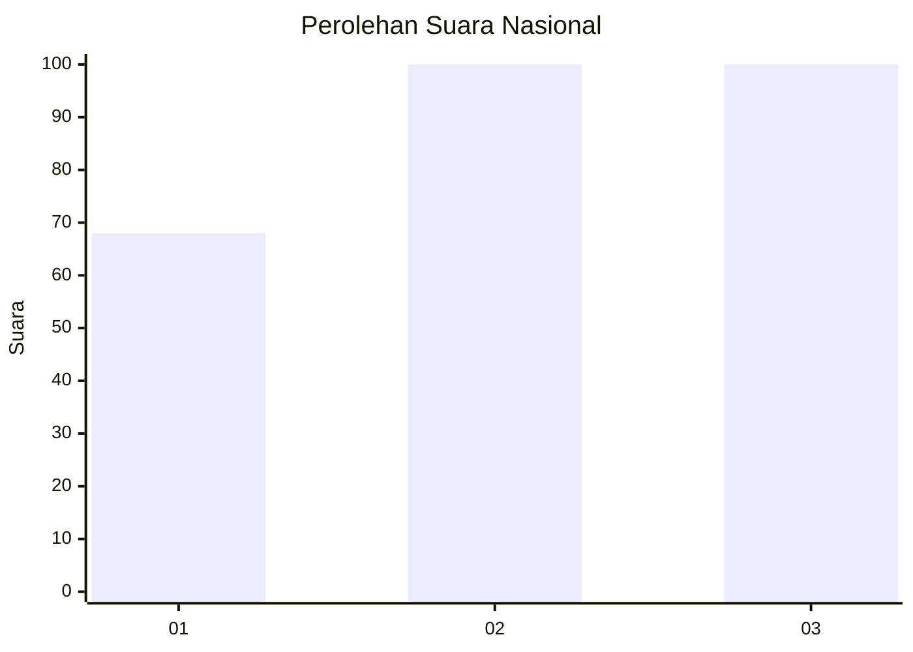
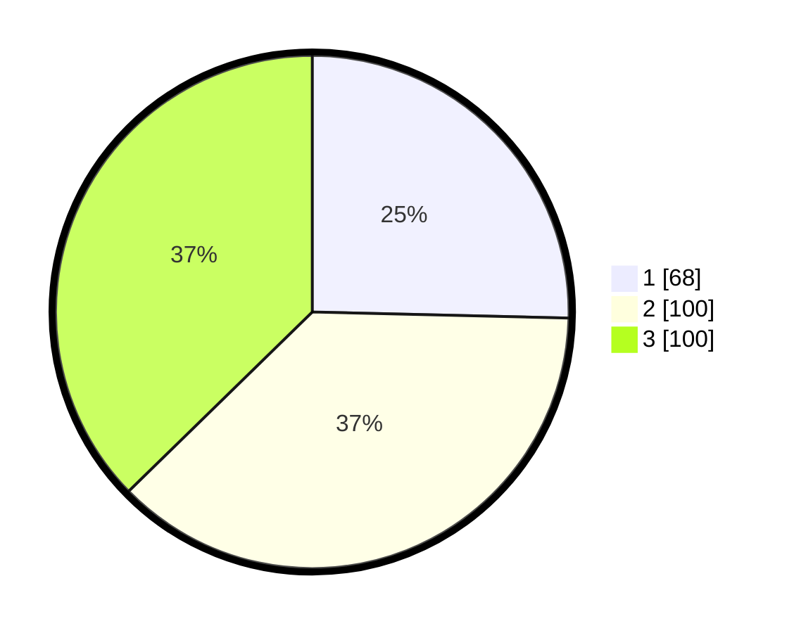

# Hasil

## Grafik

## Tabel

| No. | Nama Paslon    | Suara | Suara (raw) | Persentase |
|:--- |:-------------- | -----:| -----------:| ----------:|
| 1   | ANIES MUHAIMIN | 68    | [68][p-1]   | 25,37      |
| 2   | PRABOWO GIBRAN | 100   | [100][p-2]  | 37,31      |
| 3   | GANJAR MAHFUD  | 100   | [100][p-3]  | 37,31      |

[p-1]: https://github.com/gigit-pemilu/pemilu-2024/blob/main/pilpres/hitung-suara/sub/94-papua-tengah/sub/01-nabire/sub/12-nabire-barat/sub/2003-gerbang-sadu/sub/003-tps/sub/paslon-1.txt
[p-2]: https://github.com/gigit-pemilu/pemilu-2024/blob/main/pilpres/hitung-suara/sub/94-papua-tengah/sub/01-nabire/sub/12-nabire-barat/sub/2003-gerbang-sadu/sub/003-tps/sub/paslon-2.txt
[p-3]: https://github.com/gigit-pemilu/pemilu-2024/blob/main/pilpres/hitung-suara/sub/94-papua-tengah/sub/01-nabire/sub/12-nabire-barat/sub/2003-gerbang-sadu/sub/003-tps/sub/paslon-3.txt

## Foto C Plano

https://sirekap-obj-formc.kpu.go.id/0304/pemilu/ppwp/94/01/12/20/03/9401122003003-20240216-113031--ab9d6cec-e4bd-4738-828e-e8d9c33d2e35.jpg

https://sirekap-obj-formc.kpu.go.id/0304/pemilu/ppwp/94/01/12/20/03/9401122003003-20240216-113328--c1bd88a1-1a5d-4648-a67f-d2c71a24b385.jpg

https://sirekap-obj-formc.kpu.go.id/0304/pemilu/ppwp/94/01/12/20/03/9401122003003-20240216-002152--e56112e5-7037-4a93-b243-5e74197342c0.jpg

## Metadata

| Key        | Value               |
| ---------- | ------------------- |
| Time Stamp | 2024-02-16 12:51:22 |

## DATA PEMILIH TETAP

Jumlah pemilih dalam DPT: **268**.
 * L: **131**.
 * P: **137**.

## DATA PENGGUNA HAK PILIH

Jumlah pengguna hak pilih dalam DPT: **268**.
 * L: **131**.
 * P: **137**.

Jumlah pengguna hak pilih dalam DPTb: **0**.
 * L: **0**.
 * P: **0**.

Jumlah pengguna hak pilih dalam DPK: **0**.
 * L: **0**.
 * P: **0**.

Jumlah pengguna hak pilih: **268**.
 * L: **131**.
 * P: **137**.

## JUMLAH SUARA SAH DAN TIDAK SAH

JUMLAH SELURUH SUARA SAH: **268**.

JUMLAH SUARA TIDAK SAH: **0**.

JUMLAH SELURUH SUARA SAH DAN SUARA TIDAK SAH: **268**.

