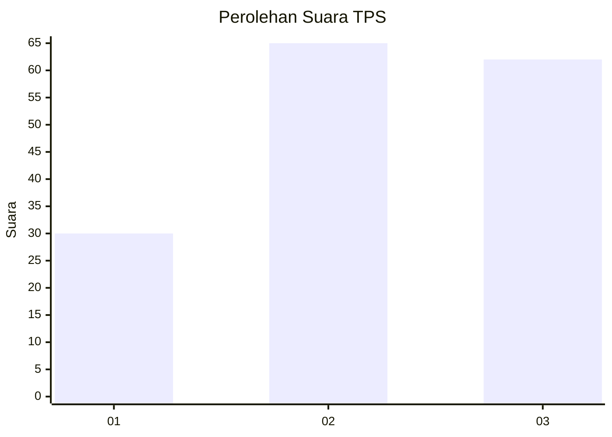
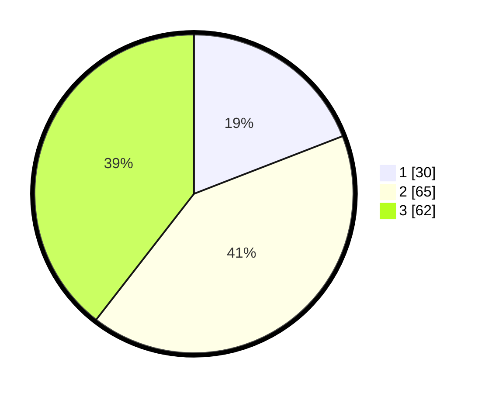

# Hasil

## Grafik

## Tabel

| No. | Nama Paslon    | Suara | Suara (raw) | Persentase |
|:--- |:-------------- | -----:| -----------:| ----------:|
| 1   | ANIES MUHAIMIN | 30    | [30][p-1]   | 19,11      |
| 2   | PRABOWO GIBRAN | 65    | [65][p-2]   | 41,40      |
| 3   | GANJAR MAHFUD  | 62    | [62][p-3]   | 39,49      |

[p-1]: https://github.com/gigit-pemilu/pemilu-2024-94-papua-tengah/blob/main/pilpres/hitung-suara/sub/94-papua-tengah/sub/01-nabire/sub/12-nabire-barat/sub/2003-gerbang-sadu/sub/004-tps/sub/paslon-1.txt
[p-2]: https://github.com/gigit-pemilu/pemilu-2024-94-papua-tengah/blob/main/pilpres/hitung-suara/sub/94-papua-tengah/sub/01-nabire/sub/12-nabire-barat/sub/2003-gerbang-sadu/sub/004-tps/sub/paslon-2.txt
[p-3]: https://github.com/gigit-pemilu/pemilu-2024-94-papua-tengah/blob/main/pilpres/hitung-suara/sub/94-papua-tengah/sub/01-nabire/sub/12-nabire-barat/sub/2003-gerbang-sadu/sub/004-tps/sub/paslon-3.txt

## Foto C Plano

https://sirekap-obj-formc.kpu.go.id/982a/pemilu/ppwp/94/01/12/20/03/9401122003004-20240216-000219--73de0de2-ddff-4dc3-a50a-885d9bc061ad.jpg

https://sirekap-obj-formc.kpu.go.id/982a/pemilu/ppwp/94/01/12/20/03/9401122003004-20240215-233109--9119354d-537a-41b9-be94-45cf5ab5cc33.jpg

https://sirekap-obj-formc.kpu.go.id/982a/pemilu/ppwp/94/01/12/20/03/9401122003004-20240215-233208--f62965ce-1d70-448a-ad7e-954298663e86.jpg

## Metadata

| Key        | Value               |
| ---------- | ------------------- |
| Time Stamp | 2024-02-19 12:00:00 |

