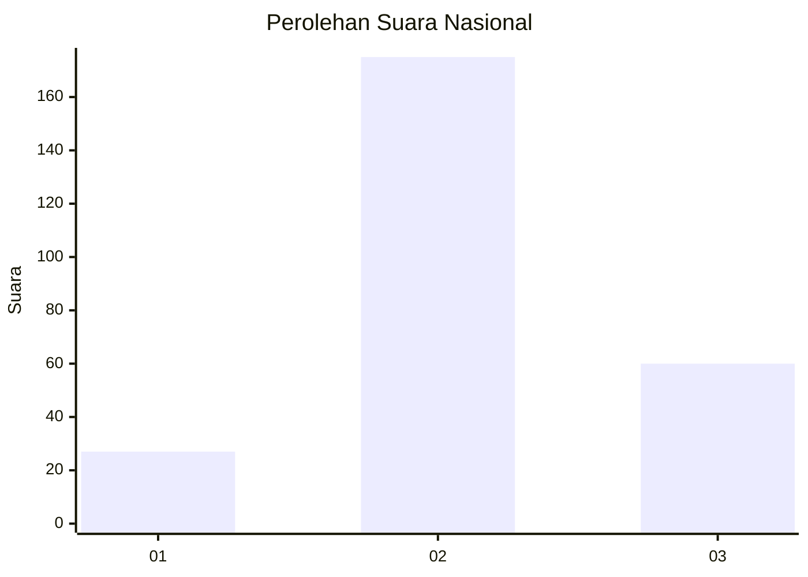
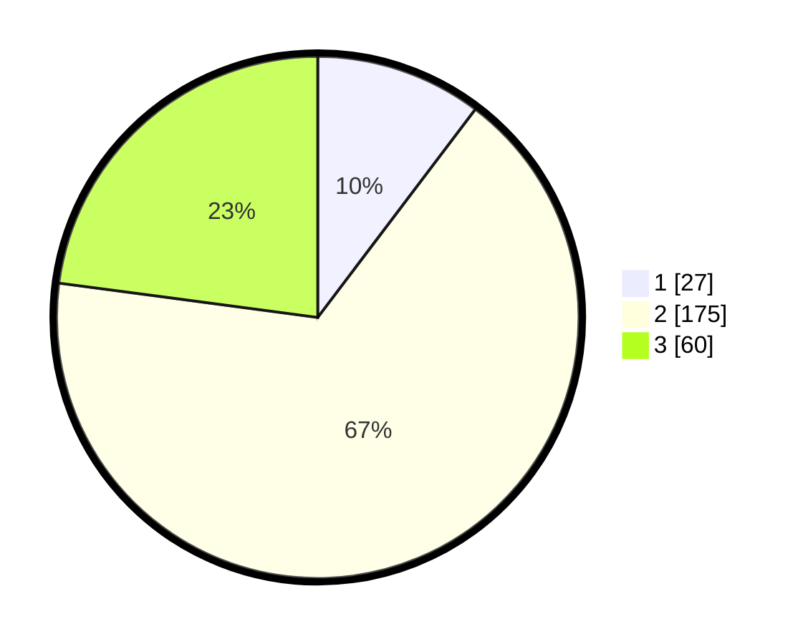

# Hasil

## Grafik

## Tabel

| No. | Nama Paslon    | Suara | Suara (raw) | Persentase |
|:--- |:-------------- | -----:| -----------:| ----------:|
| 1   | ANIES MUHAIMIN | 27    | [27][p-1]   | 10,31      |
| 2   | PRABOWO GIBRAN | 175   | [175][p-2]  | 66,79      |
| 3   | GANJAR MAHFUD  | 60    | [60][p-3]   | 22,90      |

[p-1]: https://github.com/gigit-pemilu/pemilu-2024/blob/main/pilpres/hitung-suara/sub/94-papua-tengah/sub/01-nabire/sub/12-nabire-barat/sub/2004-kali-semen/sub/001-tps/sub/paslon-1.txt
[p-2]: https://github.com/gigit-pemilu/pemilu-2024/blob/main/pilpres/hitung-suara/sub/94-papua-tengah/sub/01-nabire/sub/12-nabire-barat/sub/2004-kali-semen/sub/001-tps/sub/paslon-2.txt
[p-3]: https://github.com/gigit-pemilu/pemilu-2024/blob/main/pilpres/hitung-suara/sub/94-papua-tengah/sub/01-nabire/sub/12-nabire-barat/sub/2004-kali-semen/sub/001-tps/sub/paslon-3.txt

## Foto C Plano

https://sirekap-obj-formc.kpu.go.id/d651/pemilu/ppwp/94/01/12/20/04/9401122004001-20240215-004109--f996cdee-b7a5-4a14-a9bc-4a7bb9c946c5.jpg

https://sirekap-obj-formc.kpu.go.id/d651/pemilu/ppwp/94/01/12/20/04/9401122004001-20240215-004150--8db427b9-5d3a-49b9-adf6-e1c4444e011d.jpg

https://sirekap-obj-formc.kpu.go.id/d651/pemilu/ppwp/94/01/12/20/04/9401122004001-20240215-004230--c8c4054d-673c-479e-aa8d-c7b61e70aea1.jpg

## Metadata

| Key        | Value               |
| ---------- | ------------------- |
| Time Stamp | 2024-02-15 20:30:46 |

