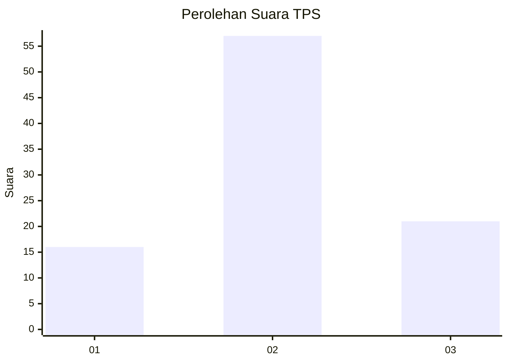
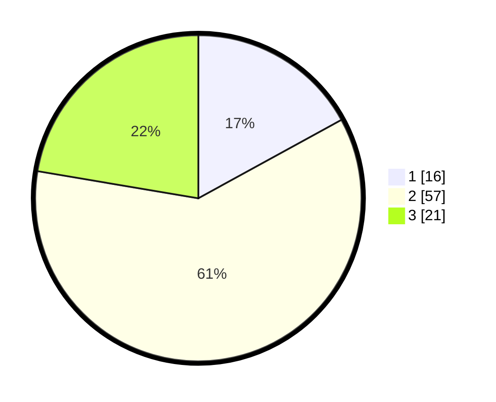

# Hasil

## Grafik

## Tabel

| No. | Nama Paslon    | Suara | Suara (raw) | Persentase |
|:--- |:-------------- | -----:| -----------:| ----------:|
| 1   | ANIES MUHAIMIN | 16    | [16][p-1]   | 17,02      |
| 2   | PRABOWO GIBRAN | 57    | [57][p-2]   | 60,64      |
| 3   | GANJAR MAHFUD  | 21    | [21][p-3]   | 22,34      |

[p-1]: https://github.com/gigit-pemilu/pemilu-2024-94-papua-tengah/blob/main/pilpres/hitung-suara/sub/94-papua-tengah/sub/01-nabire/sub/12-nabire-barat/sub/2004-kali-semen/sub/011-tps/sub/paslon-1.txt
[p-2]: https://github.com/gigit-pemilu/pemilu-2024-94-papua-tengah/blob/main/pilpres/hitung-suara/sub/94-papua-tengah/sub/01-nabire/sub/12-nabire-barat/sub/2004-kali-semen/sub/011-tps/sub/paslon-2.txt
[p-3]: https://github.com/gigit-pemilu/pemilu-2024-94-papua-tengah/blob/main/pilpres/hitung-suara/sub/94-papua-tengah/sub/01-nabire/sub/12-nabire-barat/sub/2004-kali-semen/sub/011-tps/sub/paslon-3.txt

## Foto C Plano

https://sirekap-obj-formc.kpu.go.id/bd37/pemilu/ppwp/94/01/12/20/04/9401122004011-20240216-144228--bcdbd917-c7d4-452d-a17d-14d8db45e5a2.jpg

https://sirekap-obj-formc.kpu.go.id/bd37/pemilu/ppwp/94/01/12/20/04/9401122004011-20240216-144230--1570ccec-f8b8-4f1a-95c1-343c70951286.jpg

https://sirekap-obj-formc.kpu.go.id/bd37/pemilu/ppwp/94/01/12/20/04/9401122004011-20240216-144229--06b29ed0-2232-4d74-a27e-edfe48e1e527.jpg

## Metadata

| Key        | Value               |
| ---------- | ------------------- |
| Time Stamp | 2024-02-22 09:00:00 |

## DATA PEMILIH TETAP

Jumlah pemilih dalam DPT: **150**.
 * L: **96**.
 * P: **54**.

## DATA PENGGUNA HAK PILIH

Jumlah pengguna hak pilih dalam DPT: **96**.
 * L: **50**.
 * P: **44**.

Jumlah pengguna hak pilih dalam DPTb: **2**.
 * L: **1**.
 * P: **1**.

Jumlah pengguna hak pilih dalam DPK: **0**.
 * L: **0**.
 * P: **0**.

Jumlah pengguna hak pilih: **96**.
 * L: **51**.
 * P: **45**.

## JUMLAH SUARA SAH DAN TIDAK SAH

JUMLAH SELURUH SUARA SAH: **94**.

JUMLAH SUARA TIDAK SAH: **2**.

JUMLAH SELURUH SUARA SAH DAN SUARA TIDAK SAH: **96**.

