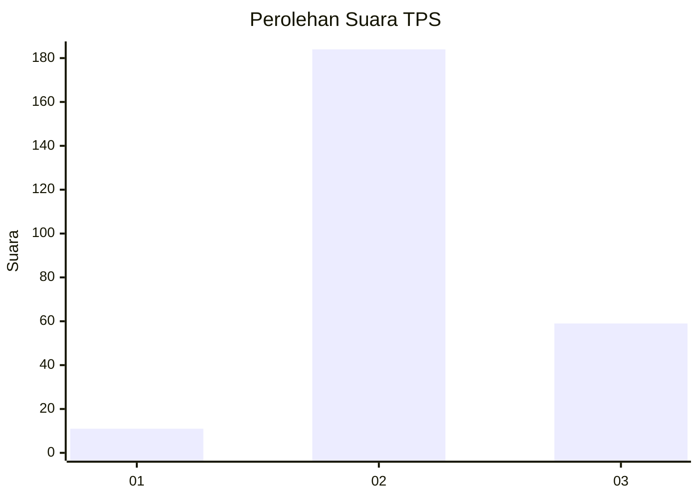
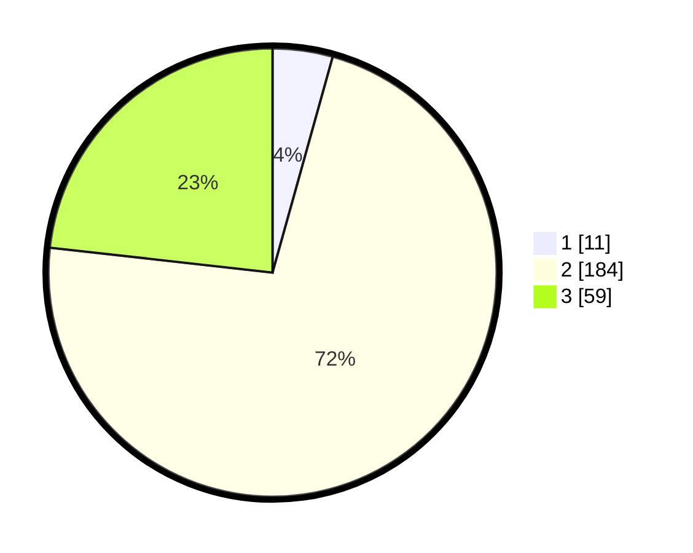

# Hasil

## Grafik

## Tabel

| No. | Nama Paslon    | Suara | Suara (raw) | Persentase |
|:--- |:-------------- | -----:| -----------:| ----------:|
| 1   | ANIES MUHAIMIN | 11    | [11][p-1]   | 4,33       |
| 2   | PRABOWO GIBRAN | 184   | [184][p-2]  | 72,44      |
| 3   | GANJAR MAHFUD  | 59    | [59][p-3]   | 23,23      |

[p-1]: https://github.com/gigit-pemilu/pemilu-2024-94-papua-tengah/blob/main/pilpres/hitung-suara/sub/94-papua-tengah/sub/01-nabire/sub/12-nabire-barat/sub/2004-kali-semen/sub/012-tps/sub/paslon-1.txt
[p-2]: https://github.com/gigit-pemilu/pemilu-2024-94-papua-tengah/blob/main/pilpres/hitung-suara/sub/94-papua-tengah/sub/01-nabire/sub/12-nabire-barat/sub/2004-kali-semen/sub/012-tps/sub/paslon-2.txt
[p-3]: https://github.com/gigit-pemilu/pemilu-2024-94-papua-tengah/blob/main/pilpres/hitung-suara/sub/94-papua-tengah/sub/01-nabire/sub/12-nabire-barat/sub/2004-kali-semen/sub/012-tps/sub/paslon-3.txt

## Foto C Plano

https://sirekap-obj-formc.kpu.go.id/cff8/pemilu/ppwp/94/01/12/20/04/9401122004012-20240216-134322--98b1629b-d4a4-4690-8879-17b821f0294a.jpg

https://sirekap-obj-formc.kpu.go.id/cff8/pemilu/ppwp/94/01/12/20/04/9401122004012-20240216-133538--e0bfc74d-6286-4132-8ff9-62d0c336e6a5.jpg

https://sirekap-obj-formc.kpu.go.id/cff8/pemilu/ppwp/94/01/12/20/04/9401122004012-20240216-133710--bd6d1d75-7b8e-4a4c-ad0c-c28408c9f96b.jpg

## Metadata

| Key        | Value               |
| ---------- | ------------------- |
| Time Stamp | 2024-02-25 14:00:00 |

