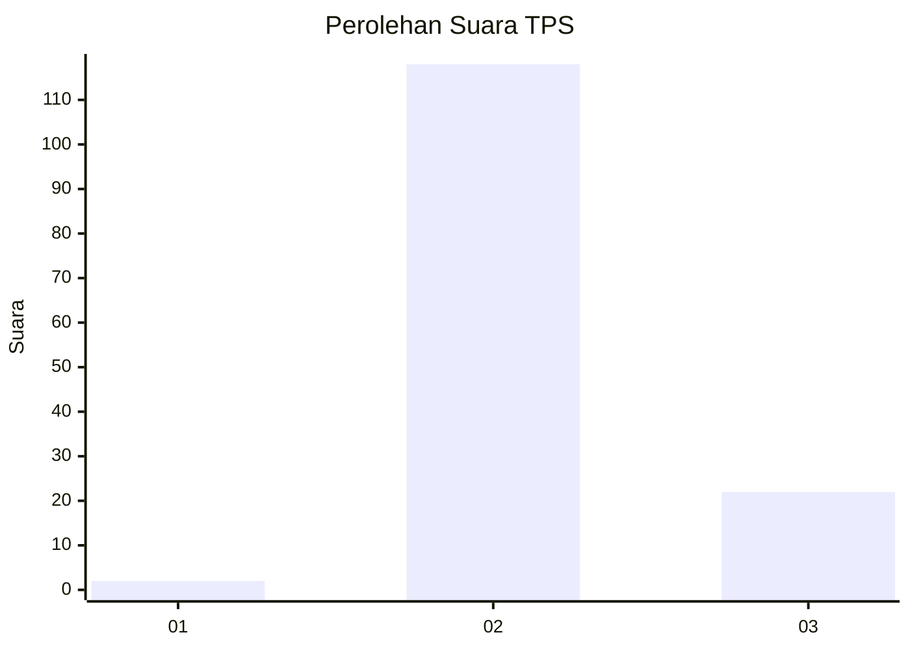
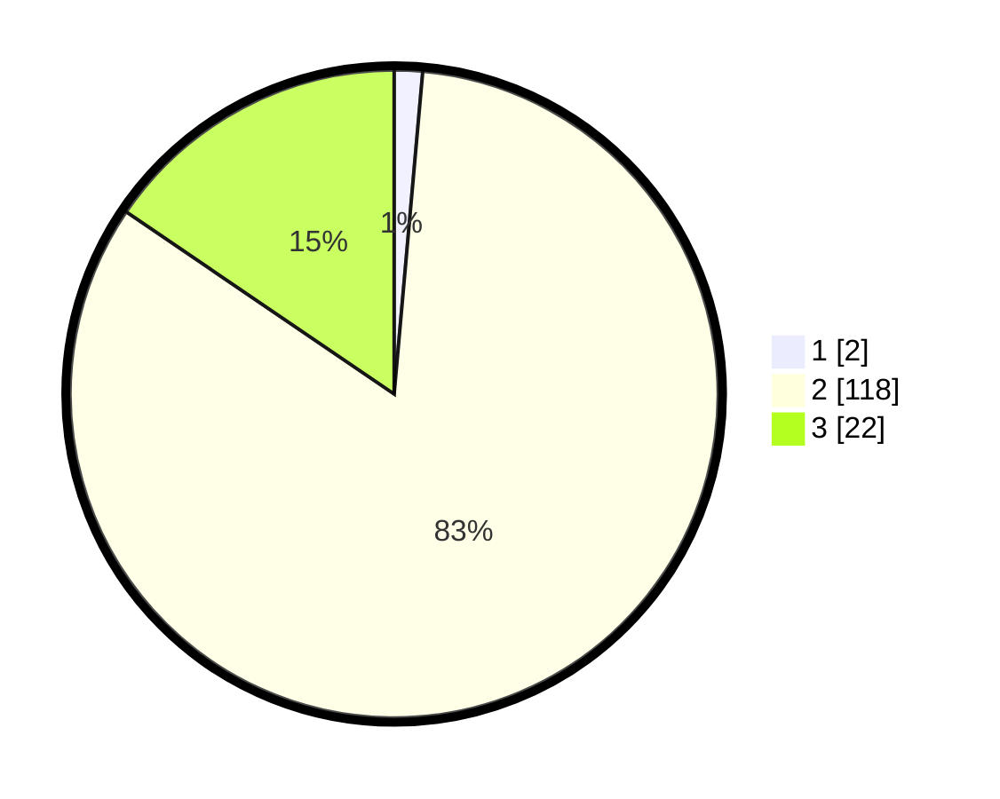

# Hasil

## Grafik

## Tabel

| No. | Nama Paslon    | Suara | Suara (raw) | Persentase |
|:--- |:-------------- | -----:| -----------:| ----------:|
| 1   | ANIES MUHAIMIN | 2     | [2][p-1]    | 1,41       |
| 2   | PRABOWO GIBRAN | 118   | [118][p-2]  | 83,10      |
| 3   | GANJAR MAHFUD  | 22    | [22][p-3]   | 15,49      |

[p-1]: https://github.com/gigit-pemilu/pemilu-2024-94-papua-tengah/blob/main/pilpres/hitung-suara/sub/94-papua-tengah/sub/01-nabire/sub/12-nabire-barat/sub/2004-kali-semen/sub/014-tps/sub/paslon-1.txt
[p-2]: https://github.com/gigit-pemilu/pemilu-2024-94-papua-tengah/blob/main/pilpres/hitung-suara/sub/94-papua-tengah/sub/01-nabire/sub/12-nabire-barat/sub/2004-kali-semen/sub/014-tps/sub/paslon-2.txt
[p-3]: https://github.com/gigit-pemilu/pemilu-2024-94-papua-tengah/blob/main/pilpres/hitung-suara/sub/94-papua-tengah/sub/01-nabire/sub/12-nabire-barat/sub/2004-kali-semen/sub/014-tps/sub/paslon-3.txt

## Foto C Plano

https://sirekap-obj-formc.kpu.go.id/fd04/pemilu/ppwp/94/01/12/20/04/9401122004014-20240214-205101--b9e54dfb-6bc7-4491-9bfa-ca6e08aea2cf.jpg

https://sirekap-obj-formc.kpu.go.id/fd04/pemilu/ppwp/94/01/12/20/04/9401122004014-20240214-205157--12ad70d6-a7a0-4b9f-b63e-5322e3b7f677.jpg

## Metadata

| Key        | Value               |
| ---------- | ------------------- |
| Time Stamp | 2024-02-15 19:00:26 |

