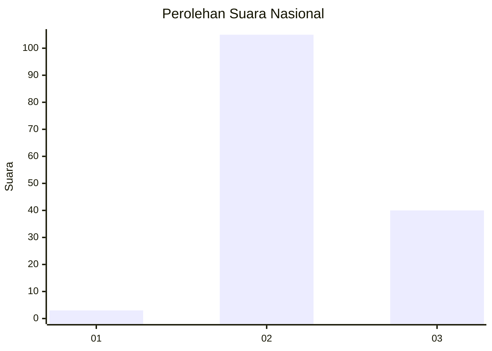
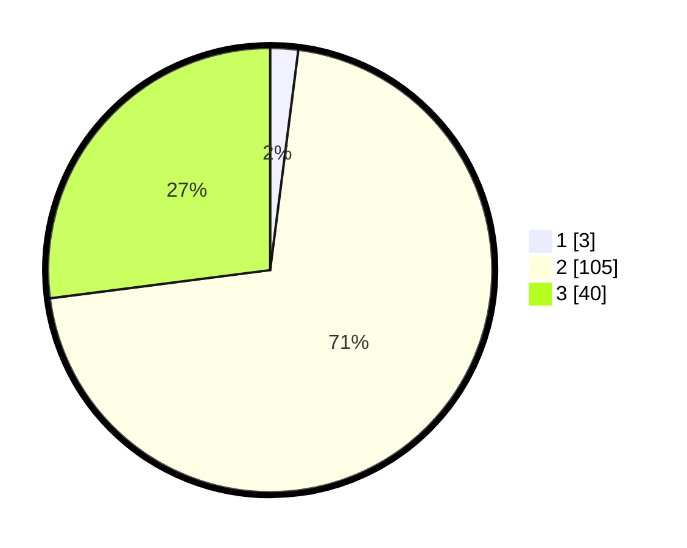

# Hasil

## Grafik

## Tabel

| No. | Nama Paslon    | Suara | Suara (raw) | Persentase |
|:--- |:-------------- | -----:| -----------:| ----------:|
| 1   | ANIES MUHAIMIN | 3     | [3][p-1]    | 2,03       |
| 2   | PRABOWO GIBRAN | 105   | [105][p-2]  | 70,95      |
| 3   | GANJAR MAHFUD  | 40    | [40][p-3]   | 27,03      |

[p-1]: https://github.com/gigit-pemilu/pemilu-2024/blob/main/pilpres/hitung-suara/sub/94-papua-tengah/sub/01-nabire/sub/12-nabire-barat/sub/2004-kali-semen/sub/017-tps/sub/paslon-1.txt
[p-2]: https://github.com/gigit-pemilu/pemilu-2024/blob/main/pilpres/hitung-suara/sub/94-papua-tengah/sub/01-nabire/sub/12-nabire-barat/sub/2004-kali-semen/sub/017-tps/sub/paslon-2.txt
[p-3]: https://github.com/gigit-pemilu/pemilu-2024/blob/main/pilpres/hitung-suara/sub/94-papua-tengah/sub/01-nabire/sub/12-nabire-barat/sub/2004-kali-semen/sub/017-tps/sub/paslon-3.txt

## Foto C Plano

https://sirekap-obj-formc.kpu.go.id/64a2/pemilu/ppwp/94/01/12/20/04/9401122004017-20240214-200032--df5cb631-5fef-42a6-8d6d-55abb1399f48.jpg

https://sirekap-obj-formc.kpu.go.id/64a2/pemilu/ppwp/94/01/12/20/04/9401122004017-20240214-200130--66ed6d85-05a6-4f65-91be-7498a2afaeaf.jpg

https://sirekap-obj-formc.kpu.go.id/64a2/pemilu/ppwp/94/01/12/20/04/9401122004017-20240214-200302--1b605030-34a0-43de-b72e-2e4a318fb559.jpg

## Metadata

| Key        | Value               |
| ---------- | ------------------- |
| Time Stamp | 2024-02-15 20:30:46 |

