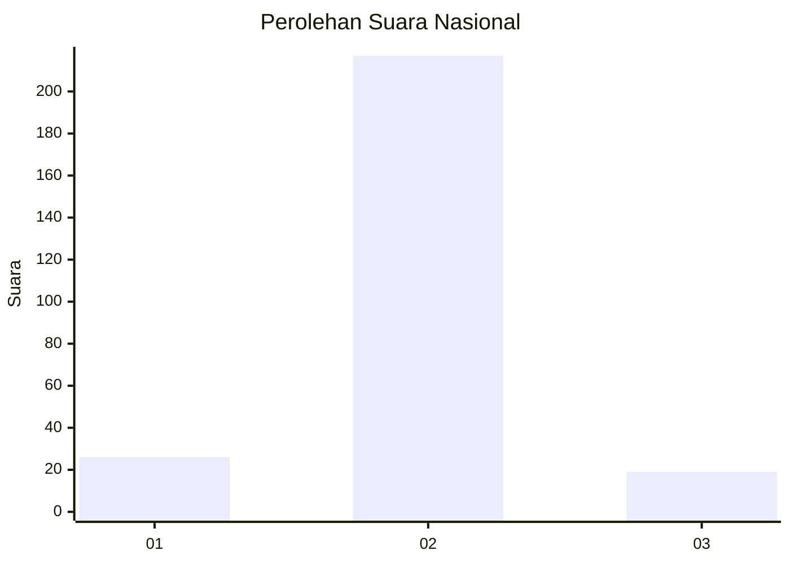
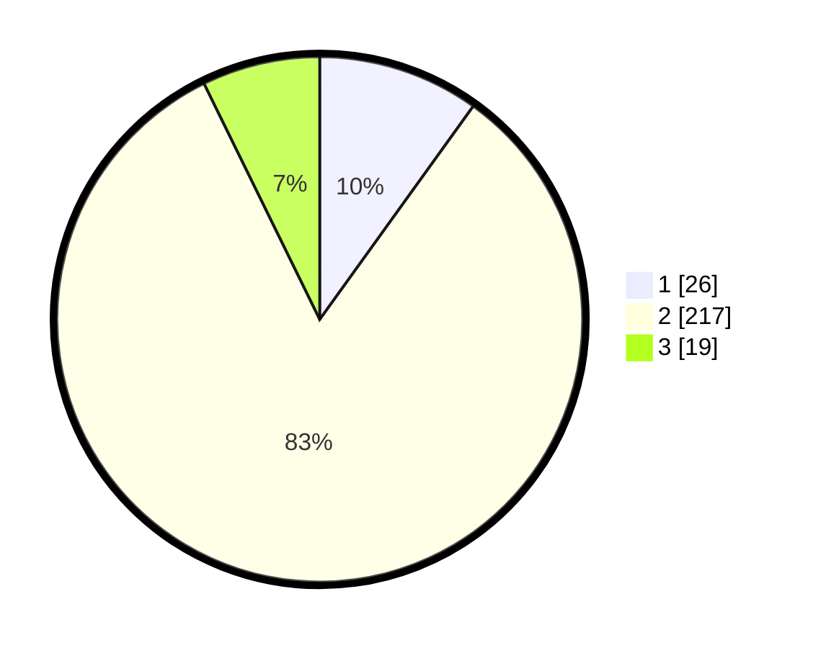

# Hasil

## Grafik

## Tabel

| No. | Nama Paslon    | Suara | Suara (raw) | Persentase |
|:--- |:-------------- | -----:| -----------:| ----------:|
| 1   | ANIES MUHAIMIN | 26    | [26][p-1]   | 9,92       |
| 2   | PRABOWO GIBRAN | 217   | [217][p-2]  | 82,82      |
| 3   | GANJAR MAHFUD  | 19    | [19][p-3]   | 7,25       |

[p-1]: https://github.com/gigit-pemilu/pemilu-2024/blob/main/pilpres/hitung-suara/sub/94-papua-tengah/sub/01-nabire/sub/12-nabire-barat/sub/2005-wadio/sub/003-tps/sub/paslon-1.txt
[p-2]: https://github.com/gigit-pemilu/pemilu-2024/blob/main/pilpres/hitung-suara/sub/94-papua-tengah/sub/01-nabire/sub/12-nabire-barat/sub/2005-wadio/sub/003-tps/sub/paslon-2.txt
[p-3]: https://github.com/gigit-pemilu/pemilu-2024/blob/main/pilpres/hitung-suara/sub/94-papua-tengah/sub/01-nabire/sub/12-nabire-barat/sub/2005-wadio/sub/003-tps/sub/paslon-3.txt

## Foto C Plano

https://sirekap-obj-formc.kpu.go.id/f892/pemilu/ppwp/94/01/12/20/05/9401122005003-20240215-194333--4eed6127-61ca-4a75-beb1-79e38f492e56.jpg

https://sirekap-obj-formc.kpu.go.id/f892/pemilu/ppwp/94/01/12/20/05/9401122005003-20240215-194418--5c2e2554-4c0f-4085-9a21-7889c2a1dbeb.jpg

https://sirekap-obj-formc.kpu.go.id/f892/pemilu/ppwp/94/01/12/20/05/9401122005003-20240215-194436--e4b1e403-0440-4303-8242-d3af0f2f2b48.jpg

## Metadata

| Key        | Value               |
| ---------- | ------------------- |
| Time Stamp | 2024-02-15 21:01:18 |

