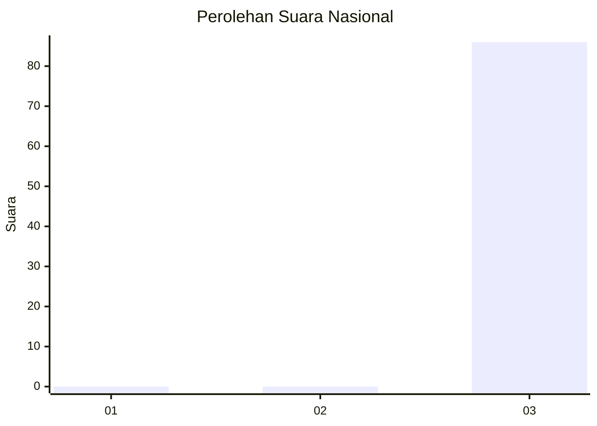
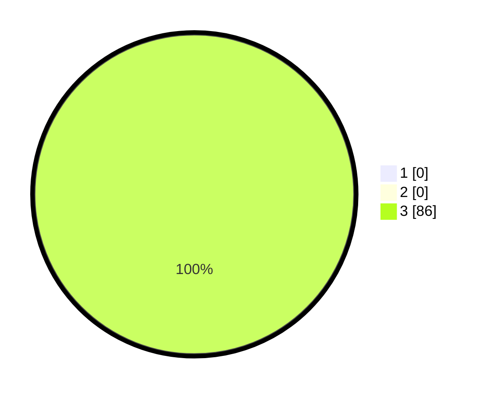

# Hasil

## Grafik

## Tabel

| No. | Nama Paslon    | Suara | Suara (raw) | Persentase |
|:--- |:-------------- | -----:| -----------:| ----------:|
| 1   | ANIES MUHAIMIN | 0     | [0][p-1]    | 0,00       |
| 2   | PRABOWO GIBRAN | 0     | [0][p-2]    | 0,00       |
| 3   | GANJAR MAHFUD  | 86    | [86][p-3]   | 100,00     |

[p-1]: https://github.com/gigit-pemilu/pemilu-2024/blob/main/pilpres/hitung-suara/sub/94-papua-tengah/sub/02-puncak-jaya/sub/07-torere/sub/2003-awiyam/sub/001-tps/sub/paslon-1.txt
[p-2]: https://github.com/gigit-pemilu/pemilu-2024/blob/main/pilpres/hitung-suara/sub/94-papua-tengah/sub/02-puncak-jaya/sub/07-torere/sub/2003-awiyam/sub/001-tps/sub/paslon-2.txt
[p-3]: https://github.com/gigit-pemilu/pemilu-2024/blob/main/pilpres/hitung-suara/sub/94-papua-tengah/sub/02-puncak-jaya/sub/07-torere/sub/2003-awiyam/sub/001-tps/sub/paslon-3.txt

## Foto C Plano

https://sirekap-obj-formc.kpu.go.id/b719/pemilu/ppwp/94/02/07/20/03/9402072003001-20240218-225138--3382a345-c855-4914-a227-36b4a6c90bc1.jpg

https://sirekap-obj-formc.kpu.go.id/b719/pemilu/ppwp/94/02/07/20/03/9402072003001-20240218-225525--b0a98568-4ecc-4d92-9e75-fe83719f1e54.jpg

https://sirekap-obj-formc.kpu.go.id/b719/pemilu/ppwp/94/02/07/20/03/9402072003001-20240218-230038--e39983e1-5fa6-463a-9362-efc2b1e4d4c9.jpg

## Metadata

| Key        | Value               |
| ---------- | ------------------- |
| Time Stamp | 2024-02-19 06:16:00 |

## DATA PEMILIH TETAP

Jumlah pemilih dalam DPT: **86**.
 * L: **46**.
 * P: **40**.

## DATA PENGGUNA HAK PILIH

Jumlah pengguna hak pilih dalam DPT: **86**.
 * L: **46**.
 * P: **40**.

Jumlah pengguna hak pilih dalam DPTb: **0**.
 * L: **0**.
 * P: **0**.

Jumlah pengguna hak pilih dalam DPK: **0**.
 * L: **0**.
 * P: **0**.

Jumlah pengguna hak pilih: **86**.
 * L: **46**.
 * P: **40**.

## JUMLAH SUARA SAH DAN TIDAK SAH

JUMLAH SELURUH SUARA SAH: **86**.

JUMLAH SUARA TIDAK SAH: **0**.

JUMLAH SELURUH SUARA SAH DAN SUARA TIDAK SAH: **86**.

