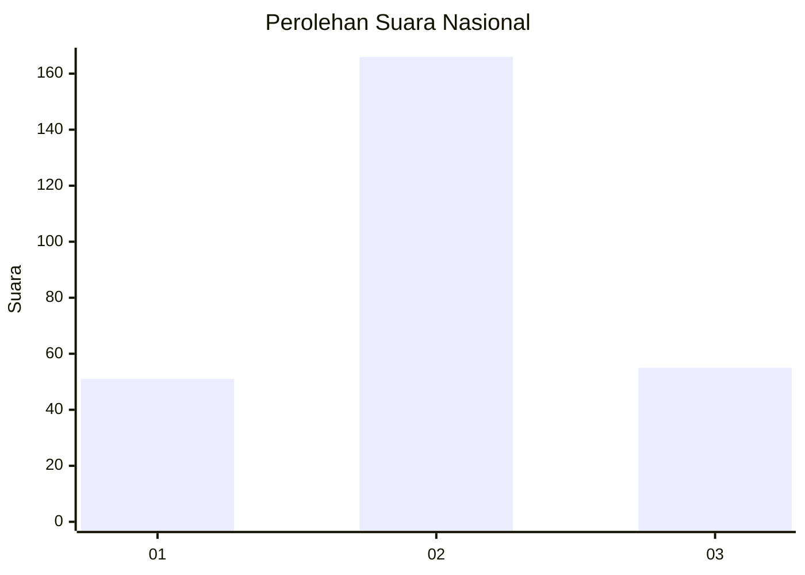
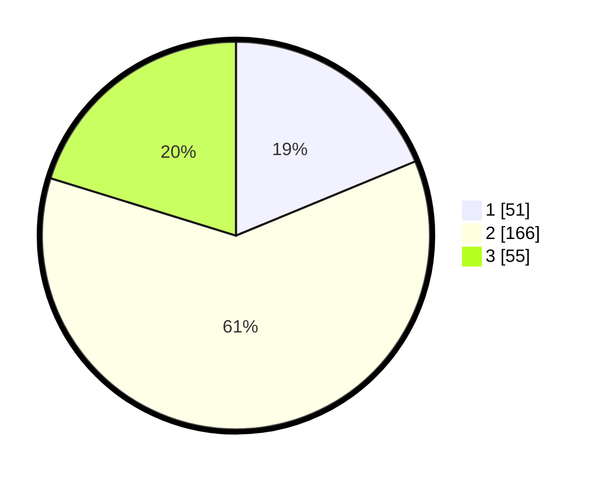

# Hasil

## Grafik

## Tabel

| No. | Nama Paslon    | Suara | Suara (raw) | Persentase |
|:--- |:-------------- | -----:| -----------:| ----------:|
| 1   | ANIES MUHAIMIN | 51    | [51][p-1]   | 18,75      |
| 2   | PRABOWO GIBRAN | 166   | [166][p-2]  | 61,03      |
| 3   | GANJAR MAHFUD  | 55    | [55][p-3]   | 20,22      |

[p-1]: https://github.com/gigit-pemilu/pemilu-2024/blob/main/pilpres/hitung-suara/sub/94-papua-tengah/sub/04-mimika/sub/01-mimika-baru/sub/1001-koperapoka/sub/001-tps/sub/paslon-1.txt
[p-2]: https://github.com/gigit-pemilu/pemilu-2024/blob/main/pilpres/hitung-suara/sub/94-papua-tengah/sub/04-mimika/sub/01-mimika-baru/sub/1001-koperapoka/sub/001-tps/sub/paslon-2.txt
[p-3]: https://github.com/gigit-pemilu/pemilu-2024/blob/main/pilpres/hitung-suara/sub/94-papua-tengah/sub/04-mimika/sub/01-mimika-baru/sub/1001-koperapoka/sub/001-tps/sub/paslon-3.txt

## Foto C Plano

https://sirekap-obj-formc.kpu.go.id/bbea/pemilu/ppwp/94/04/01/10/01/9404011001001-20240214-214138--7c3b5d57-9351-4b50-ac51-9c5cbac52e13.jpg

https://sirekap-obj-formc.kpu.go.id/bbea/pemilu/ppwp/94/04/01/10/01/9404011001001-20240214-214532--cd9ff46b-3e5d-4168-bd12-de136d8251c9.jpg

https://sirekap-obj-formc.kpu.go.id/bbea/pemilu/ppwp/94/04/01/10/01/9404011001001-20240214-214817--cc25546f-a600-4d4e-86e3-c1ec162cc213.jpg

## Metadata

| Key        | Value               |
| ---------- | ------------------- |
| Time Stamp | 2024-02-15 21:30:27 |

## DATA PEMILIH TETAP

Jumlah pemilih dalam DPT: **268**.
 * L: **142**.
 * P: **126**.

## DATA PENGGUNA HAK PILIH

Jumlah pengguna hak pilih dalam DPT: **268**.
 * L: **142**.
 * P: **126**.

Jumlah pengguna hak pilih dalam DPTb: **6**.
 * L: **3**.
 * P: **3**.

Jumlah pengguna hak pilih dalam DPK: **0**.
 * L: **0**.
 * P: **0**.

Jumlah pengguna hak pilih: **274**.
 * L: **145**.
 * P: **129**.

## JUMLAH SUARA SAH DAN TIDAK SAH

JUMLAH SELURUH SUARA SAH: **272**.

JUMLAH SUARA TIDAK SAH: **2**.

JUMLAH SELURUH SUARA SAH DAN SUARA TIDAK SAH: **274**.

