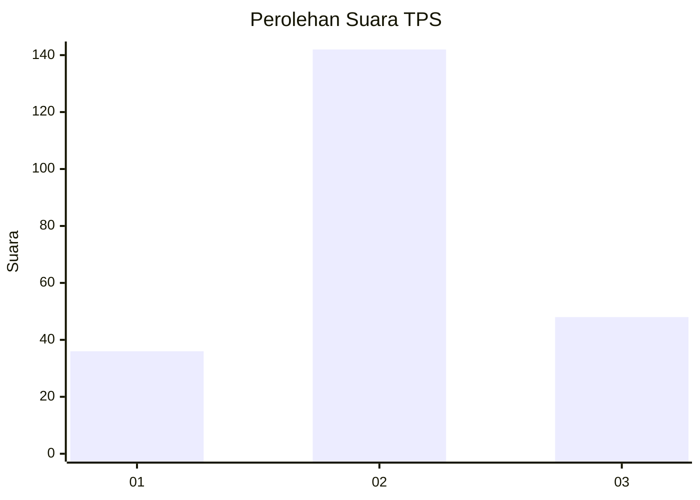
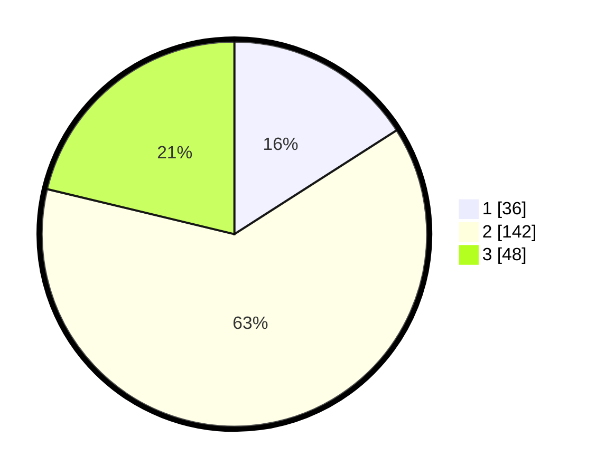

# Hasil

## Grafik

## Tabel

| No. | Nama Paslon    | Suara | Suara (raw) | Persentase |
|:--- |:-------------- | -----:| -----------:| ----------:|
| 1   | ANIES MUHAIMIN | 36    | [36][p-1]   | 15,93      |
| 2   | PRABOWO GIBRAN | 142   | [142][p-2]  | 62,83      |
| 3   | GANJAR MAHFUD  | 48    | [48][p-3]   | 21,24      |

[p-1]: https://github.com/gigit-pemilu/pemilu-2024-94-papua-tengah/blob/main/pilpres/hitung-suara/sub/94-papua-tengah/sub/04-mimika/sub/01-mimika-baru/sub/1001-koperapoka/sub/006-tps/sub/paslon-1.txt
[p-2]: https://github.com/gigit-pemilu/pemilu-2024-94-papua-tengah/blob/main/pilpres/hitung-suara/sub/94-papua-tengah/sub/04-mimika/sub/01-mimika-baru/sub/1001-koperapoka/sub/006-tps/sub/paslon-2.txt
[p-3]: https://github.com/gigit-pemilu/pemilu-2024-94-papua-tengah/blob/main/pilpres/hitung-suara/sub/94-papua-tengah/sub/04-mimika/sub/01-mimika-baru/sub/1001-koperapoka/sub/006-tps/sub/paslon-3.txt

## Foto C Plano

https://sirekap-obj-formc.kpu.go.id/63b1/pemilu/ppwp/94/04/01/10/01/9404011001006-20240215-024952--bcb0f17a-ffe3-4c60-a740-21cfa8631588.jpg

https://sirekap-obj-formc.kpu.go.id/63b1/pemilu/ppwp/94/04/01/10/01/9404011001006-20240215-025157--89fd67b3-01a0-4f2e-9275-a3f8db488a32.jpg

https://sirekap-obj-formc.kpu.go.id/63b1/pemilu/ppwp/94/04/01/10/01/9404011001006-20240215-024912--e6d3df51-4d9f-4155-bf8a-bd22359b2bc1.jpg

## Metadata

| Key        | Value               |
| ---------- | ------------------- |
| Time Stamp | 2024-02-24 22:31:28 |

