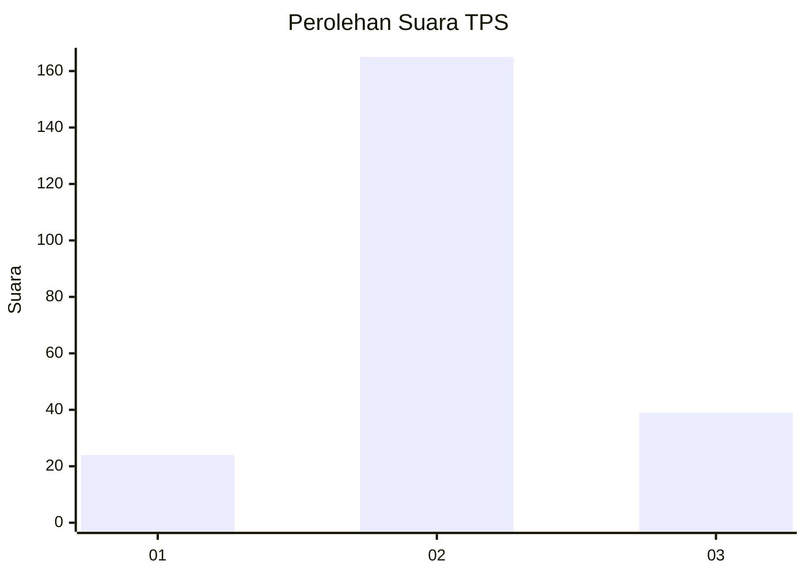
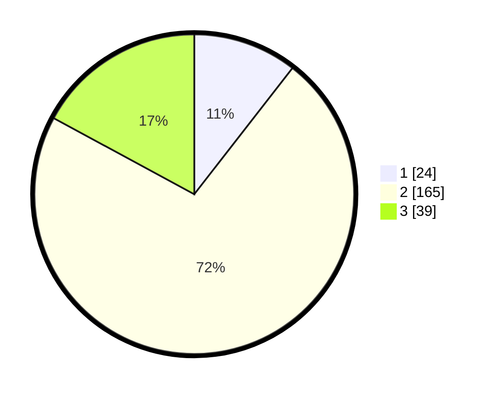

# Hasil

## Grafik

## Tabel

| No. | Nama Paslon    | Suara | Suara (raw) | Persentase |
|:--- |:-------------- | -----:| -----------:| ----------:|
| 1   | ANIES MUHAIMIN | 24    | [24][p-1]   | 10,53      |
| 2   | PRABOWO GIBRAN | 165   | [165][p-2]  | 72,37      |
| 3   | GANJAR MAHFUD  | 39    | [39][p-3]   | 17,11      |

[p-1]: https://github.com/gigit-pemilu/pemilu-2024-94-papua-tengah/blob/main/pilpres/hitung-suara/sub/94-papua-tengah/sub/04-mimika/sub/01-mimika-baru/sub/1001-koperapoka/sub/012-tps/sub/paslon-1.txt
[p-2]: https://github.com/gigit-pemilu/pemilu-2024-94-papua-tengah/blob/main/pilpres/hitung-suara/sub/94-papua-tengah/sub/04-mimika/sub/01-mimika-baru/sub/1001-koperapoka/sub/012-tps/sub/paslon-2.txt
[p-3]: https://github.com/gigit-pemilu/pemilu-2024-94-papua-tengah/blob/main/pilpres/hitung-suara/sub/94-papua-tengah/sub/04-mimika/sub/01-mimika-baru/sub/1001-koperapoka/sub/012-tps/sub/paslon-3.txt

## Foto C Plano

https://sirekap-obj-formc.kpu.go.id/5056/pemilu/ppwp/94/04/01/10/01/9404011001012-20240215-011633--aa4af3c6-0644-4993-945a-25ea561d7d27.jpg

https://sirekap-obj-formc.kpu.go.id/5056/pemilu/ppwp/94/04/01/10/01/9404011001012-20240214-193628--c2956a63-8c7c-4966-8227-46cf8bc4c6f5.jpg

https://sirekap-obj-formc.kpu.go.id/5056/pemilu/ppwp/94/04/01/10/01/9404011001012-20240214-193409--564d352c-fef1-4b96-95f3-751975845919.jpg

## Metadata

| Key        | Value               |
| ---------- | ------------------- |
| Time Stamp | 2024-02-25 14:00:00 |

