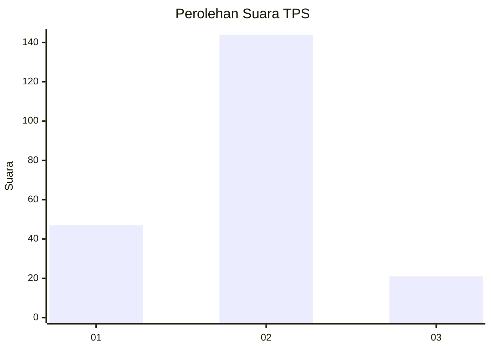

# Hasil

## Grafik

## Tabel

| No. | Nama Paslon    | Suara | Suara (raw) | Persentase |
|:--- |:-------------- | -----:| -----------:| ----------:|
| 1   | ANIES MUHAIMIN | 47    | [47][p-1]   | 22,17      |
| 2   | PRABOWO GIBRAN | 144   | [144][p-2]  | 67,92      |
| 3   | GANJAR MAHFUD  | 21    | [21][p-3]   | 9,91       |

[p-1]: https://github.com/gigit-pemilu/pemilu-2024-94-papua-tengah/blob/main/pilpres/hitung-suara/sub/94-papua-tengah/sub/04-mimika/sub/01-mimika-baru/sub/1001-koperapoka/sub/029-tps/sub/paslon-1.txt
[p-2]: https://github.com/gigit-pemilu/pemilu-2024-94-papua-tengah/blob/main/pilpres/hitung-suara/sub/94-papua-tengah/sub/04-mimika/sub/01-mimika-baru/sub/1001-koperapoka/sub/029-tps/sub/paslon-2.txt
[p-3]: https://github.com/gigit-pemilu/pemilu-2024-94-papua-tengah/blob/main/pilpres/hitung-suara/sub/94-papua-tengah/sub/04-mimika/sub/01-mimika-baru/sub/1001-koperapoka/sub/029-tps/sub/paslon-3.txt

## Foto C Plano

https://sirekap-obj-formc.kpu.go.id/4c79/pemilu/ppwp/94/04/01/10/01/9404011001029-20240214-200602--aa119c3a-3d84-4eff-b1a9-bb229897b336.jpg

https://sirekap-obj-formc.kpu.go.id/4c79/pemilu/ppwp/94/04/01/10/01/9404011001029-20240214-200901--b3bf2752-ece7-411e-b4a3-b67fea189561.jpg

## Metadata

| Key        | Value               |
| ---------- | ------------------- |
| Time Stamp | 2024-02-15 22:00:27 |

