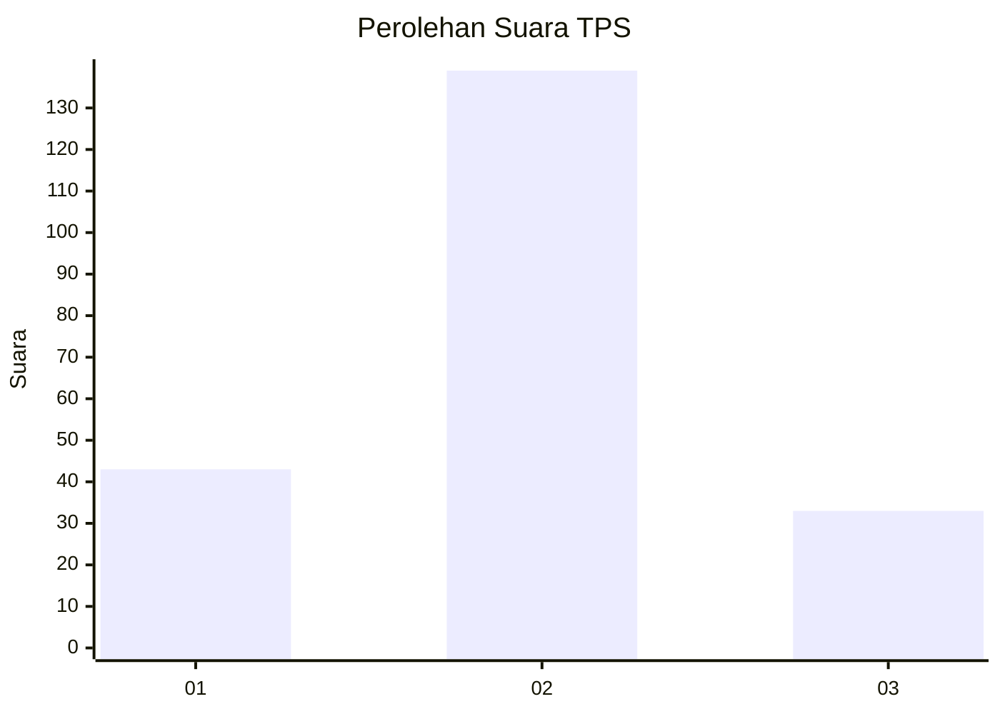
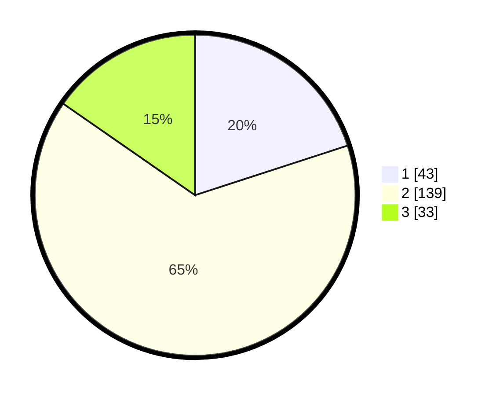

# Hasil

## Grafik

## Tabel

| No. | Nama Paslon    | Suara | Suara (raw) | Persentase |
|:--- |:-------------- | -----:| -----------:| ----------:|
| 1   | ANIES MUHAIMIN | 43    | [43][p-1]   | 20,00      |
| 2   | PRABOWO GIBRAN | 139   | [139][p-2]  | 64,65      |
| 3   | GANJAR MAHFUD  | 33    | [33][p-3]   | 15,35      |

[p-1]: https://github.com/gigit-pemilu/pemilu-2024-94-papua-tengah/blob/main/pilpres/hitung-suara/sub/94-papua-tengah/sub/04-mimika/sub/01-mimika-baru/sub/1001-koperapoka/sub/038-tps/sub/paslon-1.txt
[p-2]: https://github.com/gigit-pemilu/pemilu-2024-94-papua-tengah/blob/main/pilpres/hitung-suara/sub/94-papua-tengah/sub/04-mimika/sub/01-mimika-baru/sub/1001-koperapoka/sub/038-tps/sub/paslon-2.txt
[p-3]: https://github.com/gigit-pemilu/pemilu-2024-94-papua-tengah/blob/main/pilpres/hitung-suara/sub/94-papua-tengah/sub/04-mimika/sub/01-mimika-baru/sub/1001-koperapoka/sub/038-tps/sub/paslon-3.txt

## Foto C Plano

https://sirekap-obj-formc.kpu.go.id/8b4e/pemilu/ppwp/94/04/01/10/01/9404011001038-20240214-232419--28dd942a-f7be-43ba-9326-68c981783dfe.jpg

https://sirekap-obj-formc.kpu.go.id/8b4e/pemilu/ppwp/94/04/01/10/01/9404011001038-20240214-232554--4be223f6-5fa2-42d6-9222-5db221d67c19.jpg

https://sirekap-obj-formc.kpu.go.id/8b4e/pemilu/ppwp/94/04/01/10/01/9404011001038-20240214-232846--f647c05f-171e-4bac-beda-e0546d629237.jpg

## Metadata

| Key        | Value               |
| ---------- | ------------------- |
| Time Stamp | 2024-02-24 22:31:28 |

