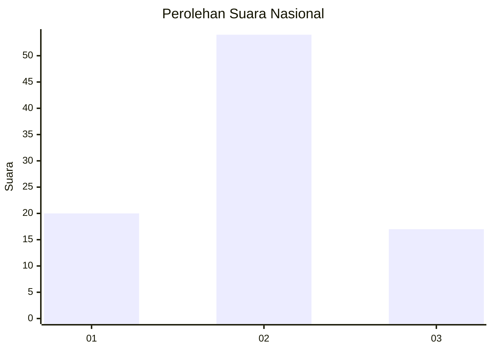
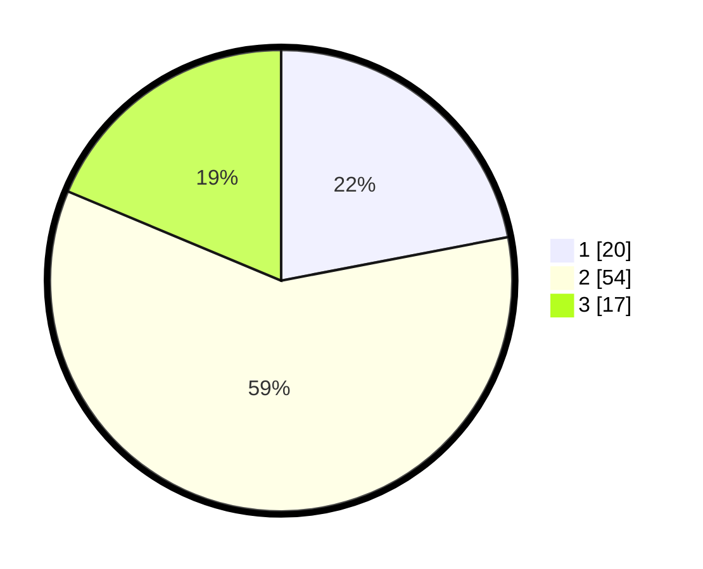

# Hasil

## Grafik

## Tabel

| No. | Nama Paslon    | Suara | Suara (raw) | Persentase |
|:--- |:-------------- | -----:| -----------:| ----------:|
| 1   | ANIES MUHAIMIN | 20    | [20][p-1]   | 21,98      |
| 2   | PRABOWO GIBRAN | 54    | [54][p-2]   | 59,34      |
| 3   | GANJAR MAHFUD  | 17    | [17][p-3]   | 18,68      |

[p-1]: https://github.com/gigit-pemilu/pemilu-2024/blob/main/pilpres/hitung-suara/sub/94-papua-tengah/sub/04-mimika/sub/01-mimika-baru/sub/1001-koperapoka/sub/040-tps/sub/paslon-1.txt
[p-2]: https://github.com/gigit-pemilu/pemilu-2024/blob/main/pilpres/hitung-suara/sub/94-papua-tengah/sub/04-mimika/sub/01-mimika-baru/sub/1001-koperapoka/sub/040-tps/sub/paslon-2.txt
[p-3]: https://github.com/gigit-pemilu/pemilu-2024/blob/main/pilpres/hitung-suara/sub/94-papua-tengah/sub/04-mimika/sub/01-mimika-baru/sub/1001-koperapoka/sub/040-tps/sub/paslon-3.txt

## Foto C Plano

https://sirekap-obj-formc.kpu.go.id/bd4a/pemilu/ppwp/94/04/01/10/01/9404011001040-20240214-231454--74a97507-6acf-4ae2-98ce-796e8fdf248b.jpg

https://sirekap-obj-formc.kpu.go.id/bd4a/pemilu/ppwp/94/04/01/10/01/9404011001040-20240214-235915--4f3f2bd8-cb5a-4f60-be66-bcd924c5340a.jpg

https://sirekap-obj-formc.kpu.go.id/bd4a/pemilu/ppwp/94/04/01/10/01/9404011001040-20240215-000119--248f9bc1-8b7a-4729-adc0-48746d08ce9e.jpg

## Metadata

| Key        | Value               |
| ---------- | ------------------- |
| Time Stamp | 2024-02-15 20:30:46 |

