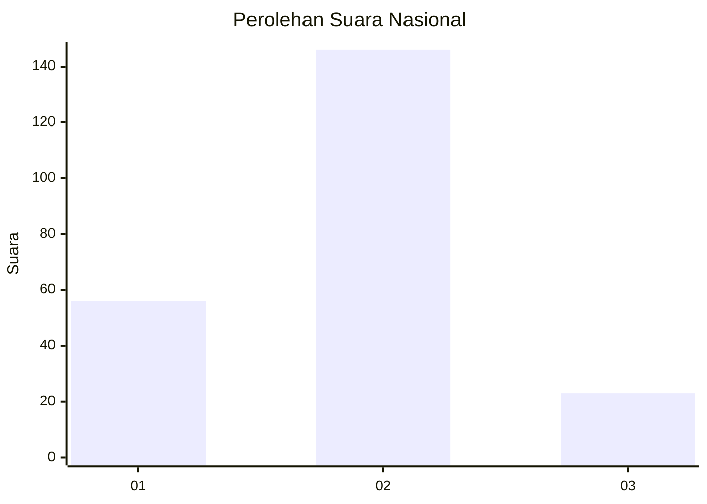
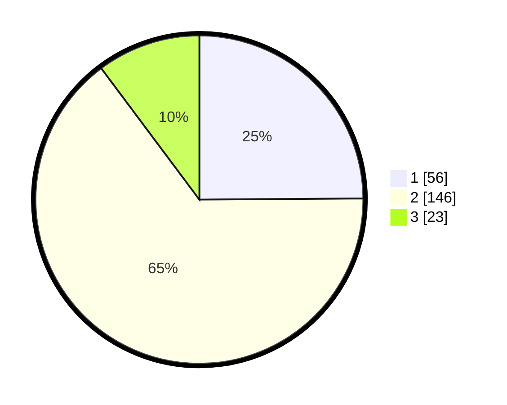

# Hasil

## Grafik

## Tabel

| No. | Nama Paslon    | Suara | Suara (raw) | Persentase |
|:--- |:-------------- | -----:| -----------:| ----------:|
| 1   | ANIES MUHAIMIN | 56    | [56][p-1]   | 24,89      |
| 2   | PRABOWO GIBRAN | 146   | [146][p-2]  | 64,89      |
| 3   | GANJAR MAHFUD  | 23    | [23][p-3]   | 10,22      |

[p-1]: https://github.com/gigit-pemilu/pemilu-2024/blob/main/pilpres/hitung-suara/sub/94-papua-tengah/sub/04-mimika/sub/01-mimika-baru/sub/1007-sempan/sub/006-tps/sub/paslon-1.txt
[p-2]: https://github.com/gigit-pemilu/pemilu-2024/blob/main/pilpres/hitung-suara/sub/94-papua-tengah/sub/04-mimika/sub/01-mimika-baru/sub/1007-sempan/sub/006-tps/sub/paslon-2.txt
[p-3]: https://github.com/gigit-pemilu/pemilu-2024/blob/main/pilpres/hitung-suara/sub/94-papua-tengah/sub/04-mimika/sub/01-mimika-baru/sub/1007-sempan/sub/006-tps/sub/paslon-3.txt

## Foto C Plano

https://sirekap-obj-formc.kpu.go.id/7713/pemilu/ppwp/94/04/01/10/07/9404011007006-20240214-211003--747a4bc9-82ec-40f1-8b03-a24e772d532d.jpg

https://sirekap-obj-formc.kpu.go.id/7713/pemilu/ppwp/94/04/01/10/07/9404011007006-20240214-210901--a3e51260-6261-4f1b-9edc-89705b30360c.jpg

https://sirekap-obj-formc.kpu.go.id/7713/pemilu/ppwp/94/04/01/10/07/9404011007006-20240214-211519--5a6895f6-569d-48de-bfae-9c48d0830bdb.jpg

## Metadata

| Key        | Value               |
| ---------- | ------------------- |
| Time Stamp | 2024-02-15 20:30:46 |

