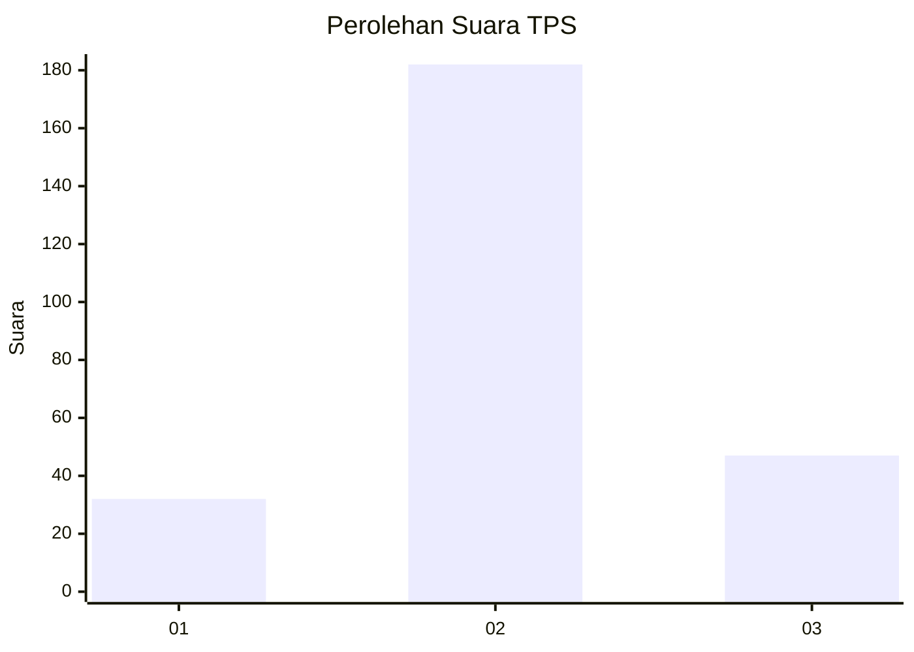
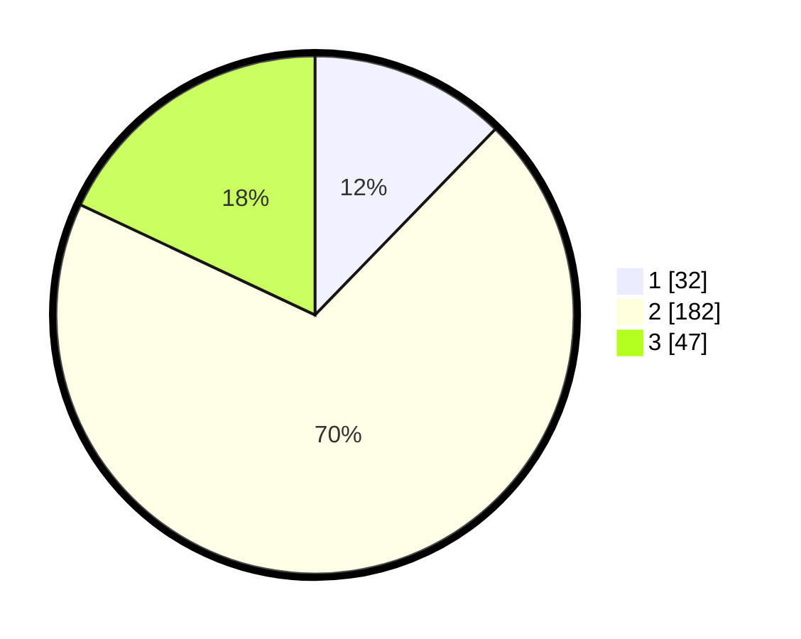

# Hasil

## Grafik

## Tabel

| No. | Nama Paslon    | Suara | Suara (raw) | Persentase |
|:--- |:-------------- | -----:| -----------:| ----------:|
| 1   | ANIES MUHAIMIN | 32    | [32][p-1]   | 12,26      |
| 2   | PRABOWO GIBRAN | 182   | [182][p-2]  | 69,73      |
| 3   | GANJAR MAHFUD  | 47    | [47][p-3]   | 18,01      |

[p-1]: https://github.com/gigit-pemilu/pemilu-2024-94-papua-tengah/blob/main/pilpres/hitung-suara/sub/94-papua-tengah/sub/04-mimika/sub/01-mimika-baru/sub/1007-sempan/sub/007-tps/sub/paslon-1.txt
[p-2]: https://github.com/gigit-pemilu/pemilu-2024-94-papua-tengah/blob/main/pilpres/hitung-suara/sub/94-papua-tengah/sub/04-mimika/sub/01-mimika-baru/sub/1007-sempan/sub/007-tps/sub/paslon-2.txt
[p-3]: https://github.com/gigit-pemilu/pemilu-2024-94-papua-tengah/blob/main/pilpres/hitung-suara/sub/94-papua-tengah/sub/04-mimika/sub/01-mimika-baru/sub/1007-sempan/sub/007-tps/sub/paslon-3.txt

## Foto C Plano

https://sirekap-obj-formc.kpu.go.id/9f91/pemilu/ppwp/94/04/01/10/07/9404011007007-20240215-015027--5cf3036d-4bb1-4d22-9cb6-af7911c261aa.jpg

https://sirekap-obj-formc.kpu.go.id/9f91/pemilu/ppwp/94/04/01/10/07/9404011007007-20240215-011956--f17e9c0b-fb13-48ef-8483-a35c8c96bff6.jpg

https://sirekap-obj-formc.kpu.go.id/9f91/pemilu/ppwp/94/04/01/10/07/9404011007007-20240215-012806--c0022e36-3a24-457d-959d-94878cfde487.jpg

## Metadata

| Key        | Value               |
| ---------- | ------------------- |
| Time Stamp | 2024-02-15 20:30:46 |

