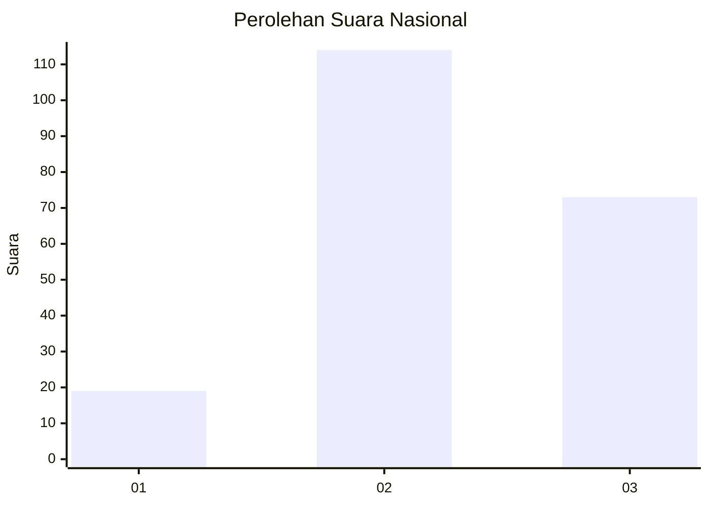
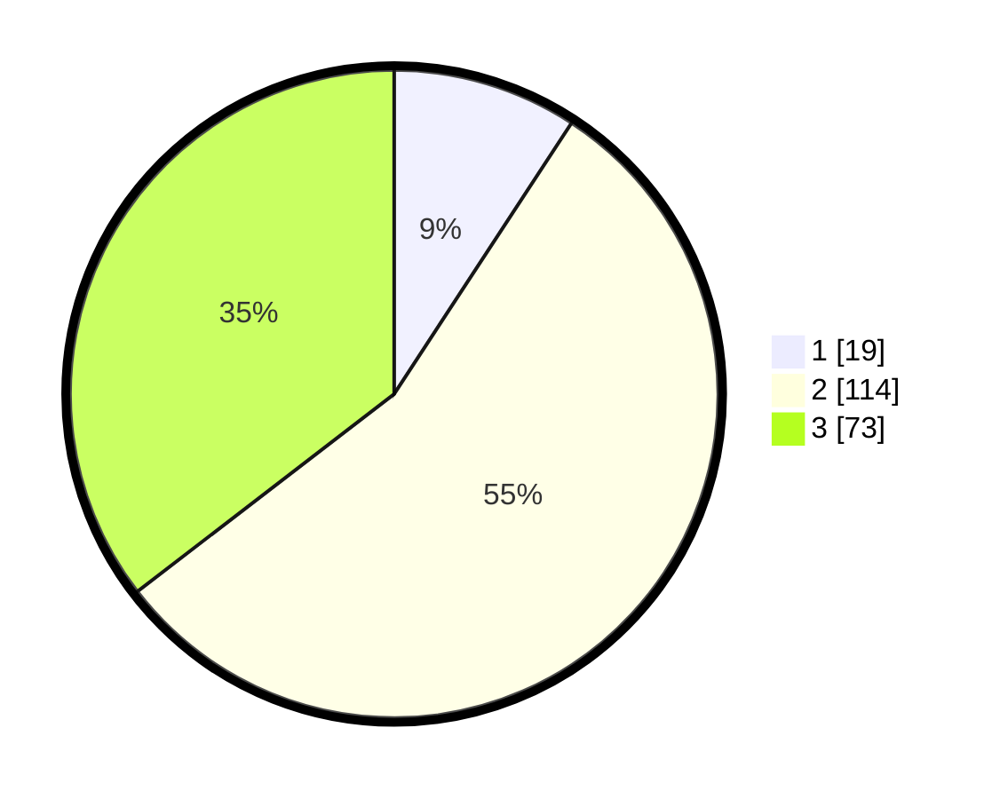

# Hasil

## Grafik

## Tabel

| No. | Nama Paslon    | Suara | Suara (raw) | Persentase |
|:--- |:-------------- | -----:| -----------:| ----------:|
| 1   | ANIES MUHAIMIN | 19    | [19][p-1]   | 9,22       |
| 2   | PRABOWO GIBRAN | 114   | [114][p-2]  | 55,34      |
| 3   | GANJAR MAHFUD  | 73    | [73][p-3]   | 35,44      |

[p-1]: https://github.com/gigit-pemilu/pemilu-2024/blob/main/pilpres/hitung-suara/sub/94-papua-tengah/sub/04-mimika/sub/01-mimika-baru/sub/1007-sempan/sub/008-tps/sub/paslon-1.txt
[p-2]: https://github.com/gigit-pemilu/pemilu-2024/blob/main/pilpres/hitung-suara/sub/94-papua-tengah/sub/04-mimika/sub/01-mimika-baru/sub/1007-sempan/sub/008-tps/sub/paslon-2.txt
[p-3]: https://github.com/gigit-pemilu/pemilu-2024/blob/main/pilpres/hitung-suara/sub/94-papua-tengah/sub/04-mimika/sub/01-mimika-baru/sub/1007-sempan/sub/008-tps/sub/paslon-3.txt

## Foto C Plano

https://sirekap-obj-formc.kpu.go.id/d2b9/pemilu/ppwp/94/04/01/10/07/9404011007008-20240214-204946--0b98e54d-1ba1-4303-a223-11e252e233d2.jpg

https://sirekap-obj-formc.kpu.go.id/d2b9/pemilu/ppwp/94/04/01/10/07/9404011007008-20240214-205528--bc333002-3cb0-4ac2-89f5-4be1ae70b1de.jpg

## Metadata

| Key        | Value               |
| ---------- | ------------------- |
| Time Stamp | 2024-02-24 22:31:28 |

