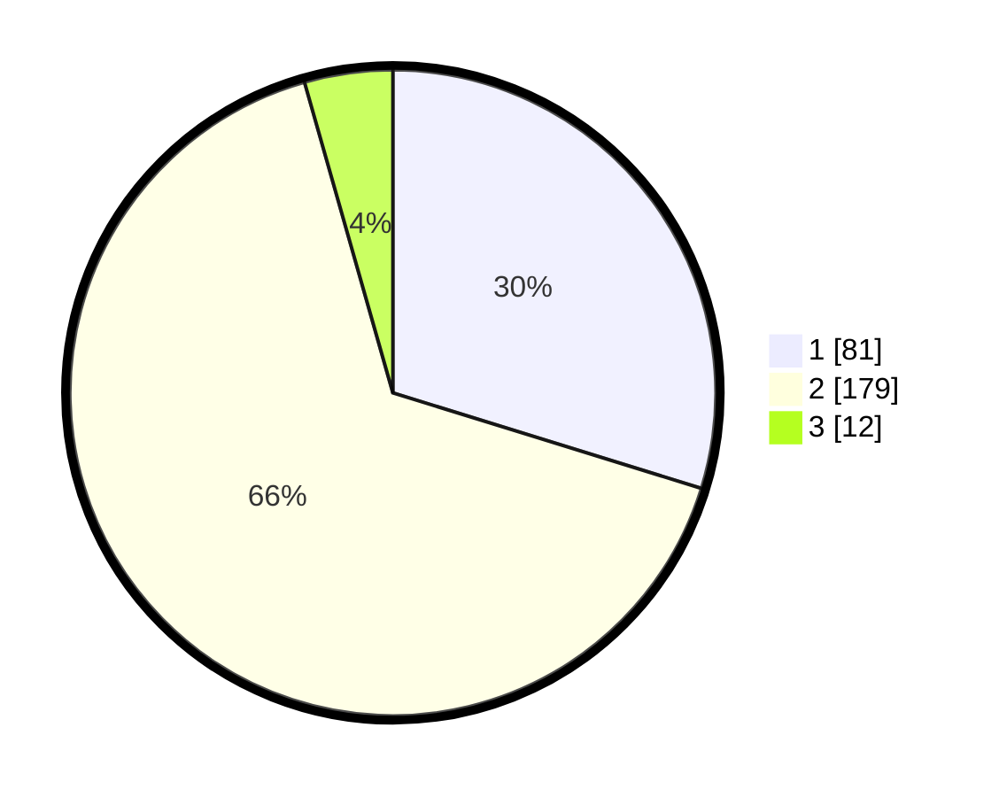

# Hasil

## Grafik

## Tabel

| No. | Nama Paslon    | Suara | Suara (raw) | Persentase |
|:--- |:-------------- | -----:| -----------:| ----------:|
| 1   | ANIES MUHAIMIN | 81    | [81][p-1]   | 29,78      |
| 2   | PRABOWO GIBRAN | 179   | [179][p-2]  | 65,81      |
| 3   | GANJAR MAHFUD  | 12    | [12][p-3]   | 4,41       |

[p-1]: https://github.com/gigit-pemilu/pemilu-2024-94-papua-tengah/blob/main/pilpres/hitung-suara/sub/94-papua-tengah/sub/04-mimika/sub/01-mimika-baru/sub/1007-sempan/sub/016-tps/sub/paslon-1.txt
[p-2]: https://github.com/gigit-pemilu/pemilu-2024-94-papua-tengah/blob/main/pilpres/hitung-suara/sub/94-papua-tengah/sub/04-mimika/sub/01-mimika-baru/sub/1007-sempan/sub/016-tps/sub/paslon-2.txt
[p-3]: https://github.com/gigit-pemilu/pemilu-2024-94-papua-tengah/blob/main/pilpres/hitung-suara/sub/94-papua-tengah/sub/04-mimika/sub/01-mimika-baru/sub/1007-sempan/sub/016-tps/sub/paslon-3.txt

## Foto C Plano

https://sirekap-obj-formc.kpu.go.id/881b/pemilu/ppwp/94/04/01/10/07/9404011007016-20240214-125551--e27c6388-8a32-4621-bc0b-156a0979adbf.jpg

https://sirekap-obj-formc.kpu.go.id/881b/pemilu/ppwp/94/04/01/10/07/9404011007016-20240214-125702--ce9193c8-55ad-4976-81b3-d995783b093c.jpg

https://sirekap-obj-formc.kpu.go.id/881b/pemilu/ppwp/94/04/01/10/07/9404011007016-20240214-125915--e4f9523c-f4c1-4eec-96b3-10a5865a6893.jpg

## Metadata

| Key        | Value               |
| ---------- | ------------------- |
| Time Stamp | 2024-02-15 20:30:46 |

