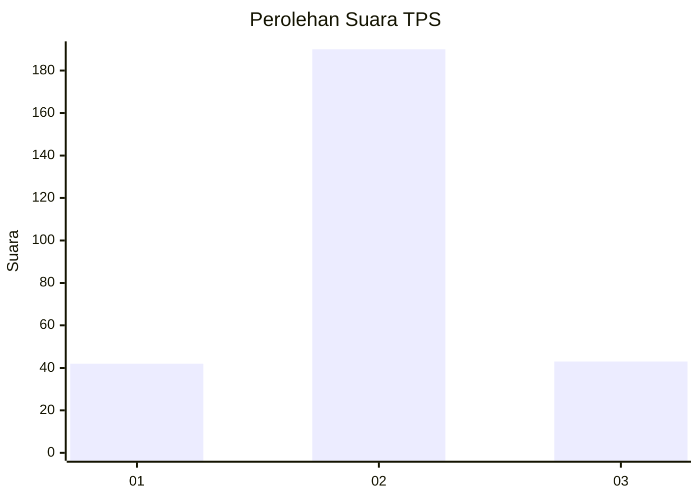

# Hasil

## Grafik

## Tabel

| No. | Nama Paslon    | Suara | Suara (raw) | Persentase |
|:--- |:-------------- | -----:| -----------:| ----------:|
| 1   | ANIES MUHAIMIN | 42    | [42][p-1]   | 15,27      |
| 2   | PRABOWO GIBRAN | 190   | [190][p-2]  | 69,09      |
| 3   | GANJAR MAHFUD  | 43    | [43][p-3]   | 15,64      |

[p-1]: https://github.com/gigit-pemilu/pemilu-2024-94-papua-tengah/blob/main/pilpres/hitung-suara/sub/94-papua-tengah/sub/04-mimika/sub/01-mimika-baru/sub/1007-sempan/sub/018-tps/sub/paslon-1.txt
[p-2]: https://github.com/gigit-pemilu/pemilu-2024-94-papua-tengah/blob/main/pilpres/hitung-suara/sub/94-papua-tengah/sub/04-mimika/sub/01-mimika-baru/sub/1007-sempan/sub/018-tps/sub/paslon-2.txt
[p-3]: https://github.com/gigit-pemilu/pemilu-2024-94-papua-tengah/blob/main/pilpres/hitung-suara/sub/94-papua-tengah/sub/04-mimika/sub/01-mimika-baru/sub/1007-sempan/sub/018-tps/sub/paslon-3.txt

## Foto C Plano

https://sirekap-obj-formc.kpu.go.id/ccd0/pemilu/ppwp/94/04/01/10/07/9404011007018-20240215-035523--6a5fa271-2f2e-4d99-abf2-5a1c78a4fa1b.jpg

https://sirekap-obj-formc.kpu.go.id/ccd0/pemilu/ppwp/94/04/01/10/07/9404011007018-20240215-035824--fce17371-13d8-4d37-9f8a-0f0f14196e55.jpg

https://sirekap-obj-formc.kpu.go.id/ccd0/pemilu/ppwp/94/04/01/10/07/9404011007018-20240215-040000--a5f0863b-4395-4103-8e3d-211aa9a25c87.jpg

## Metadata

| Key        | Value               |
| ---------- | ------------------- |
| Time Stamp | 2024-02-15 20:30:46 |

